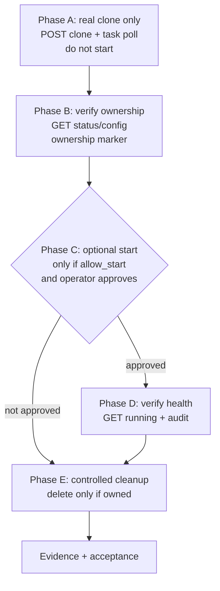

# Helper Compute HC3 Session 6 — Controlled Real Proxmox Provisioning Activation Plan

**Status:** PLANNING ONLY — no implementation in this session  
**Proposed checkpoint:** `CHECKPOINT_HC3_6_REAL_CLONE_PASS` (alias `CHECKPOINT_HC3_6_CONTROLLED_CLONE_PASS`)  
**Prerequisites:** `CHECKPOINT_HC1_FINAL_PASS`, `CHECKPOINT_HC2_FINAL_PASS`, `CHECKPOINT_HC2_REGRESSION_PASS`, `CHECKPOINT_HC2_CATALOG_VERIFIED`, `CHECKPOINT_HC3_1_PASS`, `CHECKPOINT_HC3_2_PASS`, `CHECKPOINT_HC3_3_PASS`, `CHECKPOINT_HC3_4_PASS`, `CHECKPOINT_HC3_4_LIVE_VERIFIED`, `CHECKPOINT_HC3_5_FINAL_PASS`  
**Latest HC3.5 evidence:** [`docs/HELPER_COMPUTE_HC3_SESSION5_ACCEPTANCE.md`](docs/HELPER_COMPUTE_HC3_SESSION5_ACCEPTANCE.md:1) — clean environment 240 passed, HC3.5 focused 36 passed, 5 previous failures proven env leakage only, no assertions skipped, no credentials persisted, real provisioning disabled, no Proxmox mutations  
**Session objective:** Safest possible first real Proxmox mutation on `pve-test` — ONE disposable clone, no production exposure  
**Policy:** Do NOT clone/create/start/stop/reboot/resize/delete any real VM in this planning session. No Proxmox ACL/user/token changes. No commit/push/merge/deploy. No TM-D12. No E1.7. No HC3.7.

> This plan reuses all accepted HC3.1–HC3.5 controls and does not invent a parallel architecture. It defines a tightly constrained first real provisioning experiment, not broad production provisioning.

---

## 1. Exact HC3.6 goal

Deliver the **safest possible first real-mutation checkpoint** that proves the HC3.5 deterministic plan compiler and mutation-disabled adapter can be extended to a real Proxmox mutation adapter without opening broad production provisioning.

HC3.6 must:

1. Introduce a `RealProxmoxMutationAdapter` structurally separate from [`control-api/app/services/helper_compute/proxmox/readonly_adapter.py`](control-api/app/services/helper_compute/proxmox/readonly_adapter.py:1) and [`control-api/app/services/helper_compute/proxmox/mutation_adapter.py`](control-api/app/services/helper_compute/proxmox/mutation_adapter.py:1), with allowlisted mutation paths only.
2. Execute **exactly ONE** controlled disposable VM clone on `pve-test` from ONE approved template onto ONE approved node/storage/bridge, using ONE reserved VMID from the dedicated Helper Compute test range, with a tiny fixed profile.
3. Prove dry-run-before-mutation, ownership tagging, idempotency, timeout reconciliation, foreign-resource protection, and controlled cleanup end-to-end.
4. Keep all other provisioning disabled: no batch, no concurrency, no production tenant, no billing, no public exposure.
5. End with the test VM deleted only after ownership proof, or retained for manual review if ambiguous, with full audit trail.

HC3.6 is **clone-only-first** (Phase A+B+E). Start is deferred to a separately approved checkpoint unless an explicit operator flag enables it under the same safety gates.

---

## 2. Why this is the correct next checkpoint

Accepted layers already provide:

- HC3.1: capacity/reservation semantics and provider abstractions ([`control-api/app/services/helper_compute/proxmox/capacity.py`](control-api/app/services/helper_compute/proxmox/capacity.py:1), [`control-api/app/services/helper_compute/proxmox/provider.py`](control-api/app/services/helper_compute/proxmox/provider.py:1), [`control-api/app/services/helper_compute/proxmox/fake_adapter.py`](control-api/app/services/helper_compute/proxmox/fake_adapter.py:1))
- HC3.2: durable reservations, deterministic placement, atomic capacity protection ([`control-api/app/services/helper_compute/proxmox/reservation.py`](control-api/app/services/helper_compute/proxmox/reservation.py:1))
- HC3.3: durable jobs, worker claims, bounded retries, idempotency, rollback states ([`control-api/app/services/helper_compute/proxmox/provisioning_job.py`](control-api/app/services/helper_compute/proxmox/provisioning_job.py:1), [`control-api/app/models.py`](control-api/app/models.py:1902))
- HC3.4: real Proxmox read-only discovery, GET-only allowlist, separate enablement ([`control-api/app/services/helper_compute/proxmox/readonly_adapter.py`](control-api/app/services/helper_compute/proxmox/readonly_adapter.py:1), [`control-api/app/services/helper_compute/proxmox/discovery_service.py`](control-api/app/services/helper_compute/proxmox/discovery_service.py:1))
- HC3.5: deterministic plan compiler, VMID leases, mutation-disabled dry-run adapter, audit trail, ownership/idempotency safeguards ([`control-api/app/services/helper_compute/proxmox/plan_compiler.py`](control-api/app/services/helper_compute/proxmox/plan_compiler.py:1), [`control-api/app/services/helper_compute/proxmox/plan_contracts.py`](control-api/app/services/helper_compute/proxmox/plan_contracts.py:1), [`control-api/app/services/helper_compute/proxmox/vmid_lease.py`](control-api/app/services/helper_compute/proxmox/vmid_lease.py:1), [`control-api/app/services/helper_compute/proxmox/audit.py`](control-api/app/services/helper_compute/proxmox/audit.py:1), [`control-api/app/services/helper_compute/proxmox/mutation_adapter.py`](control-api/app/services/helper_compute/proxmox/mutation_adapter.py:1))

The remaining risk is translating a proven dry-run plan into one real Proxmox mutation while preserving all safety invariants. Jumping to broad provisioning would combine unproven decisions: VMID ownership, template identity, storage syntax, cloud-init, network, task polling, timeout ambiguity, and cleanup. A single-clone, clone-only-first checkpoint isolates the smallest reversible mutation and proves the safety gates before any start/configure/billing exposure.

HC3.5 explicitly left [`control-api/app/services/helper_compute/proxmox/config.py`](control-api/app/services/helper_compute/proxmox/config.py:174) `is_provisioning_worker_enabled()` always `False` and rejected `real` mode. HC3.6 is the first checkpoint allowed to relax that, but only under a multi-gate, fail-closed model.

---

## 3. Exact in-scope mutation

Exactly ONE real Proxmox mutation is in scope for the live acceptance run:

- `POST /api2/json/nodes/{approved_node}/qemu/{approved_template_vmid}/clone` with `newid={leased_vmid}`, `name=hc36-test-{short_fp}`, `target={approved_node}`, `full=1`, `description=helper-compute:test:job_id={job_id}:plan={plan_fp}:tenant={tenant_id}:cluster={cluster_fingerprint}`

Plus its **task polling** via `GET /api2/json/nodes/{node}/tasks/{upid}/status` until `status=stopped` and `exitstatus=OK`.

No other POST/PUT/PATCH/DELETE is executed live in the clone-only-first variant. All other operations (configure CPU/RAM/disk/network/cloud-init, start) are validated via dry-run and live GET verification only.

---

## 4. Explicit out-of-scope operations

HC3.6 must NOT:

- Enable broad production provisioning, batch provisioning, or auto-scaling.
- Create/clone more than ONE test VM per acceptance run.
- Start/stop/reboot the VM unless `helper_compute_proxmox_allow_start=true` and operator explicitly approves Phase C.
- Resize CPU/RAM/disk live (validate only; defer live resize to later checkpoint).
- Write cloud-init live beyond bounded spec (no secrets, no arbitrary payloads).
- Mutate networking beyond the single approved bridge (no VLAN/SDN/firewall/storage pool creation).
- Mutate storage pools, templates, HA groups, backup policies, or cluster config.
- Change Proxmox ACLs, users, tokens, roles, or permissions.
- Delete any VM that fails ownership proof (see §36, §38).
- Enable production provisioning worker, production tenants, production database, production network, billing, or public exposure.
- Modify TM-D12 or E1.7.
- Deploy, commit, push, or merge (working-tree checkpoint only, like HC3.5).

---

## 5. Preconditions that must be frozen before any mutation

All must be frozen, documented, and allowlisted before the first real mutation. No mutation if any is missing:

1. `CHECKPOINT_HC3_5_FINAL_PASS` accepted and working tree clean for HC3.5 files (no unrelated dirty files in the focused diff).
2. Live `pve-test` cluster reachable via HC3.4 read-only discovery; `cluster_fingerprint` pinned and recorded.
3. Approved template VMID, node, storage, bridge, VMID range, and test tenant identity documented in the HC3.6 acceptance report (see §6–§11).
4. Allowlists populated: `helper_compute_proxmox_allowed_nodes`, `helper_compute_proxmox_allowed_templates`, `helper_compute_proxmox_allowed_storages`, `helper_compute_proxmox_allowed_bridges`, `helper_compute_proxmox_cluster_fingerprint`, `helper_compute_proxmox_vmid_range_start/end`.
5. Real mutation flags explicitly enabled via two-key model (see §16) and `APP_ENV` guard passes (see §17).
6. Kill-switch verified as off (not engaged) and emergency disable procedure tested (see §39).
7. Dry-run plan compiled and preflighted successfully against fresh discovery snapshot (see §19).
8. Operator approval recorded (see §18) with explicit `pve-test` target and cleanup authorization.
9. Audit trail and DB migrations for HC3.5 (`proxmox_vmid_leases`, `proxmox_provisioning_audit_events`) applied and verified.
10. No production credentials in repo; token sourced from env only (see §42).

Freeze artifact: a `HC3.6 Frozen Preconditions` table in the acceptance report listing each value, its source (env/DB/discovery), and the operator who approved it.

---

## 6. Approved Proxmox template selection

- Exactly ONE template, identified by Proxmox VMID and `template=1` marker.
- Must be discovered via HC3.4 read-only adapter (`GET /api2/json/nodes/{node}/qemu` with `template=1` filtering in [`control-api/app/services/helper_compute/proxmox/discovery.py`](control-api/app/services/helper_compute/proxmox/discovery.py:1)).
- Must be allowlisted in `helper_compute_proxmox_allowed_templates` (CSV of VMIDs, e.g., `9000` or `100` — operator to freeze exact value).
- Must be on the approved node (see §7) and use the approved storage (see §8).
- Must be a disposable test template (e.g., minimal cloud-init Ubuntu/Debian, no customer data, no production secrets).
- Plan compiler must validate: template exists, `available=true`, `template=1`, and allowlisted; otherwise `FailureCategory.VALIDATION` and no mutation.
- No template creation or modification in HC3.6; use existing template only.

To be frozen before HC3.6 execution: `template_vmid=<operator-provided>`, `template_id=proxmox-{node}-{vmid}`, `template_name=<as discovered>`.

---

## 7. Approved target node

- Exactly ONE node, e.g., `pve-test-01` (operator to freeze exact `node_id`).
- Must be `online=true`, `maintenance=false`, and allowlisted in `helper_compute_proxmox_allowed_nodes`.
- Must have sufficient reservable CPU/RAM/disk for the tiny test profile (see §12).
- Must be the same node used for discovery, clone, verification, and cleanup — no cross-node migration.
- Cluster fingerprint must match `helper_compute_proxmox_cluster_fingerprint` (pinned).

---

## 8. Approved storage

- Exactly ONE storage pool, e.g., `local-lvm` or `local` (operator to freeze exact `pool_id`).
- Must be `is_online=true`, `available_gb >= disk_gb` (tiny profile), and allowlisted in `helper_compute_proxmox_allowed_storages`.
- Must be on the approved node; no shared storage mutation.
- No storage pool creation, resize, or config change.

---

## 9. Approved network/bridge mapping

- Exactly ONE bridge, e.g., `vmbr0` (isolated test bridge preferred, e.g., `vmbr1` if available).
- Must be in `NETWORK_PROFILE_TO_BRIDGE` ([`control-api/app/services/helper_compute/proxmox/plan_contracts.py`](control-api/app/services/helper_compute/proxmox/plan_contracts.py:28)) and allowlisted in `helper_compute_proxmox_allowed_bridges`.
- Profile `isolated` → `vmbr1` is preferred for HC3.6 to avoid production network exposure; fallback `default` → `vmbr0` only if `vmbr1` not present and operator explicitly approves.
- No bridge/VLAN/SDN/firewall creation or mutation.
- NetworkAttachmentSpec: `profile=isolated`, `bridge=vmbr1`, `vlan_tag=None`, `firewall_enabled=false`, `model=virtio`.

---

## 10. Dedicated Helper Compute test VMID range

- Dedicated test range: `helper_compute_proxmox_vmid_range_start=9000`, `helper_compute_proxmox_vmid_range_end=9999` (existing defaults in [`control-api/app/config.py`](control-api/app/config.py:180)) — or a narrower sub-range like `9500–9599` if operator prefers tighter isolation.
- Must be outside production VMID ranges and outside template VMIDs.
- Must be allowlisted via `get_vmid_range()` ([`control-api/app/services/helper_compute/proxmox/config.py`](control-api/app/services/helper_compute/proxmox/config.py:136)) and enforced by `allocate_vmid()` ([`control-api/app/services/helper_compute/proxmox/vmid_lease.py`](control-api/app/services/helper_compute/proxmox/vmid_lease.py:46)) with `UniqueConstraint(cluster_fingerprint, vmid)` ([`control-api/app/models.py`](control-api/app/models.py:1986)).
- Exactly ONE VMID per acceptance run, lowest available deterministic allocation, checked against live inventory via discovery preflight (`occupied_vmids`).

---

## 11. Dedicated disposable test tenant/ownership identity

- Single test tenant: e.g., `tenant_id=hc3-6-test-tenant`, `customer_id=hc3-6-test-customer` (operator to freeze).
- Must be a non-production, disposable identity with no real billing, no customer traffic, no production database.
- Must be used for reservation, job, plan, VMID lease, and audit events — all records must share the same `tenant_id`/`request_id`/`job_id` for ownership proof.
- No real customer data; no PII.

---

## 12. Fixed initial CPU/RAM/disk profile

Fixed, minimal, cheap, disposable:

| Field | Value | Rationale |
|-------|-------|-----------|
| `vcpu` | `1` | Minimal CPU, fits any node |
| `ram_mb` | `1024` (1 GB) | Minimal RAM, low cost |
| `disk_gb` | `10` | Minimal disk, fast clone |
| `hostname` | `hc36-test-{short_fingerprint}` | Deterministic, bounded |
| `network` | `isolated` → `vmbr1` | No production exposure |
| `cloud_init` | `CloudInitSpec` with `network_dhcp=true`, no secrets | Bounded spec only |

No customer traffic, no production DB, no public IP, no billing. All values are catalog-controlled and validated by `can_fit()` and storage `reservable_gb` checks.

---

## 13. Whether the first checkpoint should be clone-only or clone+configure

**Recommendation: clone-only-first (Phase A+B+E).**

| Option | Scope | Pros | Cons | Risk |
|--------|-------|------|------|------|
| **Option 1: clone-only-first (recommended)** | HC3.6 = Phase A+B+E (no start, no live configure) | Smallest blast radius; proves mutation, ownership, idempotency, reconciliation, cleanup without networking/cloud-init/start complexity; reversible; cheap | Defers configure/start proof to next checkpoint | Lowest risk |
| Option 2: clone+configure (no start) | HC3.6 = Phase A+B+live configure (CPU/RAM/disk/network/cloud-init) +E | Proves configure syntax | More mutations, more failure modes, harder to isolate clone vs configure failure | Medium risk |
| Option 3: clone+configure+start | HC3.6 = Phase A+B+C+D+E | Proves full provisioning | Largest blast radius; combines clone, configure, network, cloud-init, start, health; hardest to debug; risk of leaked running VM | Highest risk |

Clone-only-first is the smallest irreversible surface. It proves the critical safety gates (multi-gate enablement, dry-run-before-mutation, VMID lease, ownership tagging, foreign-resource protection, timeout reconciliation, audit, kill-switch, and controlled cleanup) with one reversible mutation. Configure and start should be separate, similarly gated checkpoints (HC3.6b/HC3.7) that reuse the same safety layers.

There is no strong technical reason to broaden HC3.6 beyond clone-only: the Proxmox clone API is the only operation that creates a new resource; all other operations are PUTs on an already-owned VM and can be proven separately after clone ownership is proven.

---

## 14. Whether VM start belongs in HC3.6 or a later checkpoint

**Defer start to a later checkpoint (HC3.6b or HC3.7).**

- Default: Do NOT start the VM in HC3.6. `helper_compute_proxmox_allow_start` defaults to `False`; `compile_operations()` filters out `START_VM` when false ([`control-api/app/services/helper_compute/proxmox/mutation_adapter.py`](control-api/app/services/helper_compute/proxmox/mutation_adapter.py:188)).
- Optional Phase C: Start only if all of: `helper_compute_proxmox_allow_start=true`, operator explicitly approves start in the same run, dry-run preflight passed, clone verified, and ownership proof holds. Then `POST /api2/json/nodes/{node}/qemu/{vmid}/status/start` with task polling.
- Recommendation: Keep HC3.6 as clone-only, no start. Defer start to HC3.6b/HC3.7 to minimize blast radius. Starting introduces cloud-init, network, and health-check complexity that should be proven separately.

---

## 15. Feature-flag model

Extend existing HC3.5 flags in [`control-api/app/config.py`](control-api/app/config.py:177) and [`control-api/app/services/helper_compute/proxmox/config.py`](control-api/app/services/helper_compute/proxmox/config.py:102) with compatible names. Do NOT rename existing flags.

| Flag (env) | Type | Default | Purpose | Existing? |
|------------|------|---------|---------|-----------|
| `helper_compute_proxmox_enabled` | bool | `False` | Master provisioning gate | Existing |
| `helper_compute_proxmox_provider` | str | `fake` | `fake` \| `proxmox` | Existing |
| `helper_compute_proxmox_provisioning_mode` | str | `fake` | `fake` \| `dry_run` \| `real` (HC3.6 allows `real` only when all gates pass) | Existing (HC3.5 rejected `real`) |
| `helper_compute_proxmox_real_mutation_enabled` | bool | `False` | Second key for real mutations (new) | New for HC3.6 |
| `helper_compute_proxmox_mutation_kill_switch` | bool | `False` | Emergency kill-switch (new) | New for HC3.6 |
| `helper_compute_proxmox_allow_start` | bool | `False` | Whether plan may include `start_vm` | Existing |
| `helper_compute_proxmox_allow_rollback_delete` | bool | `False` | Whether rollback delete is allowed | Existing |
| `helper_compute_proxmox_readonly_enabled` | bool | `False` | Discovery gate (separate) | Existing |
| `helper_compute_proxmox_api_url` | str | `https://proxmox.example.invalid:8006` | Real URL for `pve-test` | Existing |
| `helper_compute_proxmox_api_token` | str | `""` | Token for `pve-test` (env only) | Existing |
| `helper_compute_proxmox_verify_tls` | bool | `True` | TLS verification | Existing |
| `helper_compute_proxmox_timeout_sec` | int | `10` | HTTP timeout | Existing |
| `helper_compute_proxmox_vmid_range_start/end` | int | `9000`/`9999` | VMID range | Existing |
| `helper_compute_proxmox_allowed_nodes/templates/storages/bridges` | str | `""` | Allowlists | Existing |
| `helper_compute_proxmox_cluster_fingerprint` | str | `""` | Pinned fingerprint | Existing |

Compatibility note: Do not blindly use `HELPER_COMPUTE_PROXMOX_PROVISIONING_ENABLED` or `HELPER_COMPUTE_PROXMOX_REAL_MUTATION_ENABLED` as env names if the codebase uses `helper_compute_proxmox_*`. The recommended names above are `helper_compute_proxmox_*` to match [`control-api/app/config.py`](control-api/app/config.py:1). If an operator prefers uppercase env, map via `SettingsConfigDict` case-insensitivity. Inspected existing config confirms `helper_compute_proxmox_*` is the correct prefix.

---

## 16. Multi-gate enablement model

Real mutation is impossible unless ALL gates pass (AND logic, fail-closed). No single flag enables mutation.

```
is_real_mutation_allowed() :=
  helper_compute_proxmox_enabled == true
  AND helper_compute_proxmox_provider == "proxmox"
  AND helper_compute_proxmox_provisioning_mode == "real"
  AND helper_compute_proxmox_real_mutation_enabled == true
  AND helper_compute_proxmox_mutation_kill_switch == false
  AND app_env in ("test", "development", "staging")  // NOT production
  AND helper_compute_proxmox_cluster_fingerprint != ""
  AND helper_compute_proxmox_allowed_nodes != ""
  AND helper_compute_proxmox_allowed_templates != ""
  AND helper_compute_proxmox_allowed_storages != ""
  AND helper_compute_proxmox_allowed_bridges != ""
  AND is_readonly_proxmox_allowed() == true  // discovery must be enabled for preflight
  AND target node/template/storage/bridge are allowlisted
  AND target vmid in allowed range
  AND dry_run preflight succeeded (see §19)
  AND operator approval recorded (see §18)
```

- Two-key minimum: `helper_compute_proxmox_enabled` + `helper_compute_proxmox_real_mutation_enabled` must both be `true`. Either alone is insufficient.
- Multi-gate adds `provisioning_mode=real`, `provider=proxmox`, `kill_switch=false`, `app_env` guard, and allowlists.
- Any gate failure → `FailureCategory.CONFIGURATION` and no mutation.

---

## 17. Default fail-closed behavior

- All new flags default to disabled (`False` or `fake`).
- `is_provisioning_mode_allowed()` in HC3.5 rejected `real`; HC3.6 must update it to allow `real` only when `is_real_mutation_allowed()` passes. Otherwise, `real` is still rejected.
- `is_provisioning_worker_enabled()` must remain `False` by default; HC3.6 may introduce `helper_compute_proxmox_provisioning_worker_enabled` but default `False` and bounded `max_jobs=1` for the single test.
- `is_allow_start()` and `is_allow_rollback_delete()` remain `False` by default.
- `helper_compute_proxmox_mutation_kill_switch` defaults to `False` (not engaged), but when `True`, it immediately blocks new mutations (see §39).
- Unknown `provisioning_mode` → fail-closed with warning.
- Missing allowlist → fail-closed (no mutation).
- `app_env=production` → fail-closed (no real mutation in production).

---

## 18. Operator approval boundary

- Explicit operator approval required before any live mutation, recorded in audit and acceptance report.
- Approval must include: `pve-test` cluster URL, node, template VMID, storage, bridge, VMID range, test tenant, resource profile, and cleanup authorization.
- Approval is per-run, not persistent: each live acceptance run requires a fresh approval record (e.g., `operator_github_login` + timestamp + `plan_fingerprint`).
- Operator must be in `operator_github_logins` ([`control-api/app/config.py`](control-api/app/config.py:267)) and authenticated via existing operator auth.
- No mutation if approval is missing, expired, or mismatched to the frozen preconditions.

---

## 19. Dry-run-before-mutation requirement

No real mutation without a successful dry-run preflight on the same plan.

1. Compile plan via `compile_provisioning_plan()` ([`control-api/app/services/helper_compute/proxmox/plan_compiler.py`](control-api/app/services/helper_compute/proxmox/plan_compiler.py:1)) using the claimed job + active reservation + fresh discovery snapshot.
2. Run `MutationDisabledAdapter.preflight()` ([`control-api/app/services/helper_compute/proxmox/mutation_adapter.py`](control-api/app/services/helper_compute/proxmox/mutation_adapter.py:63)) — GET-only validation, no writes.
3. Run `MutationDisabledAdapter.provision(dry_run=True)` — ordered operations preview, no reservation consume.
4. Only if `preflight.valid==true` and `dry_run` succeeds, proceed to `RealProxmoxMutationAdapter.provision(real=True)` with the same `plan_fingerprint` and `ownership_fingerprint`.
5. Record both dry-run and real audit events with the same `plan_fingerprint` for traceability.

If dry-run fails, do not attempt real mutation; classify as `VALIDATION`/`CAPACITY`/`CONFIGURATION` and fail the job without consuming reservation.

---

## 20. Exact operation ordering

Canonical ordering from `compile_operations()` ([`control-api/app/services/helper_compute/proxmox/plan_compiler.py`](control-api/app/services/helper_compute/proxmox/plan_compiler.py:1)) and [`control-api/app/services/helper_compute/proxmox/plan_contracts.py`](control-api/app/services/helper_compute/proxmox/plan_contracts.py:60):

```
1. VALIDATE_TEMPLATE
2. VALIDATE_NODE
3. VALIDATE_STORAGE
4. ALLOCATE_VCID  (VMID lease)
5. CLONE_TEMPLATE  (POST /api2/json/nodes/{node}/qemu/{template_vmid}/clone)
6. CONFIGURE_CPU_RAM  (PUT /api2/json/nodes/{node}/qemu/{vmid}/config) — validated, not executed live in HC3.6 clone-only
7. CONFIGURE_DISK  (PUT resize) — validated, not executed live in HC3.6
8. CONFIGURE_NETWORK  (PUT config) — validated, not executed live in HC3.6
9. CONFIGURE_CLOUD_INIT  (PUT config) — validated, not executed live in HC3.6
10. START_VM  (POST /api2/json/nodes/{node}/qemu/{vmid}/status/start) — excluded unless allow_start
11. VERIFY_GUEST  (GET /api2/json/nodes/{node}/qemu/{vmid}/status/current) — GET-only verification
12. FINALIZE_OWNERSHIP  (DB: consume lease, consume reservation, set job ready)
13. ROLLBACK_DELETE  (DELETE /api2/json/nodes/{node}/qemu/{vmid}) — only on failure with ownership proof and allow_rollback_delete
```

HC3.6 clone-only-first: Live execution is only `CLONE_TEMPLATE` (step 5) + `VERIFY_GUEST` (GET) + `FINALIZE_OWNERSHIP` (DB). Steps 6–9 are dry-run validated but not live-mutated. Step 10 is excluded. Step 13 is only for cleanup with ownership proof.

---

## 21. Clone/create strategy

- Strategy: `clone` from template VMID, not `create` from scratch. Proxmox API: `POST /api2/json/nodes/{node}/qemu/{template_vmid}/clone` with `newid={target_vmid}`, `name={hostname}`, `target={node}`, `full=1` (full clone for isolation).
- Idempotency: If `target_vmid` already exists and ownership matches (see §28), treat as success (idempotent). If exists and ownership mismatches, `CONFLICT` and do not overwrite.
- Task polling: Clone returns a `UPID` task ID; poll `GET /api2/json/nodes/{node}/tasks/{upid}/status` until `status=stopped` and `exitstatus=OK`, with timeout (see §34).
- No linked clone (`full=0`) for HC3.6 — full clone is safer for disposable test and avoids template dependency.
- No additional disks at clone time; disk is as per template, then validated for resize (deferred).

---

## 22. Resource configuration strategy

- HC3.6 live: Do NOT live-configure CPU/RAM. Validate via dry-run that `vcpu=1`, `ram_mb=1024` fits `node.reservable_cpu/ram` and template can be configured.
- Future live configure (deferred): `PUT /api2/json/nodes/{node}/qemu/{vmid}/config` with `cores=1`, `memory=1024`, `sockets=1`. Must be after clone and before start, with ownership proof and idempotency (re-apply same config is safe).
- Validation: `plan_compiler` checks `can_fit(vcpu, ram_gb, disk_gb)` against `ClusterProxmoxCapacity`; preflight re-checks against fresh snapshot.

---

## 23. Disk strategy

- HC3.6 live: Do NOT live-resize disk. Validate that `disk_gb=10` fits `storage_pool.reservable_gb` and template disk.
- Future live resize (deferred): `PUT /api2/json/nodes/{node}/qemu/{vmid}/resize` with `disk=scsi0`, `size=+XG` (if needed). Only if template disk < requested; otherwise no resize.
- No storage creation or pool mutation.

---

## 24. Network strategy

- HC3.6 live: Do NOT live-configure network beyond what clone inherits. Validate `NetworkAttachmentSpec` (`isolated` → `vmbr1`) via dry-run and allowlist.
- Future live configure (deferred): `PUT /api2/json/nodes/{node}/qemu/{vmid}/config` with `net0=virtio,bridge=vmbr1,firewall=0`. Must be allowlisted and validated.
- No bridge/VLAN/SDN/firewall mutation.

---

## 25. Cloud-init boundary

- HC3.6 live: Do NOT write cloud-init live. Represent intent via `CloudInitSpec` ([`control-api/app/services/helper_compute/proxmox/plan_contracts.py`](control-api/app/services/helper_compute/proxmox/plan_contracts.py:89)) with `hostname`, `network_dhcp=true`, `dns_servers`, no secrets.
- Future live cloud-init (deferred): `PUT /api2/json/nodes/{node}/qemu/{vmid}/config` with `ciuser`, `sshkeys` (refs only), `ipconfig0=ip=dhcp`, `nameserver`, `searchdomain`. Bounded spec, no arbitrary `user_data`, no passwords/keys.
- No secret injection (no customer passwords, API keys, SSH private keys, Odoo DB credentials).

---

## 26. Start policy

- Default: Do NOT start the VM in HC3.6. `helper_compute_proxmox_allow_start` defaults to `False`; `compile_operations()` filters out `START_VM` when false ([`control-api/app/services/helper_compute/proxmox/mutation_adapter.py`](control-api/app/services/helper_compute/proxmox/mutation_adapter.py:188)).
- Optional Phase C: Start only if all of: `helper_compute_proxmox_allow_start=true`, operator explicitly approves start in the same run, dry-run preflight passed, clone verified, and ownership proof holds. Then `POST /api2/json/nodes/{node}/qemu/{vmid}/status/start` with task polling.
- Recommendation: Keep HC3.6 as clone-only, no start. Defer start to HC3.6b/HC3.7 to minimize blast radius. Starting introduces cloud-init, network, and health-check complexity that should be proven separately.

---

## 27. Post-provision verification

After clone (and optional start), perform GET-only verification:

1. `GET /api2/json/nodes/{node}/qemu/{vmid}/status/current` — VM exists, `status` is `stopped` (if not started) or `running` (if started), `template=0`.
2. `GET /api2/json/nodes/{node}/qemu/{vmid}/config` — `cores`, `memory`, `net0` bridge, `description`/`tags` contain ownership marker (see §28).
3. `GET /api2/json/nodes/{node}/qemu` — VMID appears in inventory, no duplicate.
4. DB checks: `ProxmoxVmidLease` state is `leased` → `consumed` only after verification, `ProxmoxProvisioningJob` has `plan_fingerprint`, `target_vmid`, `ownership_fingerprint`, `provider_task_id`.
5. Capacity: `ClusterProxmoxCapacity` reflects the new VM (if started, resources committed).

All verification is read-only; no mutation.

---

## 28. Ownership marker/tag/description strategy

Every test VM must carry multiple ownership proofs for safe cleanup:

- Proxmox description/tag: `helper-compute:test:job_id={job_id}:plan={plan_fingerprint_short}:tenant={tenant_id}:cluster={cluster_fingerprint}` (or `tags=helper-compute-test,{job_id}` if description not available).
- DB lease: `ProxmoxVmidLease` with `cluster_fingerprint`, `vmid`, `job_id`, `request_id`, `state=leased/consumed` ([`control-api/app/models.py`](control-api/app/models.py:1978)).
- DB job: `ProxmoxProvisioningJob` with `plan_fingerprint`, `ownership_fingerprint` (SHA-256 of `cluster_fingerprint, node_id, vmid, tenant_id`), `target_vmid`, `provider_task_id` ([`control-api/app/models.py`](control-api/app/models.py:1948)).
- Audit: `ProxmoxProvisioningAuditEvent` with `plan_fingerprint`, `target_vmid`, `cluster_fingerprint`, `node_id` ([`control-api/app/models.py`](control-api/app/models.py:2009)).
- Naming: `hostname=hc36-test-{short_fingerprint}` and `name` in Proxmox.

All four must match before cleanup is allowed (see §38).

---

## 29. Plan fingerprint/idempotency binding

- Plan fingerprint: `compute_plan_fingerprint()` ([`control-api/app/services/helper_compute/proxmox/plan_contracts.py`](control-api/app/services/helper_compute/proxmox/plan_contracts.py:1)) — SHA-256 over canonical plan JSON; same inputs → same fingerprint.
- Ownership fingerprint: `compute_ownership_fingerprint()` — SHA-256 of `(cluster_fingerprint, node_id, vmid, tenant_id)`.
- Job idempotency: `idempotency_key` and `request_id` unique constraints ([`control-api/app/models.py`](control-api/app/models.py:1906)); duplicate `create_provisioning_job` returns existing job.
- VMID lease idempotency: `allocate_vmid()` reuses existing lease for same `job_id` (see [`control-api/app/services/helper_compute/proxmox/vmid_lease.py`](control-api/app/services/helper_compute/proxmox/vmid_lease.py:46)).
- Clone idempotency: If VMID already exists and ownership matches, treat as success; if mismatched, `CONFLICT` and do not retry blindly.
- Audit idempotency: `event_id` unique, but events are append-only; duplicate plan compilation does not duplicate VM.

---

## 30. VMID lease lifecycle

Via [`control-api/app/services/helper_compute/proxmox/vmid_lease.py`](control-api/app/services/helper_compute/proxmox/vmid_lease.py:1):

- Allocate: `allocate_vmid()` → `leased` (lowest available, unique constraint, idempotent for same `job_id`).
- Consume: `consume_vmid()` → `consumed` only after verified clone success (ownership + GET verification).
- Release: `release_vmid()` → `released` on rollback/delete or when VM proven not to exist.
- Conflict: `mark_vmid_conflict()` → `conflicted` if VMID exists but ownership mismatches.
- Recover: `recover_stale_lease()` for expired leases (worker crash).
- Dry-run: Lease is allocated but NOT consumed; released if dry-run is the only execution.

---

## 31. Reservation lifecycle

- Create: Reservation is `active` (HC3.2) before job creation.
- Job create: `create_provisioning_job()` validates reservation is `active` and matches `request_id`/`tenant_id` ([`control-api/app/services/helper_compute/proxmox/provisioning_job.py`](control-api/app/services/helper_compute/proxmox/provisioning_job.py:81)).
- Dry-run: Does NOT consume or release reservation (HC3.5 semantics).
- Real clone success + verification: `consume_reservation()` exactly once, after verified managed VM (ownership proof + GET verification).
- Real clone failure (retryable): Do not consume; keep `active` for retry.
- Real clone failure (permanent/ownership mismatch): `fail_reservation()` or `release_reservation()` per HC3.2 semantics, with audit.
- Rollback: `release_reservation()` if VM deleted; retain if ambiguous.

---

## 32. Worker claim lifecycle

- DB-backed claim: `claimed_by`, `claimed_at`, `version` conditional UPDATE (like HC3.3 `provisioning_job.py`).
- Single worker: HC3.6 allows at most ONE real provisioning worker with `max_jobs=1` and `poll_sec=5` (or manual trigger only, no background worker by default).
- Lease expiry: `worker_lease_expires_at` (e.g., 5 minutes); stale claim is recoverable via `recover_stale_lease()` and re-claim.
- No concurrent claims for the same `job_id`; concurrent test must prove one-wins.
- Kill-switch: Worker must check `is_real_mutation_allowed()` and `mutation_kill_switch` before each claim; if blocked, do not claim.

---

## 33. Retry limits

- Max attempts: `max_attempts=3` (from [`control-api/app/models.py`](control-api/app/models.py:1934) and [`control-api/app/config.py`](control-api/app/config.py:78)).
- Retryable: `TRANSPORT`, `TASK_TIMEOUT`, `UNAVAILABLE`, `AMBIGUOUS` (after reconciliation shows retryable).
- Not retryable: `VALIDATION`, `CONFIGURATION`, `CAPACITY`, `CONFLICT`, `OWNERSHIP_MISMATCH`, `PERMANENT`.
- Backoff: Exponential backoff with `next_retry_at` (e.g., 30s, 60s, 120s).
- No blind retry on ambiguous timeout; reconciliation first (see §35).

---

## 34. Ambiguous timeout handling

If a mutation request times out:

DO NOT blindly retry.

Required behavior:

1. Mark outcome as ambiguous.
2. Stop further mutation.
3. Perform GET-only reconciliation.
4. Query target VMID/resource.
5. Verify ownership marker/fingerprint.
6. Determine whether clone/create completed.
7. Resume only if state can be proven.
8. Otherwise require manual review.

Design tests for this (see §45–§47).

- HTTP timeout: `helper_compute_proxmox_timeout_sec` (default 10s) for all Proxmox calls via `httpx`; must be bounded and configurable.
- Task polling timeout: Clone task polling with `timeout=60s` (or 120s for slow storage), polling interval `2s`, max attempts `30`.
- Classification: Timeout → `FailureCategory.TASK_TIMEOUT` or `TRANSPORT`, not `PERMANENT`; do not mark job `failed` immediately.
- No blind retry on timeout; go to reconciliation (see §35).

---

## 35. GET-only reconciliation after uncertain mutation outcome

If a mutation times out or returns ambiguous (e.g., `500`, `timeout`, `task not found`):

1. Do NOT retry clone blindly.
2. Perform GET-only reconciliation:
   - `GET /api2/json/nodes/{node}/tasks/{upid}/status` — check task `exitstatus`.
   - `GET /api2/json/nodes/{node}/qemu/{vmid}/status/current` — check if VM exists.
   - `GET /api2/json/nodes/{node}/qemu` — inventory check.
3. Decision matrix:
   - Task `OK` + VM exists + ownership matches → success, consume lease/reservation, finalize.
   - Task `OK` + VM exists + ownership mismatches → `CONFLICT`, mark lease `conflicted`, do not consume, require manual review.
   - Task `failed` + VM not exists → retryable, release lease, retry with backoff (if attempts remain).
   - Task `unknown`/`timeout` + VM exists → `AMBIGUOUS`, retain for review, do not delete, audit `RETAIN_FOR_REVIEW`.
   - Task `unknown` + VM not exists → retryable, release lease, retry.
4. Record `last_reconciled_at` and audit event with `outcome_code=ambiguous` and `RollbackIntent.RETAIN_FOR_REVIEW`.

---

## 36. Foreign-resource protection

A real VM must NEVER be deleted unless ALL ownership checks pass:

1. VMID is within dedicated Helper Compute test range (`9000–9999` or frozen sub-range).
2. Recorded `ProxmoxVmidLease` exists with `cluster_fingerprint`, `vmid`, `job_id`, `state=leased/consumed` and matches the VM.
3. `ProxmoxProvisioningJob` has matching `plan_fingerprint`, `ownership_fingerprint`, `target_vmid`, `tenant_id`.
4. Proxmox VM `description`/`tags` contain the expected ownership marker (see §28).
5. Target `node_id` and `cluster_fingerprint` match the frozen preconditions.
6. Operator cleanup mode explicitly enabled (`helper_compute_proxmox_allow_rollback_delete=true` and per-run approval).

If any check fails → `FailureCategory.OWNERSHIP_MISMATCH`, `RollbackIntent.RETAIN_FOR_REVIEW`, and no deletion. Log and audit the mismatch.

---

## 37. Rollback rules

- Rollback intent is typed via `RollbackIntent` ([`control-api/app/services/helper_compute/proxmox/plan_contracts.py`](control-api/app/services/helper_compute/proxmox/plan_contracts.py:77)): `NONE`, `DELETE_CLONE`, `REVERT_CONFIG`, `RETAIN_FOR_REVIEW`.
- HC3.6 rollback: Only `DELETE_CLONE` for the single test VM, and only if ownership proof passes (see §36) and `helper_compute_proxmox_allow_rollback_delete=true`.
- No rollback if nothing was mutated (`NONE`).
- Retain for review if ambiguous (see §35) — do not auto-delete.
- Reservation: Release on rollback; do not consume.
- VMID lease: Release on rollback (if VM deleted) or mark `conflicted` if foreign.

---

## 38. Cleanup eligibility checks

Controlled cleanup of only the VM proven to be owned by this test:

1. Ownership proof — all checks in §36 must pass (VMID range, lease, job, description/tag, node/cluster, operator cleanup enabled).
2. Pre-delete GET — `GET /api2/json/nodes/{node}/qemu/{vmid}/status/current` confirms VM exists and is owned.
3. Delete — `DELETE /api2/json/nodes/{node}/qemu/{vmid}` (or `POST /api2/json/nodes/{node}/qemu/{vmid}/destroy` per Proxmox API) with task polling. Only if `helper_compute_proxmox_allow_rollback_delete=true` and per-run approval.
4. Post-delete GET — `GET /api2/json/nodes/{node}/qemu/{vmid}/status/current` returns `400`/`not found` or inventory no longer lists VMID.
5. Release lease (`released`) and release reservation if not already consumed, or keep consumed if VM was successfully provisioned and then cleaned up (audit `cleanup`).
6. Audit `cleanup` event with `outcome_code=deleted` and `plan_fingerprint`.

If ownership proof fails: Do NOT delete; audit `RETAIN_FOR_REVIEW` and require manual operator review.

Consider whether cleanup should happen in the same checkpoint or be its own explicit acceptance phase: **Recommendation — cleanup in the same HC3.6 checkpoint** as Phase E, immediately after verification, to prove the full lifecycle is reversible and to avoid leaking a test VM. If cleanup is deferred, the acceptance report must explicitly record the retained VMID and require manual cleanup before closing the checkpoint.

---

## 39. Emergency kill switch

Separate emergency kill-switch that prevents any new mutation immediately:

- Env kill-switch: `helper_compute_proxmox_mutation_kill_switch=true` → `is_real_mutation_allowed()` returns `False` immediately, no new claims, no new clones. Existing in-flight task is allowed to complete reconciliation but no new mutation.
- File kill-switch (optional): `/data/helper_compute_mutation_kill_switch` — if file exists, block mutations (for operator `touch` without env restart).
- Operator action: `export helper_compute_proxmox_mutation_kill_switch=true` and restart worker, or `touch /data/helper_compute_mutation_kill_switch`.
- Verification: Health check must expose `mutation_kill_switch` status; tests must assert kill-switch blocks mutation.
- No new mutation when kill-switch is engaged, even if all other gates pass.
- Existing in-flight ambiguous jobs should move into reconciliation/manual-review behavior, not continue mutating blindly.

---

## 40. Concurrency limit

- Concurrency: `1` — only ONE real mutation at a time for HC3.6. No parallel clones.
- Worker: `max_jobs=1`, `poll_sec=5`, single worker ID (e.g., `hc36-worker-1`).
- VMID allocation: Unique constraint prevents double-lease; concurrent test must prove one-wins.
- Live concurrency limit: No parallel real mutations; second attempt while one is in-flight must be rejected with `retryable=false` and audit.

---

## 41. Rate limiting if useful

- Rate limiting: At most `1` mutation per `60` seconds (or per acceptance run); no burst.
- API: No more than `5` GETs per second to `pve-test` (discovery + verification + task polling).
- Useful for HC3.6 to avoid hammering `pve-test` during task polling and to make the single-clone experiment observable. Not strictly required for safety, but recommended as a defense-in-depth control and to simplify evidence collection.

---

## 42. Credential handling

- Source: Env only (`helper_compute_proxmox_api_token`), never hardcoded, never in DB, never in logs, never in audit, never in plan.
- Redaction: `sanitize_message()` in [`control-api/app/services/helper_compute/proxmox/errors.py`](control-api/app/services/helper_compute/proxmox/errors.py:1) and `to_public_dict()` in [`control-api/app/services/helper_compute/proxmox/plan_contracts.py`](control-api/app/services/helper_compute/proxmox/plan_contracts.py:1) must strip tokens.
- Tests: Assert `credentials_absent_from_plan` and `credentials_redacted_from_errors` (like HC3.5).
- No real credentials in `.env.example` (placeholder only).

---

## 43. TLS handling

- Default: `helper_compute_proxmox_verify_tls=true` (verify).
- For `pve-test`: If using self-signed cert, operator may set `helper_compute_proxmox_verify_tls=false` only for `pve-test` and only with pinned `cluster_fingerprint` and explicit approval. Document the exception in the acceptance report.
- No insecure fallback in production; `app_env=production` must have `verify_tls=true`.
- Timeout: `helper_compute_proxmox_timeout_sec=10` (or 15 for slow `pve-test`).

---

## 44. Audit requirements

Via [`control-api/app/services/helper_compute/proxmox/audit.py`](control-api/app/services/helper_compute/proxmox/audit.py:1) and [`control-api/app/models.py`](control-api/app/models.py:2009):

- Append-only `ProxmoxProvisioningAuditEvent` for every state transition: `plan_compiled`, `preflight`, `dry_run_executed`, `real_clone_attempted`, `task_polled`, `reconciled`, `verified`, `consumed`, `released`, `rollback_intent`, `cleanup`.
- Sanitized: No secrets, no tokens, no PII; `to_public_dict()` strips credentials.
- Sufficient to reconstruct the operation sequence: `job_id`, `reservation_id`, `request_id`, `tenant_id`, `plan_fingerprint`, `ownership_fingerprint`, `target_vmid`, `cluster_fingerprint`, `node_id`, `provider_task_id`, `outcome_code`, `actor_type`.
- Durable: DB `flush()` and `commit()`; never in-memory only.

---

## 45. Mock-provider test requirements

All HC3.6 logic must be proven via mocked transport (no live Proxmox) before live `pve-test`:

- Mock `httpx` or `MockMutationProvider` that simulates `POST clone` → `UPID`, `GET task status` → `OK`/`failed`/`timeout`, `GET qemu/{vmid}` → exists/not found, `DELETE` → `OK`.
- Tests for: success, retryable failure, permanent failure, timeout → reconciliation → success, timeout → ambiguous → retain, ownership mismatch → no delete, kill-switch → blocked, dry-run → no mutation, idempotency, concurrency, audit, credential redaction.
- Must reuse HC3.5 patterns: `test_helper_compute_hc3_5.py` style with `fake` discovery snapshot and mocked adapter.

---

## 46. Negative test requirements

All must be mocked provider tests (no live mutation) plus one live negative check (GET-only):

- Missing real-mutation flag → `CONFIGURATION`, no mutation.
- Kill switch active → `CONFIGURATION`, no mutation.
- Wrong environment (`app_env=production`) → `CONFIGURATION`, no mutation.
- Unapproved node → `VALIDATION`, no mutation.
- Unapproved template → `VALIDATION`, no mutation.
- Unapproved storage → `VALIDATION`, no mutation.
- Unapproved bridge → `VALIDATION`, no mutation.
- VMID outside allowed range → `CONFLICT`, no mutation.
- VMID collision → `CONFLICT`, no mutation.
- Foreign VM occupying target VMID → `CONFLICT`, no mutation.
- Plan fingerprint mismatch → `OWNERSHIP_MISMATCH`, no mutation.
- Ownership marker mismatch → `OWNERSHIP_MISMATCH`, no deletion.
- Stale lease → recoverable, not auto-consumed.
- Duplicate worker → one-wins via version.
- Duplicate job → idempotent, no duplicate VM.
- Dry-run not completed → `CONFIGURATION`, no real mutation.
- Capacity drift after dry-run → `CAPACITY`, no mutation.
- Template disappears → `VALIDATION`, no mutation.
- Node becomes offline → `UNAVAILABLE`, no mutation.
- Storage becomes unavailable → `UNAVAILABLE`, no mutation.
- Ambiguous clone timeout → `AMBIGUOUS`, reconciliation required.
- Successful reconciliation → consume after proof.
- Conflicting reconciliation → `CONFLICT`, retain.
- Rollback denied for foreign resource → no delete, `RETAIN_FOR_REVIEW`.
- Cleanup allowed only for proven-owned test VM → otherwise no delete.
- Secrets absent from audit/logging → assert redaction.
- Kill switch during pending workflow → blocked, reconciliation only.
- Concurrency limited to one real mutation for first acceptance → second rejected.

---

## 47. Concurrency test requirements

- VMID concurrent allocation: Two threads allocate same range with same `cluster_fingerprint` → one wins, other gets next VMID or `VmidLeaseError` (like HC3.5 `test_hc3_5_concurrent_vmid_claims`).
- Job claim concurrency: Two workers claim same `job_id` → one wins via `version` conditional UPDATE.
- Idempotent duplicate job: Same `request_id`/`idempotency_key` → returns existing job, no duplicate VM.
- Duplicate plan compile: Same inputs → same `plan_fingerprint`, same `target_vmid` lease reused.
- Live concurrency limit: No parallel real mutations; second attempt while one is in-flight must be rejected with `retryable=false` and audit.

---

## 48. Live `pve-test` acceptance scenario

Cheap, disposable, reversible — ONE test VM, no customer traffic:

1. Preconditions frozen (see §5) and operator approval recorded.
2. Create reservation for test tenant with tiny profile (`vcpu=1`, `ram_gb=1`, `disk_gb=10`, `isolated`).
3. Create job referencing the reservation (`request_id`, `idempotency_key`).
4. Claim job via worker (DB claim).
5. Compile plan via `compile_provisioning_plan()` with fresh discovery snapshot; record `plan_fingerprint`, `ownership_fingerprint`.
6. Dry-run preflight via `MutationDisabledAdapter` — must be `valid=true`.
7. Real clone via `RealProxmoxMutationAdapter.clone()` with `target_vmid` from lease, `template_vmid`, `node`, `storage`, `hostname`, ownership marker. Poll task until `OK`.
8. GET verification (see §27) — VM exists, `stopped`, config matches, ownership marker present.
9. Consume lease (`consumed`) and consume reservation (only after verification).
10. Audit all steps with `plan_fingerprint`.
11. Do NOT start (unless Phase C explicitly approved).
12. Cleanup (see §49) — delete only after ownership proof.

Success criteria: Clone succeeds, verification passes, lease/reservation consumed, audit complete, no foreign resource touched, no production exposure.

Proposed sequence mirrors the task's preferred sequence:

1. clean HC3.5 dry-run
2. operator explicitly enables HC3.6 gates
3. compile same deterministic plan
4. re-run live preflight
5. acquire VMID lease
6. perform one real clone/create
7. verify VM exists using GET-only calls
8. verify ownership metadata
9. do NOT start unless HC3.6 plan explicitly justifies it
10. record evidence
11. execute controlled cleanup only if ownership checks all pass
12. prove cleanup removed only the test VM
13. disable mutation gates again

---

## 49. Controlled cleanup scenario

Controlled cleanup of only the VM proven to be owned by this test:

1. Ownership proof — all checks in §36 must pass (VMID range, lease, job, description/tag, node/cluster, operator cleanup enabled).
2. Pre-delete GET — `GET /api2/json/nodes/{node}/qemu/{vmid}/status/current` confirms VM exists and is owned.
3. Delete — `DELETE /api2/json/nodes/{node}/qemu/{vmid}` (or `POST /api2/json/nodes/{node}/qemu/{vmid}/destroy` per Proxmox API) with task polling. Only if `helper_compute_proxmox_allow_rollback_delete=true` and per-run approval.
4. Post-delete GET — `GET /api2/json/nodes/{node}/qemu/{vmid}/status/current` returns `400`/`not found` or inventory no longer lists VMID.
5. Release lease (`released`) and release reservation if not already consumed, or keep consumed if VM was successfully provisioned and then cleaned up (audit `cleanup`).
6. Audit `cleanup` event with `outcome_code=deleted` and `plan_fingerprint`.

If ownership proof fails: Do NOT delete; audit `RETAIN_FOR_REVIEW` and require manual operator review.

---

## 50. Rollback acceptance scenario

Proves rollback is safe and foreign-resource protected:

1. Inject failure after clone (e.g., mock `CONFIGURE_CPU_RAM` failure or real `PUT` failure if configure were attempted).
2. Classify as `TASK_FAILURE` or `VALIDATION` with `RollbackIntent.DELETE_CLONE`.
3. Reconcile via GET — VM exists and is owned.
4. Rollback — delete only if ownership proof passes and `allow_rollback_delete=true`.
5. Verify — VM no longer exists, lease `released`, reservation `released`, job `rolled_back`.
6. Negative rollback test: Attempt rollback when VMID is outside test range or ownership mismatches → must NOT delete, must audit `OWNERSHIP_MISMATCH` and `RETAIN_FOR_REVIEW`.

---

## 51. Evidence requirements

Acceptance report must include:

- Frozen preconditions table (see §5) with exact values and operator approval.
- Plan `plan_fingerprint`, `ownership_fingerprint`, `target_vmid`, `template_vmid`, `node`, `storage`, `bridge`, `tenant_id`, `job_id`, `reservation_id`.
- Dry-run preflight result (valid, errors, warnings) and `DryRunResult`.
- Real clone `provider_task_id` (UPID), task polling logs (sanitized, no token), and GET verification outputs (sanitized).
- DB records: `ProxmoxVmidLease` (leased→consumed→released), `ProxmoxProvisioningJob` (state transitions), `ProxmoxProvisioningAuditEvent` (all events).
- Sanitized Proxmox API responses (no token, no secrets).
- Cleanup proof: pre-delete ownership checks, delete task UPID, post-delete GET not found.
- Negative, concurrency, and mocked test results (counts, pass/fail).
- Kill-switch test proof.
- No-mutation verification for dry-run (structural: no POST/PUT/PATCH/DELETE in dry-run adapter).

---

## 52. Acceptance criteria

HC3.6 is `PASS` only if ALL are met:

- [ ] `RealProxmoxMutationAdapter` exists, is separate from read-only adapter, and has allowlisted mutation paths only (clone/create, task poll, config, delete) with no broad mutation.
- [ ] All gates in §16 pass for the live run; any gate failure blocks mutation (fail-closed).
- [ ] Dry-run-before-mutation succeeded for the same plan.
- [ ] ONE disposable VM cloned on `pve-test` from approved template onto approved node/storage/bridge with dedicated VMID and tiny profile.
- [ ] Post-provision GET verification passed (VM exists, stopped, config and ownership marker correct).
- [ ] Lease consumed and reservation consumed only after verification.
- [ ] Cleanup deleted only the owned VM after ownership proof; foreign-resource protection proven (negative delete test).
- [ ] Timeout reconciliation proven (mocked ambiguous test and live task polling).
- [ ] Rollback proven (mocked failure → delete with ownership proof; mismatch → no delete).
- [ ] Idempotency, concurrency, and retry limits proven (mocked tests).
- [ ] Audit trail complete, append-only, sanitized, and reconstructs the sequence.
- [ ] Credentials never in plan/DB/audit/logs/errors; TLS and timeout handled.
- [ ] Rate limiting and kill-switch proven.
- [ ] All HC1/HC2/HC3.1–HC3.5 regressions pass (no HC3.6-caused failures).
- [ ] Evidence report with frozen preconditions, fingerprints, task IDs, and sanitized outputs.
- [ ] No production provisioning, no TM-D12, no E1.7, no deploy/commit/push.

---

## 53. Proposed final checkpoint token

```
CHECKPOINT_HC3_6_REAL_CLONE_PASS
```

Alias: `CHECKPOINT_HC3_6_CONTROLLED_CLONE_PASS` — records that HC3.6 proved ONE controlled disposable clone on `pve-test` with dry-run-before-mutation, ownership proof, idempotency, reconciliation, foreign-resource protection, and controlled cleanup, without enabling broad production provisioning.

Must NOT be interpreted as approval for production provisioning, batch provisioning, auto-start, or billing. A separate checkpoint (HC3.7 or HC3.6b) is required for start/configure/billing.

---

## Staged execution evaluation and recommended checkpoint boundary



- Phase A: Real `clone` only, do not start. Poll task, handle timeout via reconciliation.
- Phase B: GET-only verification of ownership and configuration (no live configure).
- Phase C: Optional `start` if `helper_compute_proxmox_allow_start=true` and per-run approval. Recommended to defer.
- Phase D: Verify VM health (`running`, `qemu-guest-agent` if available) — only if Phase C executed.
- Phase E: Controlled cleanup of only the owned VM (see §49).

Clone-only-first vs clone+configure+start is evaluated in §13. Recommendation is clone-only-first.

---

## Recommended HC3.6 definition

HC3.6 = Controlled Real Clone (no start) on `pve-test`

- Goal: Prove ONE real clone with all safety gates, then clean up.
- First live mutation: `POST /api2/json/nodes/{approved_node}/qemu/{approved_template_vmid}/clone` with `newid={leased_vmid}`, `name=hc36-test-{short_fp}`, `target={approved_node}`, `full=1`, `description=helper-compute:test:job_id={job_id}:plan={plan_fp}:tenant={tenant_id}`.
- Safety gates: Multi-gate AND (see §16) + dry-run-before-mutation + ownership proof + kill-switch + allowlists + `app_env` guard.
- Prerequisites: Frozen preconditions (see §5) + operator approval + mocked tests passing.
- Execution order: Reserve → job → claim → compile plan → dry-run preflight → real clone → GET verify → consume lease/reservation → audit → cleanup (if owned) → evidence.
- Rollback: `DELETE` only if owned and `allow_rollback_delete=true`; otherwise `RETAIN_FOR_REVIEW`.
- Key risks: See below.
- Files: See below.

---

## Safety gates summary

```
is_real_mutation_allowed() = 
  enabled && provider==proxmox && mode==real && real_mutation_enabled
  && !kill_switch && app_env != production
  && cluster_fingerprint && allowlists non-empty
  && target allowlisted && vmid in range
  && readonly_enabled && dry_run preflight valid
  && operator approval
```

All gates are fail-closed; any `false` → no mutation.

---

## Prerequisites summary

- HC3.5 accepted, working tree clean for HC3.5 files.
- `pve-test` discovery live, fingerprint pinned.
- Template/node/storage/bridge/VMID range/tenant frozen and allowlisted.
- Two-key flags enabled, `app_env` guard passes, kill-switch off.
- Dry-run preflight valid, operator approval recorded, audit DB ready.

---

## Execution order summary

```
1. Freeze preconditions + operator approval
2. Create reservation (tiny profile, isolated)
3. Create job (idempotent)
4. Claim job (DB version)
5. Compile plan (deterministic, fingerprint)
6. Dry-run preflight (GET-only, no mutation)
7. Real clone (POST clone + task poll) — ONLY if dry-run valid and all gates pass
8. Reconcile if timeout/ambiguous (GET-only)
9. GET verify (status/config/inventory)
10. Consume lease + reservation (only after verify)
11. Audit all steps
12. Cleanup (DELETE only if owned) + post-delete verify
13. Evidence + acceptance report
```

---

## Rollback strategy summary

- No mutation → no rollback (`NONE`).
- Clone succeeded but later step failed → `DELETE_CLONE` only if owned and `allow_rollback_delete=true`.
- Ambiguous → `RETAIN_FOR_REVIEW`, no auto-delete, manual review.
- Foreign → no delete, audit `OWNERSHIP_MISMATCH`.
- Reservation/lease: Release on rollback, consume only on verified success.

---

## Key risks and mitigations

| Risk | Mitigation |
|------|------------|
| Accidental production mutation | `app_env` guard + `cluster_fingerprint` pin + allowlists + `pve-test` only + no production credentials |
| VMID collision with existing VM | `allocate_vmid()` unique constraint + `occupied_vmids` from discovery + `CONFLICT` handling |
| Foreign VM deletion | 6-check ownership proof (see §36) + `allow_rollback_delete=false` by default + per-run approval |
| Ambiguous timeout (clone succeeded but timed out) | GET reconciliation before retry (see §35), no blind retry, `RETAIN_FOR_REVIEW` |
| Leaked running VM (if start enabled) | Default `allow_start=false`; clone-only-first; cleanup with ownership proof |
| Credential leakage | Env only, `sanitize_message()`, `to_public_dict()`, tests for redaction |
| Concurrent double-clone | Unique constraint + versioned claim + concurrency tests + `max_jobs=1` |
| Kill-switch not working | Kill-switch blocks `is_real_mutation_allowed()` and worker claim; tested in mocked and live health check |
| Dirty working tree overwriting unrelated work | Focused diff: only HC3.6 files in commit; do not `reset`/`stash`/`discard` unrelated files |

---

## Production boundary

HC3.6 must NOT mean production provisioning is generally enabled. The plan explicitly preserves:

- Fake provider as default (`helper_compute_proxmox_provider=fake`, `helper_compute_proxmox_provisioning_mode=fake`).
- Production worker mutation disabled by default (`is_provisioning_worker_enabled()` remains `False` unless explicitly enabled with `max_jobs=1` for the single test).
- No customer-triggered real provisioning (only operator-approved test tenant).
- No billing integration.
- No automated broad rollout.
- No unrestricted template/node/storage selection (allowlists required).

---

## Files created/modified (proposed)

### New files (HC3.6)

- [`control-api/app/services/helper_compute/proxmox/real_mutation_adapter.py`](control-api/app/services/helper_compute/proxmox/real_mutation_adapter.py:1) — Real Proxmox mutation adapter (allowlisted POST/PUT/DELETE, task polling, reconciliation, ownership checks)
- [`control-api/tests/test_helper_compute_hc3_6.py`](control-api/tests/test_helper_compute_hc3_6.py:1) — Mocked provider tests (success, failure, timeout, reconciliation, ownership, idempotency, concurrency, kill-switch, audit)
- [`control-api/tests/test_helper_compute_hc3_6_live.py`](control-api/tests/test_helper_compute_hc3_6_live.py:1) — Live `pve-test` acceptance test (single clone + verify + cleanup, gated by env and operator approval, skipped by default)

### Modified files (HC3.6)

- [`control-api/app/config.py`](control-api/app/config.py:177) — Add `helper_compute_proxmox_real_mutation_enabled`, `helper_compute_proxmox_mutation_kill_switch`, `helper_compute_proxmox_provisioning_worker_enabled` (all fail-closed)
- [`control-api/app/services/helper_compute/proxmox/config.py`](control-api/app/services/helper_compute/proxmox/config.py:102) — Add `is_real_mutation_allowed()`, `is_mutation_kill_switch_engaged()`, update `is_provisioning_mode_allowed()` to allow `real` only when gates pass, add `is_provisioning_worker_enabled()` with bounded `max_jobs`
- [`control-api/app/services/helper_compute/proxmox/plan_compiler.py`](control-api/app/services/helper_compute/proxmox/plan_compiler.py:1) — No major change; ensure `allow_start` filtering remains
- [`control-api/app/services/helper_compute/proxmox/vmid_lease.py`](control-api/app/services/helper_compute/proxmox/vmid_lease.py:1) — No major change; ensure `occupied_vmids` from live discovery is used
- [`control-api/app/services/helper_compute/proxmox/audit.py`](control-api/app/services/helper_compute/proxmox/audit.py:1) — No major change; ensure real mutation events are audited
- [`control-api/app/models.py`](control-api/app/models.py:1902) — No schema change expected (HC3.5 tables suffice); if needed, add `mutation_kill_switch` audit field (reviewed migration)

### Unchanged (frozen)

- All HC1, HC2, HC3.1, HC3.2, HC3.3, HC3.4 files (except config)
- [`control-api/app/services/helper_compute/proxmox/readonly_adapter.py`](control-api/app/services/helper_compute/proxmox/readonly_adapter.py:1) — remains GET-only, separate
- [`control-api/app/services/helper_compute/proxmox/mutation_adapter.py`](control-api/app/services/helper_compute/proxmox/mutation_adapter.py:1) — remains mutation-disabled, for dry-run
- E1.x / TM-D12 files: untouched

> Working-tree note: `git status` currently shows many modified/untracked files from unrelated cloud/demo work (as noted in HC3.5 acceptance §16). HC3.6 must be a focused working-tree checkpoint — do not overwrite, `reset`, `stash`, or `discard` unrelated dirty work. Commit only HC3.6 files when ready.

---

## Final token

```
HC3_6_PLAN_READY
```

This plan is planning only and does not perform any real Proxmox mutation. Implementation of HC3.6 must be a separate, explicitly approved session that follows this plan and its safety gates.
