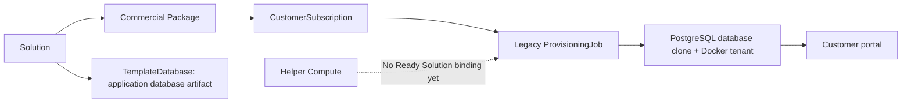

# Ready Solutions audit and next implementation plan

Date: 2026-09-12, Africa/Cairo. Repository: `/opt/projects/active/odoo-sh-local-mock`.
Inspected HEAD: `1f96959e9f5fd4c29531b5e83cdbe2fae213b337` plus the existing dirty working tree.
Scope: repository audit and planning only. No runtime code changed.

## Executive summary

Ready Solutions is an existing product line, not a blank implementation. It has
first-class Solution and commercial Package records, three seeded verticals,
public catalog/details pages, operator CRUD, authenticated demo trial confirmation,
subscriptions, a legacy PostgreSQL/Docker tenant worker, portal status and backup
infrastructure. **It does not yet implement the requested solution → deployment
profile → compute recommendation → itemized price → checkout → Helper Compute path.**

Estimated completion against that end-to-end target: **approximately 35% (judgment
range 25–45%)**. This is a scope estimate, not a test coverage or production-readiness
metric: discovery and commercial records exist; demo/runtime pieces are partial;
solution-specific resource profiles, integrated resource selection, paid checkout
and the Helper Compute/application-install handoff are missing. Catalog/portal
foundations are substantially more complete than the target deployment journey.

Veterinary is the best first vertical **because it has two packages and the most
existing fixtures/tests**, not because its veterinary application is proven ready.
Current seeds advertise appointments/patients, but the included initializer installs
only Odoo `base`. No veterinary application bundle, validated business workflows or
benchmarked resource profile was established in this repository.

Recommended next checkpoint: **RS1 — Ready Solution Catalog & Deployment Profiles**.
Extend existing records and pages; add versioned solution deployment profiles and
an offline recommendation/estimate adapter using existing Helper Compute catalog
and pricing functions. Do not rebuild the catalog, add another billing system, or
connect any provisioning worker. Proposed implementation acceptance token:
`CHECKPOINT_RS1_CATALOG_DEPLOYMENT_PROFILES_PASS` (not issued by this audit).

## Evidence and verification limits

Primary sources below are current files, with function/class names where useful:

| Source | Evidence |
| --- | --- |
| `control-api/app/models.py` | Solution, Package, TemplateDatabase, CustomerSubscription, ProvisioningJob, Tenant, TenantEnvironment, BackupPolicy; separate Cloud and Helper Compute models |
| `control-api/app/services/catalog_service.py` | CRUD, `list_public_solutions`, `seed_demo_catalog`, subscription snapshots |
| `control-api/app/schemas_saas.py`, `services/saas_serialization.py` | validation and actual public/operator response fields |
| `control-api/app/api/catalog.py`, `app/main.py` | public JSON, operator CRUD, `/catalog`, aliases and trial/portal routes |
| `control-api/app/templates/catalog.html`, `catalog_solution.html`, `portal/trial_confirm.html` | actual customer links, fields and trial form |
| `control-api/app/services/portal_service.py` | eligibility, package-specific trial duration, idempotency, ownership, queued provisioning |
| `control-api/app/services/template_init_service.py` | placeholder-to-PostgreSQL template initialization; `-i base` only |
| `control-api/app/services/provisioning_service.py`, `tenant_postgres_service.py`, `tenant_docker_service.py`, `provisioning_rollback.py` | legacy database clone/container path and rollback |
| `control-api/app/services/customer_serialization.py` | safe launch links, status/ownership presentation; no credential delivery |
| `control-api/app/product_lines.py`, `services/cloud_demo_lifecycle_service.py`, `cloud_pricing_service.py` | separate Cloud lifecycle/pricing; not Ready Solutions behavior |
| `control-api/app/services/helper_compute/{catalog,pricing,recommendation,provisioning_contract}.py`, `app/api/helper_compute.py` | reusable resource functions and current integration constraints |
| `docs/PHASE8_PROVISIONING_WORKER.md`, `PHASE9_CUSTOMER_PORTAL.md`, `DUAL_COMMERCIAL_JOURNEY.md`, `THREE_PRODUCT_LINES.md` | historical intent; code takes precedence where they differ |

Existing relevant tests were executed with outbound socket connections blocked,
all Helper Compute Proxmox environment overrides removed from the test process,
and the repository's temporary SQLite fixtures. **60 passed, 30 warnings in 27.70s.**
These prove mocked application behavior, not live veterinary module functionality,
current production database contents, public routing or a successful real demo.
No live control database inventory or deployment was performed. “Seeded” below
means the checked-in seed definition exercised in isolated tests, not a claim that
every running installation contains identical rows. No external veterinary repo,
Proxmox endpoint, existing customer tenant, or infrastructure service was accessed.

## Current architecture and data model

| Model / actual table | Important fields and relationships | Current usage / seed / exposure | Gaps relevant to target |
| --- | --- | --- | --- |
| `Solution` / `solutions` | unique code, name/description, Odoo/current version, module CSVs, active status, is_demo, optional project/Git/stable branch; packages/templates/subscriptions | Three seed rows; public list/detail HTML and list JSON; operator CRUD | No industry/category, media, curated feature content, deployment profile, readiness distinction or tested workload data |
| `Package` / `packages` | solution FK; unique solution+code; monthly/annual decimal strings, currency, trial_days, users/branches/companies, filestore quota, backup entitlements, modules/features, API/staging/SLA | Four seeded commercial packages; UI comparison, public JSON, operator CRUD and entitlement snapshot | No CPU/RAM/disk profile or itemized resource fee; storage quota is not VM disk; no compute-plan FK |
| `TemplateDatabase` / `template_databases` | solution/package FKs; template_kind, edition, image/digest/module checksums, validation evidence/status, Odoo/solution version, source ID, state, optional PostgreSQL name | One draft placeholder per seeded solution; operator templates API/init; broader fields also support Platform templates | No vetted vertical artifact proof in seed; overlapping state/validation_status; legacy selector ignores package/version-specific compatibility |
| `CustomerSubscription` / `customer_subscriptions` | solution/package/customer FKs, subscription_type=solution, product_line=ready_solution, trial/billing/status dates, entitlement_snapshot; tenant and jobs | Created by trial/operator paths, not by catalog seed; customer/operator views | No RS resource selection, profile revision, compute quote/reservation link, paid order or checkout snapshot |
| `ProvisioningJob` / `provisioning_jobs` | subscription/tenant FKs, UUID/idempotency, operation, status/step/error/retry/rollback/audit | Created on trial; dedicated existing worker; operator API and customer status | Legacy Docker/PG path, not HC3 job; single-worker claim; no two-stage infrastructure/application contract |
| `Tenant` / `tenants` | subscription FK; DB/role/filestore/container/port, URLs, protected generated password, versions, node/status, metering/quota fields | Created by successful worker flow; customer-safe and operator views | Shared runtime record, not a solution resource profile; active is not a veterinary business acceptance result |
| `TenantEnvironment` / `tenant_environments` | tenant FK; unique tenant+environment type, status/domain/name | Worker creates a `production`-named environment even for a trial | Trial environment terminology and demo/production lifecycle separation need review |
| `BackupPolicy`, `TenantBackup` / `backup_policies`, `tenant_backups` | tenant/subscription policy snapshot, schedule/retention/quota and backup state | Policies attached on tenant provisioning; backup UI/services and tests exist | Reuse ownership/policy patterns; not evidence that RS trial expiry/cleanup is automated |
| `HelperComputeQuote`, `HelperComputeReservation` | resource/pricing snapshots, optional `solution` string and `compute_profile`, owner/expiry/state | Existing Compute/Cloud path; not created by RS catalog/trial | String context is not an FK to Solution or a versioned deployment profile; RS mapping missing |
| `CloudPlan`, `CloudApplicationPackage`, `CloudAddon`, Cloud orders/subscriptions/instances/requests/templates | separate helpers_cloud product line; priced Odoo bundles and Cloud lifecycle | Separate seeded Cloud product and UI | Reuse generic pricing/validation patterns only; do not relabel these rows as veterinary solution packages |
| `PlatformPlan`, legacy `Subscription`, project/build/module catalog entities | developer_platform, Git/build and module selection | Existing independent Developer Platform | Not prerequisites or commercial plan dependencies for Ready Solutions |

There is **no explicit Ready Solution deployment/resource profile** today. Existing
`compute_profile` fields belong to Helper Compute quote/reservation records. Existing
module categories are not an industry taxonomy for Solution.

Documentation drift: `THREE_PRODUCT_LINES.md` mentions `solution_packages`; the
actual ORM table is **`packages`**. Public `solution_to_dict()` does not add a
product_line field, although the subscription has one and some older docs describe
Ready Solution dictionaries as explicitly tagged. Both should be normalized in RS1's
contracts, without renaming existing tables or rewriting unrelated documentation now.

## Exact seed catalog

`seed_demo_catalog()` is called by `init_db()`. It skips an already-existing solution
code entirely, so it does **not** repair missing packages/templates or overwrite an
operator-edited catalog on subsequent runs. All entries below are active,
`is_demo=True`, Odoo `19.0`, version `1.0.0-demo`, stable branch `main`, no GitHub repo.
There is no category, screenshot/media record, image URL, resource plan or compute
profile on any of these seeds. Descriptive business domains below are inferred from
names, not stored categories.

| Solution code | Name / business description | Required modules | Optional modules |
| --- | --- | --- | --- |
| `vet-hospital` | Veterinary Hospital; clinics, appointments, patients, billing | base, mail, contacts, account, stock | website, calendar |
| `hms` | Hospital Management System (HMS); admissions, wards, pharmacy, billing | base, mail, contacts, account, stock, purchase | hr, maintenance |
| `sis` | School Information System (SIS); students, classes, fees, parent portal | base, mail, contacts, account, website | calendar, survey |

Every package has monthly and annual prices **NULL**, currency USD, active status
and demo flag true. No seeded fee should be interpreted as zero-price production.

| Solution / package | Name | Trial days | Users / branches / companies | Filestore MB | Backup hours / retention days | API / staging | SLA | Enabled modules | Feature labels |
| --- | --- | --- | --- | --- | --- | --- | --- | --- | --- |
| vet-hospital / starter | Starter Clinic | 14 | 5 / 1 / 1 | 2048 | 24 / 7 | no / no | business_hours | base, mail, contacts, account | appointments, patients |
| vet-hospital / pro | Multi-Branch Hospital | 30 | 25 / 5 / 3 | 10240 | 12 / 14 | yes / yes | 24x5 | base, mail, contacts, account, stock | appointments, patients, inventory, staging |
| hms / essential | HMS Essential | 14 | 10 / 2 / 1 | 5120 | 24 / 7 | no / no | business_hours | base, mail, contacts, account | admissions, billing |
| sis / campus | SIS Campus | 21 | 50 / 3 / 1 | 8192 | 24 / 14 | yes / yes | business_hours | base, mail, contacts, account, website | students, fees, parent_portal |

Each solution receives `{code}-v1.0.0-demo-template`, with source identifier
`template://demo/{code}/1.0.0-demo`, `package_id=None`, `state=draft`, no checksum,
and notes explicitly describing a placeholder with no production database cloned.
These are database artifact references, not Proxmox templates. Source definitions
contain no veterinary image/gallery or actual veterinary module package.

## UI and API status

Current flow:
`/solutions` → `/catalog` → `/solutions/{code}` → `/catalog/{code}` → sign in →
package trial confirmation → subscription + queued legacy job → status → tenant link.

| Customer capability | Current result |
| --- | --- |
| Browse solutions | Yes: active catalog cards, names, descriptions, version and package summaries |
| Filter industry/category | No taxonomy/filter/search UI in these catalog pages |
| Open details | Yes: version/release, package comparison and entitlements |
| Features/modules | Yes as CSV-derived technical names and feature labels; no verified feature/module compatibility evidence |
| Screenshots | No solution gallery/media fields or rendered screenshots |
| Launch demo | Trial CTA exists when both solution/package are demo; depends on sign-in, validated template, worker and URL; not an instant shared demo |
| Choose package/edition | Can choose which commercial package trial to start; no customer Odoo edition selector |
| Choose usage/resources | No Ready Solution size or CPU/RAM/disk selection |
| Monthly price | Can render a non-demo populated Package price; all current seed details show demo/presentation text |
| Checkout | No Ready Solutions paid checkout; non-demo package branch is contact-sales text |
| Provisioning request | Yes for legacy demo trial only; no Helper Compute handoff |

The catalog template checks `user.github_connected` for the trial CTA and sends
unauthenticated users to `/login`. The server trial handler accepts the existing
session user; Cloud has a different customer authentication journey. RS1 should
preserve this flow; a consistent non-GitHub customer login is a later decision.
Trial confirmation has only hidden IDs, CSRF/idempotency and a terms checkbox:
**there is no company setup form in this Ready Solutions path**, despite historical
three-product prose suggesting a “configure company” step.

Public/customer contracts:

| Method / route | Current purpose |
| --- | --- |
| GET `/api/catalog/solutions` | active solutions with active packages; module/feature arrays and nullable prices |
| GET `/catalog`, `/catalog/{solution_code}` | rendered index and detail |
| GET `/solutions`, `/solutions/{solution_code}` | aliases redirecting to catalog |
| GET `/portal/trial/confirm` | owned-session confirmation using solution_id/package_id |
| POST `/portal/trial/start` | CSRF + confirmation + eligibility + idempotency; queues trial job |
| GET `/portal/provisioning/{job_id}`, `/api/portal/provisioning/{job_id}` | ownership-scoped job status |
| GET `/portal/subscriptions[/{id}]`, `/portal/tenants[/{id}]` | customer subscription/tenant views |

Operator catalog API has GET/POST `/api/operator/solutions`, PATCH/DELETE by ID;
POST `/api/operator/packages`, PATCH/DELETE by ID; GET/POST templates,
customer-subscriptions and tenants; POST tenant-environments. Operator HTML starts
at `/operator/solutions`. Provisioning API includes queue, job list/retry,
reconciliation, template validate-demo and worker health. These mutate when invoked;
none were invoked against the running application during this audit.

Missing: public JSON solution detail by code, deployment-profile list/detail,
solution-specific recommendation/estimate and paid checkout/provisioning contracts.
`/checkout` belongs to Developer Platform; `/cloud/...` checkout/pricing belongs to
Helpers ERP Cloud. Neither is a Ready Solutions checkout endpoint.

## What demo means here

Ready Solutions supports **a per-subscription isolated tenant cloned from a shared
source PostgreSQL template**, with its own role, filestore and Docker container.
It is neither a static screenshot demo nor an external veterinary application nor a
shared interactive database. Creation is queued; no infrastructure work runs inside
`start_demo_trial()`. A running worker could perform real PG/Docker work; “demo” is
not synonymous with “mock-only.” This audit did not run that worker.

Creation: active demo solution/package → no existing open subscription → entitlement
snapshot → package-duration trial begins immediately at request time → queued job →
validated/active solution template → PG clone → tenant role/environment/port/container
→ HTTP health → active tenant + backup policy. Initializing the seed template is an
explicit separate operation; `ensure_demo_template_validated()` initializes `base`
only. The worker picks the first eligible solution template by ID, not an explicitly
selected package artifact/version. It does not install the package's feature labels
or required veterinary modules during provisioning.

Duration: Veterinary Starter 14 days, Pro 30, HMS 14, SIS 21. The trial clock starts
before provisioning finishes. `CLOUD_DEMO_TRIAL_DAYS=7` and
`CLOUD_DEMO_GRACE_DAYS=3` are real constants used by the **separate Cloud demo
lifecycle**, not this flow. Ready Solution subscriptions recognize a `grace_period`
status, but no corresponding automatic duration/expiry/suspend/delete lifecycle was
found for these customer subscriptions. Launch authorization checks status rather
than comparing `trial_ends_at`; timestamps alone do not prove expiry enforcement.

Cleanup: failure rollback code removes tenant resources; it is not scheduled trial
expiry cleanup. Do not infer the Cloud retention/auto-destroy policy applies. The
rollback code uses tenant records and identifier checks; its filestore check tests
that the tenant code occurs in the path rather than proving a canonical root plus
job-bound ownership. Re-audit before reusing it for future owned-only cleanup.

Auth: portal ownership and CSRF exist. The worker generates a role secret and a
protected stored “admin password,” passing it as Odoo `admin_passwd` configuration.
That alone does **not** establish an Odoo user login/password reset. No Ready
Solution `res.users` credential reset or secure customer credential handoff was
found in this path. The existing success test asserts encrypted storage and HTTP
health, not a successful Odoo login. Historical claims of a unique working customer
admin login therefore need end-to-end proof. Public launch also depends on a verified
public URL; remote clients do not receive unusable localhost links by default.

## Pricing: current behavior and future boundary

| Component | Ready Solutions today |
| --- | --- |
| A. Application/solution fee | Commercial Package monthly/annual strings; all seed prices NULL |
| B. Platform/service fee | No separate component; historical contract is one package with included hosting/backup/user/storage entitlements |
| C. Compute/resources | No Ready Solution resource selection or separately calculated fee |
| D. Add-ons | No RS priced add-on entity/selection; optional modules/features are not a priced add-on catalog |
| E. Implementation/customization | No field, fee schedule or checkout item found |

Do not add a resource bill on top of an old “hosting included” package price without
an explicit commercial migration. Cloud's cents-based plan + extra users/storage +
application package + add-ons calculator is separate; its records must not be used
as Ready Solution subscriptions. Helper Compute already prices CPU + RAM + disk
with versioned demo rates and catalog validation, and Cloud's build resource page
already consumes those functions. That pattern is reusable; the Cloud product keys
and checkout session are not.

Future target: `monthly_total = solution_service_fee + resource_fee + add_ons`.
Treat any one-time implementation fee separately. Use currency + integer cents,
explicit pricing version/expiry and server-computed totals. Preserve NULL as
“not priced,” not zero. In RS1 show the resource estimate with demo/unapproved-price
labeling; solution fee and grand total remain “not configured” where applicable.
No payment button should be enabled by an incomplete price.

## Helper Compute boundary and deployment profile v1

```mermaid
flowchart LR
  S[Existing Solution + commercial Package] --> D[Versioned SolutionDeploymentProfile]
  D --> A[Ready Solutions recommendation adapter]
  A --> H[Existing Compute catalog validation + resource price]
  H --> V[Recommendation and estimate preview]
  V -. Later checkout .-> Q[Approved quote and reservation]
  Q -. Later provisioning .-> C[Helper Compute infrastructure request]
  C -. Infrastructure verified .-> I[Application artifact install or restore]
  I --> T[Tenant application acceptance]
```

Ready Solutions owns business metadata, package entitlements, artifact selection,
minimum/recommended resources and application acceptance. Helper Compute owns
sellable resource limits, capacity/pricing/leases and infrastructure providers.
An application deployment service owns artifact restore/install after infrastructure
is ready. No Solution/Profile field or public response should contain node names,
raw VMIDs, provider URLs/tokens, Proxmox bridges or storage-pool IDs.

Existing `ProvisioningRequest` is a useful later boundary: identity/idempotency,
tenant/customer, service/product, resources, logical image/template, environment and
business placement hints. It also exposes optional `preferred_node_id` and provider-like
storage-class values; an RS adapter must not accept/pass these from customers.
Map explicit `product_code=ready_solution` (rather than leaving its Cloud default),
solution/profile/artifact IDs in allowlisted metadata, logical region/storage/network,
and translate `storage_gb` to its `disk_gb` field with validated units. Do not create
fake tenants merely to fill a required request field in RS1. Profile/estimate preview
is enough; actual request creation requires the later commercial ownership contract.

Minimum proposed new entity: `SolutionDeploymentProfile` /
`solution_deployment_profiles`. Extend existing Solution; do not create a parallel
ReadySolution table. Prefer one new table initially:

| Field group | Minimum v1 decision |
| --- | --- |
| Identity | id, solution_id FK, code, revision; unique(solution_id, code, revision); immutable published revision |
| Scope/status | purpose (`demo` or `production`), status (`draft`, `published`, `retired`), clear `recommendation_only` readiness |
| Application artifact | optional template_database_id FK for existing vertical DB artifact; validate same solution and compatible Odoo/version/edition; NULL or draft means not deployable |
| Runtime compatibility | Odoo version + edition; default from known solution/artifact metadata, reject contradictions |
| Size | min/recommended vcpu, ram_gb, storage_gb; positive, recommended >= minimum, compatible with active Compute catalog steps/ranges |
| Usage | simple workload label such as small-clinic/multi-branch; optional expected-users advisory range, not a performance guarantee or entitlement |
| Resource policy | logical storage_class and whether customers may adjust above minimum; no provider selectors |
| Audit | created_at/updated_at; recommendation rationale and source/evidence reference |

Add a small optional `industry_code` on Solution for catalog filtering. Existing
required/optional modules and commercial package entitlements remain their source
of truth. A foreign-key mapping must not pretend current base-only templates contain
veterinary modules. Use the response to separate `recommendation_available` from
`deployment_ready=false` and provide a reason.

Defer worker tuning, DB engine/version ranges, regional compliance, bandwidth/public
IP/GPU, HA, migration/customization flags, backup-policy overrides, complex module
variants, compatibility join tables and a new add-on marketplace. Existing package
backup entitlements can be displayed without duplicating their policy in profiles.
Community/enterprise must be explicit, but enterprise availability must not be
inferred from an empty edition field or invented license entitlement.

A draft veterinary planning example may use HC's generic small profile (2 vCPU,
4 GB RAM, 80 GB disk) as a **clearly labeled unbenchmarked estimate**. It is not a
veterinary performance claim or approved deployment requirement. Final min/recommended
values require the actual application artifact and workload evidence. Missing evidence
must not prevent honest catalog/recommendation planning or enable real deployment.

Important reuse trap: existing `recommend_profile()` knows Cloud package guides
sales/trading/operations/full_erp and falls back to trading for unknown package codes.
`QuoteRequest.solution` is not used to select a vertical-specific profile. Do not
pass `vet-hospital` or `starter` into that fallback and call the result veterinary
sizing. Implement the explicit profile adapter outside HC; reuse HC's generic
catalog validation and resource pricing. Existing GET catalog/quote handlers also
call seeding, so RS1 preview should use read services/pure functions rather than
assuming every GET is side-effect-free. No capacity reservation on catalog reads.

## Template/package terminology

- **Solution**: veterinary/HMS/SIS business application.
- **Solution Package**: existing commercial `Package` (Starter Clinic, Pro).
- **Application artifact** / **application template**: versioned vertical Odoo
  database/container/module artifact; currently represented by TemplateDatabase.
- **Deployment profile**: application resource/compatibility requirements.
- **Infrastructure template**: Compute/provider VM image/template; owned and resolved
  internally by Helper Compute, never the Ready Solutions application artifact.

Do not introduce a new `solution_package` name for an artifact: it conflicts with
the already-established commercial Package term. A later richer `ApplicationArtifact`
entity is reasonable only when multiple artifact backends justify it; reuse the
existing template FK plus explicit kind/readiness for RS1.

## Veterinary first-solution readiness

Already present: `vet-hospital`, metadata, two packages, trial CTAs, module/feature
labels, placeholder template and extensive catalog/portal test fixtures. Missing:
curated screenshots, industry metadata, actual veterinary modules/assets, tested
application artifact, customer credentials/login, company configuration, measured
profile, explicit pricing components, payment contract, HC handoff, lifecycle policy
and veterinary workflow acceptance (patient/animal/owner, appointments, billing).

Keep the stable code. “Veterinary Clinic” can be a future product display choice;
do not silently change existing package codes or rebrand HMS/SIS into veterinary.
RS1 makes Veterinary the first complete **catalog + profile + recommendation** slice.
It must not claim Veterinary is a fully working deployed solution until separate
artifact/demo/business-flow acceptance is complete.

## Target customer journey and gaps

| Step | Current evidence | RS1/later action |
| --- | --- | --- |
| 1–3 Browse, select Veterinary, details | Working catalog/routes | Enhance existing pages; category and richer profile response |
| 4 Launch demo | Existing trial queue; seed artifact not ready | Preserve truthful legacy CTA/readiness; no automatic demo creation from new profile UI |
| 5 Included features | Feature/module labels exist | Curated presentation and honest unverified readiness |
| 6 Usage/company size | Missing | Profile/workload choice, distinct from paid entitlement |
| 7 Recommend resources | Missing RS mapping | RS1 profile adapter using HC catalog |
| 8 Adjust resources | Missing RS UI | RS1 optional adjustment with server validation and explicit failure reasons |
| 9 Itemized price | Nullable package price only | Resource estimate + unavailable solution fee/total where needed |
| 10 Checkout | No paid RS endpoint | Later commercial checkpoint; do not redirect into Cloud checkout |
| 11 Payment/reservation | No RS paid flow | Later server quote/expiry/ownership/idempotency integration |
| 12 Provisioning request | Legacy trial job only | Later provider-neutral RS application+infrastructure intent |
| 13 Helper Compute | No RS handoff | Later; HC3.6 live freeze/clone remains separately pending |
| 14 Install/restore package | Generic PG clone; base-only init | Later verified artifact/version/module/filestore restore |
| 15 Tenant active | Legacy HTTP-health state exists | Later application login + vertical workflow acceptance before claiming ready |

## Tests and technical debt

Existing audited/rerun files (counts are collected tests; these files are not solely
RS tests where their names indicate shared product flows):

| File under `control-api/tests` | Count | Coverage |
| --- | --- | --- |
| `test_saas_catalog.py` | 11 | CRUD, uniqueness, schema validation, demo seed, catalog authorization |
| `test_customer_portal.py` | 17 | public detail, auth/ownership, CSRF/trial/idempotency, launch/status behavior |
| `test_dual_journey.py` | 11 | independent Solution/Platform journey, redirects/subscriptions/entitlements |
| `test_product_line_regression.py` | 5 | vertical identity vs Cloud packages; trial linkage; product isolation |
| `test_provisioning.py` | 9 | queue/idempotency/eligibility, mocked success/failure/rollback/retry/operator API |
| `test_template_init.py` | 1 | PostgreSQL template identifier generation only, not veterinary module installation |
| `test_three_product_navigation.py` | 6 | navigation and sign-in/product route separation |
| **Executed total** | **60** | **All passed; 30 existing deprecation warnings** |
| `test_backups.py` | 20 | related policy, backup/quota/ownership tests; inspected inventory, not rerun |
| `test_backup_scheduler.py` | 8 | related schedule/retention/idempotency; inspected inventory, not rerun |
| `test_operator_auth.py` | 4 | adjacent operator access boundary; not rerun |

Platform/module/template/lifecycle suites also use some catalog fixtures; their
passing history is not proof of Ready Solutions trial expiration or application
readiness. No dedicated RS deployment-profile or veterinary end-to-end test exists.
The existing HC 318-test acceptance from the preceding session is historical here;
HC runtime was not changed or retested by this documentation-only audit.

Technical debt to carry explicitly:

1. “Demo” conflates catalog fixture, trial eligibility and runnable application.
2. Template validation is base-only; selector is first validated row per solution,
   not an immutable package/version/edition artifact selection.
3. Trial starts at request rather than activation; no verified RS expiry/grace cleanup
   or direct timestamp launch enforcement.
4. Generated database-manager secret is not demonstrated customer Odoo authentication.
5. Legacy worker claiming/rollback/duplicate-subscription transaction boundaries need
   review before scaling; do not transplant them into HC's durable mutation controls.
6. Filestore quota differs from VM disk; module/feature strings do not install code.
7. NULL decimal-string package prices and bundled-hosting intent need a commercial
   decision before introducing separate compute charges.
8. Seed skips existing solutions wholesale; migrations/seeds must preserve operator
   edits and explicitly repair only missing RS1 records.
9. Public serialization/terminology and old docs are not fully aligned; enrich
   responses additively and keep existing route aliases.
10. A queue entry or HTTP health check does not prove a working business solution.

## RS1 exact proposed scope and acceptance

Suggested files to add (proposal only):
`services/ready_solution_profile_service.py`,
`services/ready_solution_recommendation.py`, a focused profile schema module,
`tests/test_ready_solution_profiles.py`, `tests/test_ready_solution_recommendations.py`
and RS1 acceptance documentation. Extend `models.py`, the existing schema migration
path, catalog seed/service/serialization/API and the existing two catalog templates.
Keep Helper Compute runtime modules unchanged; call their stable pure functions.

1. Preserve Solution/Package and all legacy IDs/codes and subscriptions. Add one
   profile table plus the small industry field. Migrations are additive/idempotent
   and tested on disposable databases; no live migration/deploy in RS1 acceptance.
2. Seed Veterinary profile records without duplicating existing solutions/packages
   or overwriting operator metadata. Keep HMS/SIS visible as honest demo entries;
   profiles may be absent with a clear state instead of fabricated requirements.
3. Expose GET `/api/catalog/solutions/{code}` and nested profiles (or a profile GET
   subroute) with product_line, min/recommended units, artifact readiness and reasons.
   Preserve list response compatibility and omit internal provider/repo credentials.
4. Add a non-provisioning recommendation preview endpoint, e.g.
   POST `/api/catalog/solutions/{code}/recommendation`. It validates profile revision,
   package ownership/status, workload and optional resource adjustments; returns
   resource estimate/currency/pricing version and business-fee completeness.
5. Reuse HC catalog bounds/steps and pricing. Fail explicitly on absent/retired
   profiles or incompatible catalog limits; no generic trading fallback. Exclude
   provider node IDs from customer responses. Unknown fee is NULL with a reason.
6. Update details with profile choice, explained recommendation, optional sliders/
   inputs and separate estimate lines. Category filtering must use real metadata.
   No new checkout/provision buttons; preserve the existing legacy demo route while
   distinguishing its prerequisites from recommendation availability.
7. Test: FK/product isolation, duplicate revision and seed idempotency, missing/retired
   profile, min <= recommended and catalog boundaries/steps, invalid package/profile
   combinations, artifact solution/version/edition mismatch, unknown vs zero price,
   deterministic Decimal/cents pricing, no fallback, customer HTML/API agreement,
   CSRF where relevant, no provider identifiers/secrets, no tenant/job/reservation
   creation during reads/previews and no outbound network/worker calls.
8. Run the 60-test existing slice above plus focused RS1 tests and the appropriate
   unchanged HC catalog/pricing/UI regressions. Do not weaken accepted assertions.

Out of scope: real or mocked-as-real provisioning acceptance; HC3 runtime changes;
Proxmox calls; powering on pve-test; payment/billing redesign; importing/building the
separate veterinary repo; installing modules; running template initialization;
changing legacy demo TTLs or Cloud E1.7/TM-D12 flows; broad auth redesign; HA/migration/
customization engines; automatic cleanup; deploy/commit/push/merge.

RS1 completion means a real existing Solution record has an explicit, honest,
versioned deployment recommendation that the UI/API can consume without producing
infrastructure or tenants. It does not mean the Veterinary application is deployable.
Outstanding product inputs (not blockers for writing RS1): authoritative veterinary
artifact/module list, display naming/media, measured sizing, eventual price split,
customer login method, and eventual demo activation/expiry policy.

## Audit disposition

Only `docs/READY_SOLUTIONS_AUDIT_AND_NEXT_PLAN.md` was created in this session.
No runtime/test source, HC3.1–HC3.6 code, TM-D12, E1.7, separate repo or live data was
modified. Test outputs/cache were temporary files under `/tmp`. Existing dirty work
was preserved. No reset/stash/discard/commit/push/merge/deploy occurred.
Implementation has not started.

READY_SOLUTIONS_AUDIT_READY
