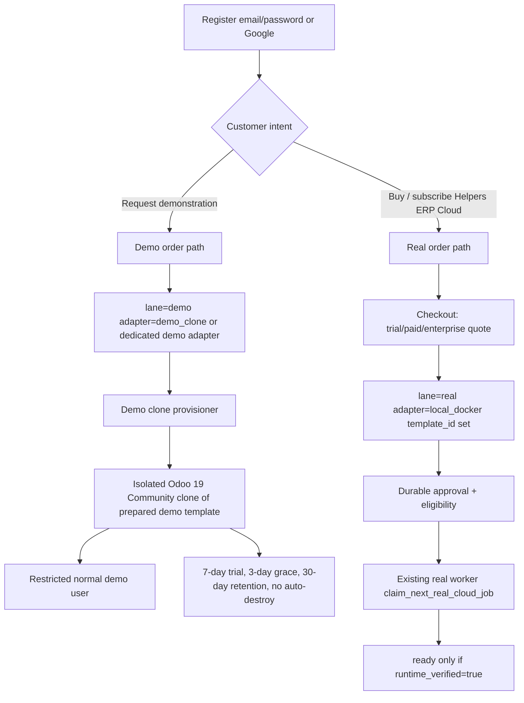

# Helpers ERP Cloud — Demo & Real Lane Master Plan

**Document role:** Session 0 reconstruction. Not an implementation.  
**Supervisor verification date:** 2026-09-07  
**Repository:** `/opt/projects/active/odoo-sh-local-mock`  
**HEAD (unchanged):** `1f96959e9f5fd4c29531b5e83cdbe2fae213b337`  
**Branch:** `main` tracking `origin/main`, **ahead 75**  
**Working tree:** **DIRTY** — preserve uncommitted cloud UX / Google OAuth work. Do not stash, revert, or overwrite overlapping files except these planning docs.

Roo job `07dc8fbf-6a23-4be6-85d3-5a7b7287f9f1` failed (OpenRouter connection). Recovery job `3e5036ad-f91d-4606-a3f3-fd03d8c41725` wrote a first draft of these files. The supervising agent independently verified the defect trace and **replaced** that draft because it was incomplete and incorrectly claimed `SESSION_PASS`.

---

## 1. Confirmed current behavior

### 1.1 Git and worktrees

| Item | Evidence |
| :--- | :--- |
| Main worktree | `/opt/projects/active/odoo-sh-local-mock` @ `1f96959` `[FIX] website: preserve Arabic locale navigation` |
| Dirty overlapping work | Modified: `cloud.py`, `cloud_auth_service.py`, `cloud_setup_service.py`, templates, i18n, compose files, tests. Untracked: `cloud_google_oauth.py`, Google register UX, public templates, UX evidence. **Likely ownership:** recent Cursor cloud-UX / Google-auth sessions (evidence under `docs/reports/evidence/cloud-*`). |
| Worktree `p2-cloud-disposable-provisioner` | `/tmp/p2-cloud-disposable-provisioner-p2_20260903T124908Z_6c905ccb2aa2` @ `73e75b9` |
| Worktree `p3-helpers-erp-cloud-controlled-activation` | `/tmp/p3-helpers-erp-cloud-p3` @ `a1c5d45` |
| Worktree `p3-helpers-erp-cloud-windows-uat` | `/tmp/p3-helpers-erp-cloud-windows-uat` @ `e7b2f07` |

Latest approved P2/P3 UAT/integration **code and reports are present** on this tree (`docs/reports/HELPERS_ERP_CLOUD_P3_*`, `HELPERS_ERP_CLOUD_UAT_V3_*`, eligibility tests). Live UAT tenants (`mosh-tenant-manual-uat-user1`…`user4`, ports 8301–8304) are **real-lane disposable Docker**, not Journey A isolated demo clones. Do not destroy them.

### 1.2 Customer checkout today (the known defect)

There is **one** customer confirm/checkout path. It always calls `checkout_demo`.

| Step | File | Behavior |
| :--- | :--- | :--- |
| POST `/cloud/setup/confirm` and POST `/cloud/checkout` | `control-api/app/api/cloud.py` `_confirm_submit` (≈1400–1423) | Calls `checkout_demo(...)` for every completed setup. |
| Order | `cloud_checkout_service.py` `checkout_demo` | `CloudOrder.status="demo_paid"`. No payment gateway. |
| Subscription | same | `status="demo_trial"` if `plan.is_demo` **or** `price_monthly_cents==0`; otherwise `status="demo_active"`. `renewal_at = now + max(plan.trial_days, 30)`. `template_id` is not a subscription field. |
| Provisioning request | same (≈113–125) | `status=queued`, `adapter="demo"`, **`template_id` omitted → NULL**, `runtime_verified=False`, `runtime_url=None`. |
| Instance | same | `queued`, `runtime_verified=False`. |
| UI | `cloud.py` provisioning page | Exposes `demo_adapter: req.adapter == "demo"`. |

Paid Starter/Business checkout still produces `adapter=demo` + `demo_active`. That is presentation-only, not production-eligible.

### 1.3 Real worker today (correct fail-closed refusal)

| Gate | File | Rule |
| :--- | :--- | :--- |
| Process enablement | `config.py`, `worker_main.py` `_should_process_cloud` | `helpers_cloud_real_provisioning_enabled=False` and `helpers_cloud_worker_max_jobs=0` by default. Worker must **not** be started for production. |
| Claim filter | `cloud_provisioning_service.py` `claim_next_real_cloud_job` | `helpers_cloud` + `adapter in {local_docker}` + `template_id IS NOT NULL` + `provisioning_approved=True` + due. **Never claims `adapter=demo`.** |
| Eligibility | `cloud_request_eligibility_reasons` | `adapter=demo` → `adapter_not_real`; `template_id is None` → `template_missing`; `status` starting with `demo_` or not in `{active,trial,paid}` → `subscription_ineligible`; `plan.is_demo` → `plan_is_demo` except a **narrow Manual UAT** exception (`is_manual_uat_allowed` + exact UAT identity + `plan.code=="trial"`). Enterprise `quote_required` needs persisted `quote_approved`. |
| Durable approval | `approve_cloud_request_for_real_provisioning` | Refuses demo adapter: `"Demo adapter cannot be approved for real provisioning"`. Fingerprint `_compute_approval_fingerprint`. |
| Ready | `DemoCloudProvisioningAdapter.advance` | Demo progression stops at health-checks. **Never** sets `runtime_verified` or a URL. Comment: ready requires a verified runtime adapter. |

**Conclusion:** the worker is correct. The customer order path is not. **Do not weaken the worker.** Introduce a distinct production-eligible order/request path.

### 1.4 Historical records to preserve

From `docs/reports/HELPERS_ERP_CLOUD_PREMERGE_UI_UAT_REPORT.md` (do not rewrite rows to make tests pass):

- Request **1**: `queued`, `adapter=demo`, `provisioning_approved=0`
- Request **2**: `queued`, `adapter=demo`, `provisioning_approved=0`
- Request **3**: `rolled_back`, `adapter=local_docker`, `provisioning_approved=1` (P3 canary)

This Session 0 did **not** re-query live `control.db`. Treat the report as authoritative unless Session 8 UAT re-reads.

### 1.5 What already exists vs Journey A/B

| Capability | Exists? | Notes |
| :--- | :--- | :--- |
| Email/password cloud register/login | Yes (dirty tree also has Google OAuth fail-closed) | `cloud_auth_service.py`, untracked `cloud_google_oauth.py`. `google_oauth_configured()` requires flag + client id/secret + valid callback. |
| GitHub login on cloud | No (Platform-only) | Cloud registration nulls `github_id`/`github_login`. GitHub-only users are blocked from password cloud login (`github_only` / `github_email_conflict`). |
| Industry / package / language / company wizard | Partial | Setup wizard exists. Industry as a first-class catalog is not confirmed as a dedicated model. |
| Isolated demo DB clone per customer | **No** | Demo adapter is presentation-only. Clone exists only on **real** `local_docker` / UAT provisioner (`clone_database_from_template` in `cloud_docker_adapter.py`). |
| Prepared demo-template catalog | **No** dedicated demo templates | Real lane uses validated `cloud_base` templates (`CLOUD_TEMPLATE_KIND`). |
| Restricted demo Odoo user | Unknown / not on demo lane | Real UAT used portal users opening provisioned Odoo; not a demo-privilege model. |
| Demo expiration in portal | Incomplete | Subscription has `trial_ends_at` / `grace_ends_at`; checkout currently sets `renewal_at` to ≥30 days. DP6 lifecycle (`platform_trial_days=7`, grace 3, retention 30, `platform_trial_auto_terminate_enabled=False`) is **Developer Platform**, not proven wired to Helpers Cloud checkout. |
| Real checkout → eligible request | **No** | All customer checkout uses `checkout_demo`. |
| Real provisioner (DB, filestore, container, modules, URL, probes) | Yes (P2 adapter + P3 bounded worker) | Disabled by default. UAT used isolated compose + bounded worker. |
| `ready` only after `runtime_verified=true` | Yes on real lane | Demo lane never reaches ready. |

---

## 2. Target architecture

Two **independent** customer journeys. Never convert, promote, or reinterpret a demo request as a real request.



### 2.1 Demo lane (Journey A)

1. Register (email/password or Google fail-closed).
2. Select industry, package, modules, language, company.
3. **Request a demonstration** (not “pay” / not `checkout_demo` reuse for production).
4. Clone a **validated prepared demo template** into an **isolated** Odoo 19 Community database. Never expose the template DB. Never share one demo DB across customers.
5. Open as a restricted normal user (no Odoo admin, DB manager, server, Docker, PostgreSQL, or control-plane privileges).
6. Realistic prepared demo data.
7. Show expiration date.
8. Lifecycle: 7-day trial unless a later authoritative cloud-specific config is approved; 3-day grace; 30-day retention; automatic destructive termination **disabled**.

Demo requests remain ineligible for `claim_next_real_cloud_job`.

### 2.2 Real lane (Journey B)

1. Register and select a package.
2. Configure company.
3. Complete the **appropriate checkout** (trial without Enterprise quote; paid; Enterprise custom quote).
4. Create a real-eligible subscription (`trial` / `active` / `paid` — **not** `demo_*`) and provisioning request with `adapter=local_docker`, valid `template_id`, Community 19 selected server-side.
5. Pass durable approval gates that apply (Enterprise still needs quote approval; trial does not).
6. Claimed by the **existing** real worker (gate unchanged).
7. Create DB, filestore, runtime, config, selected modules, customer URL.
8. Runtime + HTTP + login + database + module verification.
9. `ready` only after `runtime_verified=true`.
10. Open from customer portal.

---

## 3. Demo vs real lane separation (mandatory)

| Signal | Demo lane | Real lane |
| :--- | :--- | :--- |
| Customer entry | Explicit “request demo” | Explicit checkout / subscribe |
| Order / request kind | New durable `lane` or `order_kind` (Session 1) | `real` |
| Subscription status | Demo-specific, never in `CLOUD_REAL_SUBSCRIPTION_STATUSES` | `trial` / `active` / `paid` |
| Adapter | Dedicated demo clone adapter **or** existing `demo` plus a new clone adapter that is **not** in `CLOUD_REAL_PROVISIONING_ADAPTERS` | `local_docker` only today |
| `template_id` | Validated **demo** template id (clone source), still ineligible for real claim | Validated `cloud_base` template |
| Worker | Separate demo provisioner | `claim_next_real_cloud_job` |
| Promotion | **Forbidden** | N/A |

`adapter=demo`, `demo_trial` / `demo_active`, missing `template_id`, or missing durable approval **must remain ineligible** for the real worker.

---

## 4. Proposed database / model / API / UI / worker changes

Session 0 does not implement these. Sequence is Sessions 1–9.

| Layer | Proposed change | Session |
| :--- | :--- | :--- |
| Models | Durable `lane` / `order_kind`; demo vs real request types; demo template catalog; demo clone metadata (source template id, isolated db name, expires_at); restricted demo user flags. Additive columns only. | 1–4 |
| Eligibility | Keep `cloud_request_eligibility_reasons` fail-closed. Add tests that new demo clone adapter cannot be claimed by the real worker. | 1, 3, 7 |
| Checkout | Split `_confirm_submit` / `checkout_demo` vs `checkout_real` (names TBD). Paid/trial real path must not call `checkout_demo`. | 5–6 |
| Demo catalog | Prepared templates per industry/package; validation job; never customer-accessible. | 2 |
| Demo provisioner | Isolated clone, restricted user, verification, rollback. Separate process/flag from real worker. | 3 |
| Lifecycle | Wire 7/3/30 + no auto-destroy to **cloud demo** (today DP6 constants are platform). Resolve catalog `trial_days=14` vs policy 7. | 4 |
| Portal UX | Demo status, expiration, Open Odoo (demo). | 5 |
| Real path | Subscription statuses eligible; template assignment; existing approval; existing worker. | 6–7 |
| Tests / UAT | Isolated disposable resources only. | 8–9 |

**Do not** add kubernetes to `CLOUD_REAL_PROVISIONING_ADAPTERS`. **Do not** start `helpers_cloud_real_provisioning_enabled`.

---

## 5. Template and demonstration-data design

- **Real templates:** existing validated `cloud_base` (`CLOUD_TEMPLATE_KIND`, healthy, `postgres_database_name` set). Keep for Journey B.
- **Demo templates:** new catalog of **prepared** demo snapshots (industry + package + language as needed). Validated before use. Customers receive **clones**, never the source DB.
- **Data:** realistic company/demo records baked into the template; no cross-tenant writes.
- **Open question for Sabry:** one template per package vs per industry×package×language.

---

## 6. Security and tenant isolation

- Fail-closed Google OAuth when credentials/callback missing (`google_oauth_configured`).
- GitHub authentication remains Developer Platform-only.
- Demo user: no Odoo admin / settings / apps install / database manager.
- No control-plane, Docker, PostgreSQL, or host secrets in the demo session.
- Per-customer database + role + filestore (same isolation pattern as real `local_docker` clone).
- Never log tokens, passwords, `.env`.
- Historical requests 1–3 and live UAT tenants are out of bounds for destructive cleanup.
- Manual UAT exception in eligibility must stay **narrow** and must not become a general `is_demo` bypass.

---

## 7. Lifecycle behavior

**Authoritative Session 0 policy (binding instructions):**

- Trial: **7 days** unless a later cloud-specific authoritative config is approved.
- Grace: **3 days**.
- Retention: **30 days**.
- Automatic destructive termination: **disabled**.

**Conflicts with current code (do not “fix” in Session 0):**

| Location | Current | Conflict |
| :--- | :--- | :--- |
| `cloud_catalog_service.py` trial plan | `trial_days=14`, `is_demo=True` | vs 7-day trial |
| `checkout_demo` | `renewal_at = now + max(trial_days, 30)` | vs 7-day trial |
| `product_lines.py` | `CLOUD_TRIAL_GRACE_DAYS_DEFAULT = 7` | vs 3-day grace |
| `config.py` DP6 | `platform_trial_days=7`, grace 3, retention 30, auto-terminate false | Matches policy but is **platform**, not proven for Helpers Cloud |

---

## 8. Migration and backward compatibility

- Additive schema only. No drops. Mirror legacy `error_code` / `error_summary` as today.
- Existing `adapter=demo` + `demo_trial` rows remain demo and ineligible.
- Do not mutate requests 1–3 or investigated customer/test rows to satisfy new tests. New tests use disposable fixtures.
- Dirty working tree: Session 1+ must not discard Google OAuth / UX files. Prefer a dedicated branch **from current dirty main** only after Sabry confirms, or isolated worktree.

---

## 9. Test strategy

- **Regression (must stay green):** `test_cloud_p1_2_eligibility.py`, `test_cloud_p1_3_durable_approval.py`, `test_cloud_p1_contracts.py`, `test_cloud_p1_atomic_concurrency.py`, `test_cloud_p3_eligibility_worker.py`.
- **New:** demo vs real order contracts; demo clone isolation; demo user privileges; lifecycle without destroy; real checkout eligibility without weakening the gate; Google fail-closed.
- **UAT:** isolated disposable compose only. Do not start the live production cloud worker. Do not change public DNS/TLS/routing.

Session 0 supervisor ran (in existing `odoo-sh-local-mock-control-api-1`, no worker start):

```
docker exec odoo-sh-local-mock-control-api-1 python -m pytest \
  tests/test_cloud_p1_2_eligibility.py \
  tests/test_cloud_p1_3_durable_approval.py \
  tests/test_cloud_p1_contracts.py \
  tests/test_cloud_p3_eligibility_worker.py \
  tests/test_cloud_google_oauth.py -q --tb=line
```

**Result: 115 passed, 10 warnings in 77.36s.** (Host `.venv` has no pip/pytest; tests used the running mock control-api image.)

---

## 10. Rollback strategy

- Session 0 docs only: delete `docs/helpers-erp-demo-cloud/` if these files must be discarded. HEAD unchanged.
- Later sessions: revert session branch; do not migrate down in ways that rewrite historical rows; demo/real workers remain flag-gated fail-closed.

---

## 11. Session plan (bounded, restartable)

| Session | Objective | Depends on | Stop when |
| :--- | :--- | :--- | :--- |
| **0** | Audit + these docs | — | Docs written; no app code. **This session.** |
| **1** | Domain contracts, state machines, eligibility rules, additive migrations, tests proving distinct demo vs real **order/request** records. Worker gate unchanged. | 0 | Contracts + tests pass; no cloner, no UX. |
| **2** | Prepared demo-template catalog, validation, demo-data strategy | 1 | Catalog + validation tests; no customer clone yet. |
| **3** | Isolated demo clone provisioner, restricted account, verification, rollback | 1–2 | Clone works in disposable env; real worker still refuses demo. |
| **4** | Demo lifecycle, expiration, portal status, safe cleanup controls | 3 | 7/3/30 + no auto-destroy wired to cloud demo. |
| **5** | Customer-facing demo journey + Open Odoo UX | 3–4 | End-to-end demo UX on isolated resources. Coordinate dirty UX files. |
| **6** | Distinct real checkout/subscription/request creation path | 1 | Customer paid/trial path no longer calls `checkout_demo`. |
| **7** | Real provisioning cycle + package/module verification | 6 + existing P2/P3 | Disposable real provision; `ready` iff `runtime_verified`. Worker not globally enabled. |
| **8** | Isolated E2E UAT both lanes | 5 + 7 | Both journeys pass on disposable resources. Preserve live requests 1–3. |
| **9** | Security review, regression, evidence, integration-readiness closeout | 8 | Report only. No merge/push/DNS unless Sabry authorizes. |

### Session 1 acceptance criteria

- Durable fields distinguish demo vs real orders/requests/subscriptions.
- Customer-shaped fixtures: demo path remains `adapter` not in `CLOUD_REAL_PROVISIONING_ADAPTERS` and ineligible; real path can be created with `local_docker` + `template_id` + non-`demo_*` status **without** changing `cloud_request_eligibility_reasons` to be more permissive.
- Migrations additive; requests 1–3 untouched.
- No demo cloner, no worker enablement, no merge/push.

### Session 1 exclusions

Application UI polish, template data authoring, Docker clone implementation, lifecycle worker, production flags, DNS/TLS, live worker, rewriting historical rows.

---

## 12. Explicit exclusions (all sessions unless Sabry authorizes)

- Do not convert demo → real.
- Do not weaken fail-closed eligibility.
- Do not start live production cloud worker (`helpers_cloud_real_provisioning_enabled`).
- Do not deploy, merge to `main`, push, or change public routing/DNS/TLS.
- Do not destroy existing tenants, DBs, volumes, records, branches, or evidence.
- Do not expose secrets.
- Do not implement Sessions 1–9 in the Session 0 chat.

---

## 13. Known blockers and decisions requiring Sabry

See `HELPERS_ERP_DEMO_CLOUD_DECISIONS.md`. Session 1 may proceed on contracts **without** waiting for template-per-industry, Google production credentials, or branch strategy if Session 1 stays off overlapping UX files where possible.
