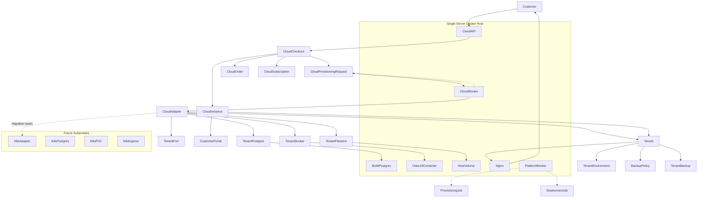
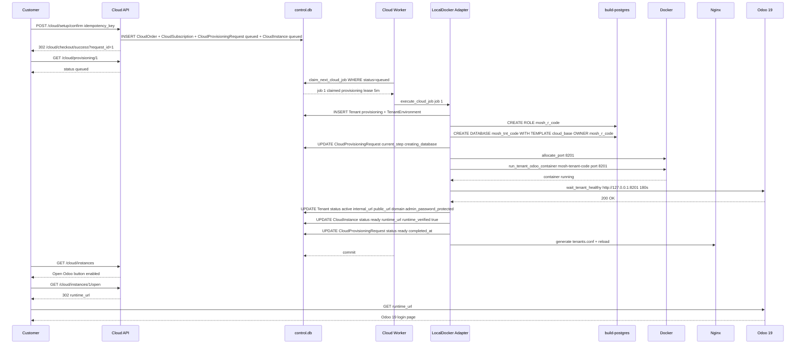

# Helpers ERP Cloud — Real Odoo 19 Instance Provisioning Plan

**Project:** `/opt/projects/active/odoo-sh-local-mock`
**Date:** 2026-09-02
**Mode:** Architect — Planning Only
**Inference:** OmniRoute `cursor-free` (`muse-spark-1.2-contributor-free`) — cursor-free inference, no code/data/service changes in this task
**Status:** PLANNING ONLY — no code modified, no data changed, no services restarted, no commits
**Save path:** [`planning/HELPERS_ERP_CLOUD_REAL_PROVISIONING_PLAN.md`](planning/HELPERS_ERP_CLOUD_REAL_PROVISIONING_PLAN.md)

---

## Table of Contents

1. [Executive Summary](#executive-summary)
2. [Current-State Findings](#current-state-findings)
3. [Root Cause: Why Cloud Instances Remain Queued](#root-cause-why-cloud-instances-remain-queued)
4. [Current Flow Map](#current-flow-map)
5. [Target Architecture — Single-Server Phase with K8s Migration Path](#target-architecture--single-server-phase-with-k8s-migration-path)
6. [Design Decisions and Rejected Alternatives](#design-decisions-and-rejected-alternatives)
7. [Eligibility, State Machine, and Cross-Cutting Contracts](#eligibility-state-machine-and-cross-cutting-contracts)
8. [Phased Gates P0–P7](#phased-gates-p0p7)
9. [Mermaid Architecture Diagram](#mermaid-architecture-diagram)
10. [Mermaid Provisioning Sequence Diagram](#mermaid-provisioning-sequence-diagram)
11. [Risk Register](#risk-register)
12. [Test Matrix](#test-matrix)
13. [Commit Sequence](#commit-sequence)
14. [Effort by Phase](#effort-by-phase)
15. [Decisions Requiring Sabry Approval](#decisions-requiring-sabry-approval)
16. [Readiness Verdict](#readiness-verdict)
17. [Appendix: Files Inspected](#appendix-files-inspected)

---

## Executive Summary

Helpers ERP Cloud onboarding is **UI-complete and demo-complete** but **runtime-incomplete**. A customer can register, configure a plan, confirm an order, and see an instance record, but that instance never leaves `queued`. No PostgreSQL database, filestore, Odoo container, domain, or credentials are created. The `Open Odoo` button is correctly gated behind `ready + runtime_verified + runtime_url`, so it remains unavailable — by design for the demo adapter.

The next phase must convert an eligible Cloud order into a **real, isolated Odoo 19 Community container** on the current single-server Docker host, reusing the proven Developer Platform provisioning primitives without mixing product ownership. The plan below defines a safe, idempotent, observable, and reversible path from `Queued → Provisioning → Ready` with explicit rollback, health verification, and tenant isolation, while preserving all existing Cloud and Developer Platform tests and screenshot evidence.

**Main architectural recommendation:** Introduce a **dedicated Cloud provisioning worker path** that reuses [`control-api/app/services/tenant_postgres_service.py`](control-api/app/services/tenant_postgres_service.py), [`control-api/app/services/tenant_docker_service.py`](control-api/app/services/tenant_docker_service.py), [`control-api/app/services/tenant_port_service.py`](control-api/app/services/tenant_port_service.py), and [`control-api/app/services/provisioning_identifiers.py`](control-api/app/services/provisioning_identifiers.py) behind a new `CloudRealProvisioningAdapter` and `cloud_provisioning_worker` claim/execute loop, with a **new `cloud_tenant` linkage** to the existing [`control-api/app/models.py:Tenant`](control-api/app/models.py:437) table via `product_line=helpers_cloud` and a Cloud-specific template source. Do **not** repurpose `ProvisioningJob` for Cloud; keep `CloudProvisioningRequest` as the Cloud queue and add lease/attempt/timeout fields to it. Keep `Tenant` as the shared runtime record but enforce strict `product_line` isolation at every query.

---

## Current-State Findings

### 1. Cloud Order and Instance Models

**Files:**
- [`control-api/app/models.py`](control-api/app/models.py:1105) — `CloudPlan`, `CloudOdooVersion`, `CloudApplicationPackage`, `CloudAddon`, `CloudSetupSelection`, `CloudSetupAddonSelection`, `CloudOrder`, `CloudSubscription`, `CloudProvisioningRequest`, `CloudInstance`
- [`control-api/app/product_lines.py`](control-api/app/product_lines.py:28) — `CLOUD_PROVISION_*` constants, `CLOUD_DEMO_PROGRESSION`, `PRODUCT_LINE_HELPERS_CLOUD`
- [`control-api/app/services/cloud_catalog_service.py`](control-api/app/services/cloud_catalog_service.py:138) — seed for plans/versions/packages/addons + demo customer
- [`control-api/app/services/cloud_setup_service.py`](control-api/app/services/cloud_setup_service.py:1) — wizard persistence, validation, subdomain checks
- [`control-api/app/services/cloud_checkout_service.py`](control-api/app/services/cloud_checkout_service.py:35) — `checkout_demo` creates `CloudOrder` + `CloudSubscription` + `CloudProvisioningRequest` + `CloudInstance` in one transaction
- [`control-api/app/services/cloud_provisioning_service.py`](control-api/app/services/cloud_provisioning_service.py:1) — `DemoCloudProvisioningAdapter` + `CloudProvisioningService`

**Findings:**
- `CloudOrder` has `idempotency_key` unique, `status=demo_paid`, `pricing_snapshot_json`, `configuration_snapshot_json`. No payment gateway; demo only.
- `CloudSubscription` links `plan_id`, `version_id`, `package_id`, `code`, `status` (`demo_trial` or `demo_active`), `requested_users`, `requested_storage_gb`.
- `CloudProvisioningRequest` fields: `request_uuid`, `idempotency_key`, `status` default `queued`, `current_step`, `adapter=demo`, `runtime_url=None`, `runtime_verified=False`. **Missing:** `claimed_by`, `attempt_count`, `max_attempts`, `started_at`, `completed_at`, `lease_expires_at`, `error_code/summary` is present but no retry/lease semantics.
- `CloudInstance` fields: `requested_subdomain` unique, `status=queued`, `runtime_url=None`, `runtime_verified=False`, `plan_code`, `package_code`, `odoo_version_code`. **Missing:** `database_name`, `database_role`, `filestore_path`, `container_name`, `http_port`, `admin_password_protected`, `tenant_id` FK, `domain`, `internal_url`, `public_url`. It is a **presentation record**, not a runtime record.
- `CloudProvisioningService.can_open_odoo` correctly requires `status==ready && runtime_verified && runtime_url` — so `Open Odoo` is unavailable until a real adapter verifies a runtime.
- `CLOUD_DEMO_PROGRESSION` stops at `running_health_checks`; `DemoCloudProvisioningAdapter.advance` explicitly never sets `runtime_verified` or `runtime_url` and never reaches `ready`.

### 2. Provisioning Worker

**Files:**
- [`control-api/app/worker_main.py`](control-api/app/worker_main.py:1) — `run_worker_loop` polls `claim_next_template_build_job` → `claim_next_deployment_job` → `claim_next_job` (ProvisioningJob) → `process_due_lifecycle_tick`
- [`control-api/app/services/provisioning_service.py`](control-api/app/services/provisioning_service.py:189) — `claim_next_job` for `ProvisioningJob` (Ready Solutions), `execute_provisioning_job` with full Docker/Postgres lifecycle
- [`control-api/app/services/deployment_service.py`](control-api/app/services/deployment_service.py:116) — `claim_next_deployment_job` / `execute_deployment_job` for Platform Quick Deploy
- [`control-api/app/services/platform_template_service.py`](control-api/app/services/platform_template_service.py:1) — template builds
- [`control-api/app/config.py`](control-api/app/config.py:62) — `tenant_root`, `tenant_host_root`, `tenant_port_min/max`, `provisioning_worker_poll_sec`, `provisioning_heartbeat_path`

**Findings:**
- Worker **does not claim or execute `CloudProvisioningRequest` at all**. No import of `cloud_provisioning_service` in worker. Cloud queue is orphaned.
- `claim_next_job` for `ProvisioningJob` uses simple `SELECT ... WHERE status==queued ORDER BY id LIMIT 1` then `UPDATE` — SQLite MVP, comment notes `FOR UPDATE SKIP LOCKED` for Postgres. No lease, no timeout, no heartbeat per job.
- `reconcile_stale_running_jobs` exists for `ProvisioningJob` (60 min in worker, 30 min default) but not for Cloud.
- Worker heartbeat is file-based at `provisioning_heartbeat_path`; no per-job heartbeat.

### 3. Deployment / Provisioning Services

**Files:**
- [`control-api/app/services/provisioning_service.py`](control-api/app/services/provisioning_service.py:211) — `execute_provisioning_job` does: `reserve_tenant` → `create_role` → `clone_database` → `create_environment` → `allocate_port` → `start_odoo` → `health_check` → `active` + `ensure_backup_policy_for_tenant`
- [`control-api/app/services/deployment_service.py`](control-api/app/services/deployment_service.py:188) — similar but with `install_modules_one_shot` for Platform
- [`control-api/app/services/tenant_docker_service.py`](control-api/app/services/tenant_docker_service.py:48) — `run_tenant_odoo_container`, `wait_tenant_healthy`, `remove_tenant_container`
- [`control-api/app/services/tenant_postgres_service.py`](control-api/app/services/tenant_postgres_service.py:60) — `create_tenant_role`, `clone_database_from_template`, `drop_tenant_role/database`
- [`control-api/app/services/tenant_port_service.py`](control-api/app/services/tenant_port_service.py:1) — `allocate_tenant_port`
- [`control-api/app/services/provisioning_identifiers.py`](control-api/app/services/provisioning_identifiers.py:1) — `generate_tenant_code`, `generate_database_name`, `generate_role_name`, `generate_admin_password`, `generate_job_uuid`
- [`control-api/app/services/deployment_rollback.py`](control-api/app/services/deployment_rollback.py:1) and [`control-api/app/services/provisioning_rollback.py`](control-api/app/services/provisioning_rollback.py:1) — rollback helpers

**Findings:**
- Provisioning primitives are **mature and reusable**: role creation, DB clone with `CREATE DATABASE WITH TEMPLATE`, filestore `chown`/`chmod`, port allocation, Odoo container run with `odoo.conf` bind mount, health check via `wait_odoo_healthy`.
- `Tenant` model already supports `customer_subscription_id`, `platform_trial_id`, `deployment_mode`, `product_line`, `database_name`, `database_role`, `filestore_path`, `container_name`, `http_port`, `internal_url`, `public_url`, `admin_password_protected`, `status`. Cloud currently **does not create a `Tenant` at all** — it creates `CloudInstance` instead.
- `TenantEnvironment` is created for Platform/Ready Solutions but not for Cloud.
- `BackupPolicy` is created via `ensure_backup_policy_for_tenant` / `ensure_backup_policy_for_platform_tenant` — Cloud has no equivalent.

### 4. Docker Compose and Runtime Configuration

**Files:**
- [`docker-compose.yml`](docker-compose.yml:1) — `control-api`, `provisioning-worker`, `backup-worker`, `build-postgres`
- [`docker-compose.e2e.yml`](docker-compose.e2e.yml:1) — e2e overrides
- [`control-api/app/config.py`](control-api/app/config.py:10) — `Settings`
- [`control-api/app/services/docker_service.py`](control-api/app/services/docker_service.py:1) — `ensure_image`, `wait_odoo_healthy`, `write_odoo_conf_file`

**Findings:**
- Single Postgres `build-postgres` (postgres:16-alpine) serves both builds and tenants. `Tenant` DBs are created via `CREATE DATABASE WITH TEMPLATE` on same host.
- `control-api` and `provisioning-worker` share `/data` and `/var/run/docker.sock`, same `DATABASE_URL=sqlite:////data/control.db` (SQLite in production path; Postgres for tenant DBs only).
- `tenant_root=/data/tenants`, `tenant_host_root=/opt/projects/active/odoo-sh-local-mock/data/tenants`, `tenant_port_min=8201`, `tenant_port_max=8298`, `build_port_min=8101`, `build_port_max=8198` — no overlap, but no Cloud-specific port range.
- `odoo:19.0` image is default; `odoo_image_for_version` selects image by major version.
- No Nginx/reverse-proxy service in compose; `tenant_public_base_url` is empty, so `public_url` is not set. `internal_url` is `http://127.0.0.1:{port}/`.
- No TLS, no per-tenant Nginx vhost, no subdomain routing.

### 5. Template Database Logic

**Files:**
- [`control-api/app/services/template_init_service.py`](control-api/app/services/template_init_service.py:1) — `ensure_demo_template_validated`, `get_validated_template_db`, `template_postgres_name`
- [`control-api/app/models.py`](control-api/app/models.py:335) — `TemplateDatabase` with `solution_id`, `package_id`, `template_code`, `template_kind`, `postgres_database_name`, `state`, `validation_status`
- [`control-api/app/services/platform_template_service.py`](control-api/app/services/platform_template_service.py:1) — platform base template builds

**Findings:**
- Template system is **Solution-centric** (`Solution` + `Package` + `TemplateDatabase` with `solution_id`). Cloud has `CloudApplicationPackage` and `CloudPlan` but **no `TemplateDatabase` linkage** for Cloud. No `cloud_template` kind.
- `ensure_demo_template_validated` only works for `is_demo` Solutions and runs `odoo -i base --stop-after-init` to create a clonable DB. Cloud would need either a Cloud-specific template or reuse of a base `odoo:19.0` empty DB + module install.
- `get_validated_template_db` is called by `provisioning_service` to get `source_db` for clone. Cloud has no equivalent call.
- `TemplateDatabase` has `installed_module_set_json`, `module_catalog_checksum`, `container_image` — Cloud packages have `standard_modules_json` + `helpers_modules_json` but no template build pipeline.

### 6. Tenant / Domain Routing

**Files:**
- [`control-api/app/models.py`](control-api/app/models.py:437) — `Tenant` with `domain`, `public_url`, `internal_url`
- [`control-api/app/product_lines.py`](control-api/app/product_lines.py:78) — `RESERVED_SUBDOMAINS`, `CLOUD_HOSTNAME_SUFFIX=helpers-erp.example`, `CLOUD_SUBDOMAIN_MIN/MAX`
- [`control-api/app/services/cloud_setup_service.py`](control-api/app/services/cloud_setup_service.py:50) — `SUBDOMAIN_RE`, `validate_subdomain_value`, `workspace_hostname`, `subdomain_taken`

**Findings:**
- Subdomain validation is solid: regex `^[a-z0-9](?:[a-z0-9-]{0,46}[a-z0-9])?$`, reserved list, clash check against `CloudSetupSelection` and `CloudInstance`. No check against `Tenant.domain` or DNS.
- `workspace_hostname` returns `{subdomain}.helpers-erp.example` — but this is **display only**, not a real DNS or Nginx config.
- No `Tenant.domain` is set for Cloud; no Nginx, no `/etc/hosts`, no wildcard DNS, no reverse proxy.

### 7. Backup and Rollback Mechanisms

**Files:**
- [`control-api/app/services/backup_service.py`](control-api/app/services/backup_service.py:1) — `ensure_backup_policy_for_tenant`, `queue_backup`, `execute_backup_job`, `claim_next_backup_job`
- [`control-api/app/services/backup_retention.py`](control-api/app/services/backup_retention.py:1) — retention
- [`control-api/app/services/backup_worker_main.py`](control-api/app/backup_worker_main.py:1) — backup worker loop
- [`control-api/app/services/deployment_rollback.py`](control-api/app/services/deployment_rollback.py:1) — deployment rollback
- [`control-api/app/services/provisioning_rollback.py`](control-api/app/services/provisioning_rollback.py:1) — provisioning rollback
- [`control-api/app/models.py`](control-api/app/models.py:513) — `BackupPolicy`, `TenantBackup`, `RestoreJob`

**Findings:**
- Backup system is tied to `Tenant` (not `CloudInstance`). Since Cloud has no `Tenant`, it has no backup policy, no retention, no quota enforcement.
- Rollback for `ProvisioningJob`/`DeploymentJob` drops DB, role, container, filestore. Cloud has no rollback path.
- `BackupPolicy` fields: `frequency_hours`, `retention_days`, `storage_quota_mb`, `backup_storage_quota_mb`, `max_users` — Cloud `CloudPlan` has `backup_retention_days`, `included_storage_gb`, `max_storage_gb` but no mapping to `BackupPolicy`.

### 8. Current Tests and Documentation

**Files:**
- [`control-api/tests/test_helpers_erp_cloud.py`](control-api/tests/test_helpers_erp_cloud.py:1) — 20+ tests for Cloud journey, pricing, checkout idempotency, provisioning transitions, isolation, CSRF, no-card-secrets
- [`control-api/tests/test_provisioning.py`](control-api/tests/test_provisioning.py:1) — provisioning queue/execution
- [`control-api/tests/test_platform_deployment.py`](control-api/tests/test_platform_deployment.py:1) — deployment
- [`control-api/tests/test_backups.py`](control-api/tests/test_backups.py:1) — backups
- [`control-api/e2e/specs/cloud-onboarding-full-journey.spec.js`](control-api/e2e/specs/cloud-onboarding-full-journey.spec.js:1) — Playwright journey
- [`docs/reports/HELPERS_ERP_CLOUD_ONBOARDING_UI_TEST_EVIDENCE.md`](docs/reports/HELPERS_ERP_CLOUD_ONBOARDING_UI_TEST_EVIDENCE.md:1) — screenshot evidence
- [`docs/CLOUD_ONBOARDING_UI_ENHANCEMENT_PLAN.md`](docs/CLOUD_ONBOARDING_UI_ENHANCEMENT_PLAN.md:1) — UI plan
- [`control-api/app/api/cloud.py`](control-api/app/api/cloud.py:1) — Cloud routes

**Findings:**
- Tests assert `runtime_verified is False`, `runtime_url is None`, `can_open_odoo is False`, and that `DemoCloudProvisioningAdapter` never reaches `ready`. These must remain green — they are **demo-contract tests**.
- No test covers real Cloud provisioning (DB/container/filestore) — expected, since it doesn't exist.
- Playwright journey ends at `Queued` with no `Open Odoo` — must be preserved as regression, with a new journey for `Ready`.

---

## Root Cause: Why Cloud Instances Remain Queued

**Exact root cause:** `CloudProvisioningRequest` is an **orphaned queue** with no worker.

1. [`control-api/app/services/cloud_checkout_service.py:113`](control-api/app/services/cloud_checkout_service.py:113) creates `CloudProvisioningRequest(status=queued, adapter=demo)` and [`control-api/app/services/cloud_checkout_service.py:128`](control-api/app/services/cloud_checkout_service.py:128) creates `CloudInstance(status=queued)` — both with `runtime_verified=False`.
2. [`control-api/app/services/cloud_provisioning_service.py:38`](control-api/app/services/cloud_provisioning_service.py:38) `DemoCloudProvisioningAdapter.advance` is presentation-only: it cycles through `CLOUD_DEMO_PROGRESSION` but **explicitly never sets `runtime_verified` or `runtime_url`** and **never transitions to `ready`** (see comment at line 55: `Stay on running_health_checks. Ready requires a verified runtime adapter.`).
3. [`control-api/app/services/cloud_provisioning_service.py:126`](control-api/app/services/cloud_provisioning_service.py:126) `transition` to `ready` requires `runtime_verified=True` — which demo never provides — so `ready` is unreachable.
4. [`control-api/app/worker_main.py:44`](control-api/app/worker_main.py:44) `run_worker_loop` claims only `PlatformTemplateBuildJob`, `DeploymentJob`, and `ProvisioningJob`. It **never imports or claims `CloudProvisioningRequest`**. No other process polls the Cloud queue.
5. `CloudInstance` is not a `Tenant`; therefore none of the existing provisioning primitives (`create_tenant_role`, `clone_database_from_template`, `run_tenant_odoo_container`, `allocate_tenant_port`, `ensure_backup_policy_for_tenant`) are invoked for Cloud.
6. No template source exists for Cloud: `TemplateDatabase` is Solution-linked, Cloud has no `TemplateDatabase` row, so even if a worker existed it would have no `source_db` to clone.

**Result:** Every Cloud order ends at `queued` forever. The `Open Odoo` guard in [`control-api/app/services/cloud_provisioning_service.py:119`](control-api/app/services/cloud_provisioning_service.py:119) correctly blocks the button.

---

## Current Flow Map

### From Order Confirmation to Last Implemented Function/DB State

```
Customer: POST /cloud/setup/confirm  (csrf + idempotency_key)
  → [`control-api/app/api/cloud.py:715`](control-api/app/api/cloud.py:715) _confirm_submit
    → [`control-api/app/services/cloud_checkout_service.py:35`](control-api/app/services/cloud_checkout_service.py:35) checkout_demo
      → review_snapshot (pricing + config validation)
      → INSERT CloudOrder (order_code, idempotency_key, pricing_snapshot_json, configuration_snapshot_json)
      → INSERT CloudSubscription (plan_id, version_id, package_id, code, status=demo_trial/demo_active)
      → INSERT CloudProvisioningRequest (request_uuid, idempotency_key=provision:{key}, status=queued, adapter=demo, runtime_verified=False)
      → INSERT CloudInstance (requested_subdomain, plan_code, package_code, odoo_version_code, status=queued, runtime_verified=False)
      → UPDATE CloudSetupSelection status=submitted
      → COMMIT
  → Redirect 302 /cloud/checkout/success?request_id={req.id}
  → GET /cloud/instances → list_instances shows status=queued, Open Odoo disabled
  → GET /cloud/provisioning/{id} → shows demo progression, no runtime_url

DB state after checkout:
  cloud_orders: 1 row, status=demo_paid
  cloud_subscriptions: 1 row, status=demo_trial
  cloud_provisioning_requests: 1 row, status=queued, adapter=demo, runtime_verified=False
  cloud_instances: 1 row, status=queued, runtime_verified=False, runtime_url=None
  tenants: 0 rows for this subscription
  No database, no filestore, no container, no port, no backup_policy
```

**Last implemented function:** [`control-api/app/services/cloud_checkout_service.py:158`](control-api/app/services/cloud_checkout_service.py:158) `return order, sub, req, inst` — the transaction commits and the HTTP layer redirects. No async job is enqueued to a real worker.

---

## Target Architecture — Single-Server Phase with K8s Migration Path

### Principles

- **Product-line isolation:** Every table row carries `product_line=helpers_cloud` and every query filters by it. No Cloud code touches `ProvisioningJob` or `DeploymentJob` tables; no Platform code touches `CloudProvisioningRequest`.
- **Reuse, don't fork:** Reuse `tenant_postgres_service`, `tenant_docker_service`, `tenant_port_service`, `provisioning_identifiers`, `docker_service`, `backup_service` as **shared libraries** behind product-line-specific adapters. No copy-paste.
- **Single-server now, K8s later:** All provisioning goes through an **adapter interface** (`CloudProvisioningAdapter`) with two implementations: `LocalDockerCloudAdapter` (now) and `KubernetesCloudAdapter` (future). The worker, state machine, and API remain identical.
- **Idempotency and leases:** Every provisioning request has `idempotency_key` unique, `attempt_count`, `max_attempts`, `claimed_by`, `lease_expires_at`, `started_at`, `completed_at`. Workers claim via atomic `UPDATE ... WHERE status=queued` with lease.
- **Observability:** Structured audit events, heartbeat per job, and operator visibility via existing `AuditEvent` + new `cloud_provisioning_events` view.

### Components

| Layer | Component | Responsibility |
|-------|-----------|---------------|
| API | [`control-api/app/api/cloud.py`](control-api/app/api/cloud.py:1) | Checkout, instances, provisioning status, Open Odoo redirect |
| Service | `CloudProvisioningService` + `CloudRealProvisioningAdapter` | State machine, eligibility, idempotency, credential handling |
| Worker | `cloud_provisioning_worker` (new, or extended `worker_main.py`) | Claim, lease, execute, heartbeat, reconcile |
| Runtime | `LocalDockerCloudAdapter` | DB clone, filestore, container, health check, rollback |
| DB | `CloudProvisioningRequest` + `CloudInstance` + `Tenant` (shared) | Queue + presentation + runtime |
| Template | `CloudTemplate` or `TemplateDatabase` with `template_kind=cloud_base` | Source DB for clone |
| Proxy | Nginx (new service) | Subdomain routing `*.helpers-erp.example` → `127.0.0.1:{port}` |
| Secrets | `admin_password_protected` via `protect_token` | Encrypted at rest, never logged |
| Backup | `BackupPolicy` per `Tenant` | Retention/quota from `CloudPlan` |

### Data Model Changes (Minimal, Reversible)

- **Alter `cloud_provisioning_requests`:** add `claimed_by`, `attempt_count`, `max_attempts`, `started_at`, `completed_at`, `lease_expires_at`, `error_code`, `error_summary` (some already exist, add missing), `tenant_id` FK to `tenants.id`, `adapter` enum (`demo` | `local_docker`).
- **Alter `cloud_instances`:** add `tenant_id` FK, `database_name`, `database_role`, `filestore_path`, `container_name`, `http_port`, `internal_url`, `public_url`, `domain`, `admin_password_protected`, `storage_used_mb`, `filestore_bytes`, `database_bytes`.
- **New `cloud_templates` or reuse `template_databases`:** add `template_kind=cloud_base` with `cloud_package_code`, `odoo_version_code`, `postgres_database_name`, `state`.
- **No change to `tenants` schema** — reuse existing columns, set `product_line=helpers_cloud`, `deployment_mode=solution` or `cloud`, `customer_subscription_id` → `cloud_subscriptions.id` (new FK or via `tenant_code`).

### Migration Path to Kubernetes

- **Boundary:** `CloudProvisioningAdapter` interface is the migration seam. `LocalDockerCloudAdapter` uses `docker.from_env()` and `psycopg2` directly. `KubernetesCloudAdapter` will use `kubernetes` client to create `StatefulSet`/`Deployment` + `Service` + `Ingress` + `PVC` for filestore, and `Postgres` via `CloudNativePG` or external RDS.
- **DB naming:** Keep `tenant_db_prefix` + `tenant_code` for both; K8s will use same DB names on managed Postgres.
- **Filestore:** Local bind mount → PVC (`ReadWriteOnce` per tenant, or `ReadWriteMany` with shared storage).
- **Routing:** Nginx → Ingress (NGINX Ingress Controller or Traefik) with wildcard `*.helpers-erp.example` and cert-manager for TLS.
- **Worker:** Same `claim_next_cloud_job` loop, but `execute` calls K8s API instead of Docker.
- **No API change:** `CloudInstance.runtime_url` and `public_url` remain the contract; only the adapter changes.

---

## Design Decisions and Rejected Alternatives

| Decision | Chosen | Rejected | Rationale |
|----------|--------|----------|-----------|
| **Queue table** | Extend `CloudProvisioningRequest` with lease/attempt fields, keep as Cloud queue | Reuse `ProvisioningJob` for Cloud | Product-line isolation; `ProvisioningJob` is for Ready Solutions with `customer_subscription_id` FK to `customer_subscriptions`. Mixing would violate `product_line` integrity and complicate queries. |
| **Runtime record** | Create `Tenant` row for Cloud with `product_line=helpers_cloud` and link `CloudInstance.tenant_id` | Add all runtime fields to `CloudInstance` only | Reuse existing `Tenant` + `TenantEnvironment` + `BackupPolicy` + `TenantBackup` ecosystem without duplication. `CloudInstance` remains presentation; `Tenant` is runtime. |
| **Template source** | New `cloud_base` template kind in `template_databases` (or new `cloud_templates` table) with `postgres_database_name` | Clone from `odoo:19.0` empty DB + install modules on every provision | Clone is faster (seconds vs minutes), more reliable, and matches Platform pattern. Module install per tenant is slow and flaky. |
| **Worker** | New `cloud_worker_main.py` or extend `worker_main.py` with `claim_next_cloud_job` as 4th poll branch | In-process FastAPI background task | Dedicated process survives API restarts, has heartbeat, and matches existing `provisioning-worker` pattern. |
| **Container per tenant** | One Docker container per Cloud tenant, port `8201-8298`, `mosh-tenant-{code}` | Single shared Odoo with multi-DB | Isolation: resource limits, filestore, DB role, and failure domain per tenant. Shared Odoo would leak data and complicate upgrades. |
| **Domain routing** | Nginx reverse proxy with wildcard `*.helpers-erp.example` → `127.0.0.1:{port}` | Direct `127.0.0.1:{port}` only | Customer-facing URL must be stable and not expose ports. Nginx allows TLS, access logs, and future K8s Ingress migration. |
| **Credentials** | Generate `admin_password` via `generate_admin_password`, store `protect_token`, deliver once via `CloudInstance` detail page with one-time view + copy | Email password | Email is insecure and not in scope. One-time portal view with audit log is safer for single-server phase. |
| **State machine** | Explicit `queued → provisioning → ready → failed → rollback_pending → rolled_back` with `current_step` sub-states | Simple `queued → ready` | Need observability and retry at each stage; `current_step` shows `creating_database`, `starting_odoo`, etc. |
| **Idempotency** | `idempotency_key` unique on `CloudOrder` and `CloudProvisioningRequest`, plus `request_uuid` | No idempotency | Prevents duplicate orders on double-click or retry; required for safe worker retries. |
| **Postgres** | Reuse `build-postgres` with `CREATE DATABASE WITH TEMPLATE` | New Postgres per tenant | Single Postgres is simpler for single-server; per-tenant Postgres would waste resources and complicate backups. |

---

## Eligibility, State Machine, and Cross-Cutting Contracts

### Manual demo/test queue provenance (2026-09-03 — read-only)

Live control DB currently holds **exactly two** `queued` Cloud provisioning requests / matching instances. They were **manually created for demo/UI testing by Sabry** (not a P1/P1.1 claim leak):

| Request ID | Instance ID | Created (UTC) | Adapter | Plan / package | Sub status | `tenant_id` | Runtime verified |
| ---------- | ----------- | ------------- | ------- | -------------- | ---------- | ----------- | ---------------- |
| 1 | 1 | 2026-09-02 04:57:10 | `demo` | `business` / `trading` | `demo_trial` | `NULL` | false |
| 2 | 2 | 2026-09-03 09:11:06 | `demo` | `trial` (plan `is_demo`) / `trading` | `demo_trial` | `NULL` | false |

Idempotency prefixes (no personal data): `provision:seed-7-business…`, `provision:cloud-8-2-…`.

> **Both queued records are user-created demo/test records. They are not provisioning leaks and must not be automatically converted into real runtimes.**

Zero Helpers ERP Cloud `Tenant` rows exist. Existing `mosh-tenant-*` containers belong to Developer Platform / Ready Solutions and must not be targeted by Cloud rollback.

### Fail-closed real-provisioning eligibility (P1.2 readiness)

`product_line == helpers_cloud` **and** `status == queued` is **never** sufficient for real runtime work.

Contract helper (implemented, no live schema change):

```python
is_cloud_request_eligible_for_real_provisioning(request, *, subscription, plan, template, quote_approved=False)
```

A request is eligible only when **all** of the following hold (fail-closed):

| Gate | Existing fields used |
| ---- | -------------------- |
| Helpers Cloud product line | `request.product_line == helpers_cloud` |
| Real adapter | `request.adapter in {local_docker}` — `demo` always denied |
| Validated Cloud template | `request.template_id` → `CloudTemplate` with `status in {validated,active}`, `health=healthy`, `template_kind=cloud_base`, non-empty `postgres_database_name` |
| Non-demo plan | `plan.active`, `plan.is_demo is False` |
| Eligible subscription | `subscription.status in {active,trial,paid}` — **`demo_trial` / `demo_active` denied**; not suspended/terminated |
| Enterprise quote | if `plan.quote_required`, caller must pass `quote_approved=True` (no DB column yet — default fail-closed) |

`claim_next_cloud_job(db, worker_id)` default (`for_real_provisioning=False`) preserves P1/P1.1 presentation-queue atomic claim (including `adapter=demo`).

**Future P2 workers MUST call** `claim_next_cloud_job(..., for_real_provisioning=True)`. That path never claims the two manual demo rows above.

**Proposed future column (not migrated; requires approval):** `cloud_provisioning_requests.provisioning_approved BOOLEAN NOT NULL DEFAULT 0` — default fail-closed; demo checkout leaves `0`; operator/API sets `1` only for real provision. Until then, `adapter=local_docker` + validated template + non-demo subscription statuses are the explicit eligibility signals.

**Rollback policy:** Cloud rollback must never target demo `adapter=demo` requests or Developer Platform `mosh-tenant-*` tenants. Code rollback uses `git revert` — **never** `git reset --hard`.

### Eligibility Rules (historical plan table — superseded for real runtime)

| Order Type | Eligible for **demo presentation** queue | Eligible for **real** P2 provisioning |
|------------|------------------------------------------|----------------------------------------|
| Checkout / seed with `adapter=demo` | Yes (UI only) | **No** |
| Manual Sabry test rows (IDs 1–2) | Yes (remain queued) | **No** |
| `local_docker` + validated template + active/trial/paid sub | N/A until P2 creates them | **Yes** (if quote approved when required) |
| `enterprise` (`quote_required=True`) without approval | May stay queued | **No** |

**Eligibility check in `queue_cloud_provisioning` (future P2):** real adapter + validated template + `is_cloud_request_eligible_for_real_provisioning`; never auto-upgrade legacy demo queued rows.


### Worker Claiming, Leases, Retries, Timeout, Idempotency

- **Claim:** `UPDATE cloud_provisioning_requests SET status=provisioning, claimed_by=:worker_id, started_at=now(), lease_expires_at=now()+5min, attempt_count=attempt_count+1 WHERE id=:id AND status=queued` — atomic, single row.
- **Lease:** 5 minutes, renewed every 30s via heartbeat `UPDATE lease_expires_at=now()+5min WHERE id=:id AND claimed_by=:worker_id`. If worker dies, `reconcile_stale_cloud_jobs` (every 60s) marks `lease_expires_at < now()` as `failed` with `error_code=lease_expired` and triggers rollback.
- **Retries:** `max_attempts=3` (from `provisioning_max_attempts` or `cloud_provisioning_max_attempts`). On failure, if `attempt_count < max_attempts`, set `status=queued`, `claimed_by=None`, `lease_expires_at=None` for retry. Else `status=failed` and `rollback_pending`.
- **Timeout:** Per-step timeouts: `create_role` 30s, `clone_database` 120s, `allocate_port` 5s, `start_odoo` 60s, `health_check` 180s (from `build_health_timeout_sec`). Overall job timeout 10 minutes.
- **Idempotency:** `CloudOrder.idempotency_key` unique, `CloudProvisioningRequest.idempotency_key` unique (`provision:{order_key}`), `CloudProvisioningRequest.request_uuid` unique. Duplicate checkout with same key returns existing order/sub/request/instance without creating new tenant.

### Explicit State Machine

```
CloudProvisioningRequest.status:
  queued ──claim──► provisioning ──success──► ready
                    │  ▲                      │
                    │  │ retry               │ terminal
                    ▼  │                      ▼
                  failed ──rollback──► rollback_pending ──► rolled_back
                    │                      │
                    └────► dead_letter (after max_attempts, no rollback)

CloudInstance.status mirrors request.status (queued, provisioning, ready, failed, rolled_back)
Tenant.status: provisioning → active → suspended → terminated (for lifecycle)

Current_step sub-states for provisioning:
  reserve_tenant → create_role → clone_database → create_environment
  → allocate_port → start_odoo → health_check → completed

Transitions:
  queued → provisioning: claim_next_cloud_job (P1 presentation) or claim_next_cloud_job(..., for_real_provisioning=True) (P2)
  provisioning → ready: health_check passed, runtime_verified=True, runtime_url set
  provisioning → failed: any step exception, attempt_count < max_attempts → queued (retry)
  provisioning → failed: attempt_count >= max_attempts → failed (terminal)
  failed → rollback_pending: automatic on terminal failure (real adapter only; never demo rows / never DP tenants)
  rollback_pending → rolled_back: rollback succeeded (DB/role/container/filestore cleaned)
  rollback_pending → rollback_failed: rollback exception (requires operator)
```

**DB constraints:** `CHECK (status IN ('queued','provisioning','ready','failed','rollback_pending','rolled_back','cancelled'))`, `CHECK (adapter IN ('demo','local_docker'))`.

### Database Naming and Creation from Correct Package Template

- **Tenant code:** `generate_tenant_code(subscription.id, plan.code)` → `helpers_cloud_{plan}_{id}_{suffix}` sanitized, max 63 chars, safe identifier.
- **DB name:** `generate_database_name(settings.tenant_db_prefix, tenant_code)` → `mosh_tnt_{tenant_code}` (e.g., `mosh_tnt_helpers_cloud_business_42_a1b2c3`).
- **Role name:** `generate_role_name("mosh_r_", tenant_code)` → `mosh_r_{tenant_code}`.
- **Template selection:** `SELECT * FROM template_databases WHERE template_kind='cloud_base' AND cloud_package_code=:package_code AND odoo_version_code=:version_code AND state IN ('validated','active') ORDER BY id DESC LIMIT 1`. If no Cloud template, fallback to `platform_base` with `odoo_version=19.0` and install `standard_modules + helpers_modules` via one-shot container (like Platform).
- **Clone:** `clone_database_from_template(source_db, db_name, role_name)` — `CREATE DATABASE {target} WITH TEMPLATE {source} OWNER {role}` + `_reassign_cloned_table_owners`.

### Filestore Creation and Ownership/Permissions

- **Path:** `Path(settings.tenant_root) / tenant_code / "filestore"` (container) and `Path(settings.tenant_host_root) / tenant_code / "filestore"` (host).
- **Prepare:** `_prepare_tenant_filestore` creates `sessions`, `filestore`, `addons` subdirs, `chown 100:101` (odoo user) or `chmod 777` fallback.
- **Ownership:** `os.chown` to `_ODOO_CONTAINER_UID=100`, `_ODOO_CONTAINER_GID=101` — matches `odoo:19.0` image.
- **Quota:** `CloudPlan.included_storage_gb` and `max_storage_gb` enforced at `save_company` and at runtime via `quota_service` (future: `filestore_bytes` metering).

### Odoo 19 Configuration and Container Lifecycle

- **Image:** `odoo_image_for_version("19.0")` → `odoo:19.0` (from `settings.odoo19_image`).
- **Config:** `write_odoo_conf_file(runtime_container / "odoo.conf", db_name, db_user, db_password, admin_passwd, data_dir="/var/lib/odoo")` — written to `Path(tenant_root) / tenant_code / "runtime" / "odoo.conf"` (host: `tenant_host_root`).
- **Run:** `run_tenant_odoo_container(name=container_name, tenant_id, provisioning_job_id, odoo_version, http_port, db_name, db_user, db_password, filestore_container_path, filestore_host_path, admin_passwd)` — `docker.containers.run` with `network=build_docker_network`, `ports={"8069/tcp": ("127.0.0.1", http_port)}`, `volumes={filestore_host_path: "/var/lib/odoo", runtime_host: "/mnt/runtime"}`, `mem_limit=1536m`, `nano_cpus=1`, `labels={mock_odoo_sh: true, mosh_tenant: true, tenant_id, provisioning_job_id}`.
- **Lifecycle:** `remove_tenant_container` on rollback, `stop_tenant_container` on suspension, `start_existing_tenant_container` on resume.

### Per-Plan Users, Storage Quota, Allowed Modules

- **Users:** `CloudPlan.included_users`, `max_users`, `price_per_additional_user_*` — validated in `save_company` and `calculate_cloud_price`. Runtime enforcement via `Tenant.active_users` metering (future).
- **Storage:** `included_storage_gb`, `max_storage_gb`, `price_per_additional_storage_gb_*` — validated at setup, enforced via `filestore_bytes` + `database_bytes` metering and `quota_service`.
- **Allowed modules:** `CloudApplicationPackage.standard_modules_json` + `helpers_modules_json` defines base set; `CloudAddon` with `compatible_package_codes` and `module_dependencies_json` defines add-ons. Template `installed_module_set_json` must match package + add-ons.

### Domain/Subdomain Validation and Routing

- **Validation:** `SUBDOMAIN_RE`, `RESERVED_SUBDOMAINS`, `subdomain_taken` (checks `CloudSetupSelection` and `CloudInstance`), `CLOUD_SUBDOMAIN_MIN=3`, `MAX=48`, `CLOUD_HOSTNAME_SUFFIX=helpers-erp.example`.
- **Routing (single-server):** Nginx service with `server_name ~^(?<subdomain>[a-z0-9-]+)\.helpers-erp\.example$` → `proxy_pass http://127.0.0.1:$tenant_port` via `map` or `lua` lookup from `Tenant` table (or static config generated by worker). For MVP, generate `/etc/nginx/conf.d/tenants.conf` on each provision and `nginx -s reload`.
- **Future K8s:** Ingress with `host: {subdomain}.helpers-erp.example` per tenant, cert-manager for TLS.

### Nginx/Reverse-Proxy Configuration

- **New service:** `nginx` in [`docker-compose.yml`](docker-compose.yml:1) with `image: nginx:alpine`, `ports: ["80:80", "443:443"]`, `volumes: ["./nginx/tenants.conf:/etc/nginx/conf.d/tenants.conf:ro", "./data/tenants:/data/tenants:ro"]`.
- **Config generation:** Worker writes `tenants.conf` fragment per tenant: `upstream tenant_{code} { server 127.0.0.1:{port}; }` + `server { listen 80; server_name {subdomain}.helpers-erp.example; location / { proxy_pass http://tenant_{code}; proxy_set_header Host $host; } }`.
- **Reload:** `docker exec nginx nginx -s reload` after each provision/rollback.

### TLS Strategy for Production

- **Single-server dev:** No TLS, `http://{subdomain}.helpers-erp.example` with `/etc/hosts` wildcard or `dnsmasq`.
- **Production:** Let's Encrypt via `certbot` or `acme.sh` with wildcard `*.helpers-erp.example` (DNS-01 challenge) or per-tenant certs (HTTP-01 via Nginx). Store certs in `/data/certs`, mount to Nginx. Future K8s: `cert-manager` with `ClusterIssuer` (Let's Encrypt) and `Certificate` per Ingress.

### Secure Creation and Delivery of First Admin Credentials

- **Generation:** `generate_admin_password()` → 16+ chars, `secrets.token_urlsafe(24)`.
- **Storage:** `Tenant.admin_password_protected = protect_token(admin_password)` — encrypted via `app.auth.crypto.protect_token` (Fernet or similar), never plaintext in DB.
- **Delivery:** One-time view on `GET /cloud/instances/{id}` after `ready`: show `admin` / `password` with `Copy` button, `Reveal` toggle, and `This will be hidden after you leave` warning. Log `audit_event` `cloud.credentials.viewed` with `actor=user.id`, `tenant_code`, `timestamp`, but **never log password**.
- **No email:** Password not sent via email; customer must copy from portal.

### Secrets Handling Without Logging Passwords

- **Never log:** `admin_password`, `db_password`, `role_password` — all `protect_token` before DB, all `***` in logs.
- **Audit:** Log `tenant_code`, `job_uuid`, `container_name`, `port`, `status`, but not secrets.
- **Env:** `BUILD_POSTGRES_ADMIN_PASSWORD`, `SESSION_SECRET` via `SecretStorage` or `.env` mode 600, not in git.

### Health/Readiness Checks

- **Container health:** `wait_tenant_healthy(container_name, port, timeout_sec=180)` — polls `http://127.0.0.1:{port}/web/health` or `http://127.0.0.1:{port}/` until 200 or timeout.
- **DB check:** `SELECT 1` via `psycopg2` to `db_name` with `role_name`.
- **Filestore check:** `Path(filestore_path).exists()` and writable.
- **Ready gate:** `Tenant.status=active`, `CloudInstance.status=ready`, `runtime_verified=True`, `runtime_url` set, `health_check` passed.

### Failure Cleanup and Automatic Rollback

- **On any step failure:** `_fail_cloud_job` sets `status=failed`, `error_code`, `error_summary`, then `rollback_cloud_job` drops DB (`drop_tenant_database`), role (`drop_tenant_role`), container (`remove_tenant_container`), filestore (`shutil.rmtree`), and deletes `Tenant` row if `status=provisioning`.
- **Idempotent rollback:** Each drop is `IF EXISTS` and safe to retry.
- **Audit:** `rollback` events in `audit_metadata` JSON.

### Retry and Dead-Letter Behavior

- **Retry:** If `attempt_count < max_attempts`, reset to `queued` with `claimed_by=None`, `lease_expires_at=None`, `current_step=None` for next worker poll.
- **Dead-letter:** If `attempt_count >= max_attempts`, set `status=failed`, `rollback_pending`, then `rolled_back` or `rollback_failed`. No further auto-retry; operator must `retry_failed_cloud_job` via API or CLI.
- **Backoff:** Exponential backoff `2^attempt_count * 10s` before next claim (via `lease_expires_at` future).

### Cancellation and Duplicate-Order Handling

- **Cancellation:** `POST /cloud/provisioning/{id}/cancel` sets `status=cancelled` if `queued` or `provisioning` with `cancel_requested=True`; worker checks `cancel_requested` at each step and aborts with rollback.
- **Duplicate order:** `checkout_demo` with same `idempotency_key` returns existing `CloudOrder`/`CloudSubscription`/`CloudProvisioningRequest`/`CloudInstance` without new provisioning. New order with same `user_id` but different `idempotency_key` is allowed only if no active `CloudProvisioningRequest` for that subscription.

### Resource Limits and Tenant Isolation

- **Docker:** `mem_limit=1536m`, `nano_cpus=1` per tenant container, `restart_policy=no`.
- **Postgres:** Per-role `LOGIN`, no `SUPERUSER`, `OWNER` of only its DB, `GRANT ALL ON SCHEMA public` only for its DB.
- **Filestore:** Per-tenant directory `tenant_root / tenant_code`, `chown 100:101`, no cross-tenant mount.
- **Network:** All tenants on `build_docker_network`, but no inter-tenant communication; each Odoo only connects to its DB.
- **Port:** `allocate_tenant_port` ensures unique `http_port` in `8201-8298`.

### Audit Logging and Operator Visibility

- **Audit events:** `cloud.provisioning.queued`, `cloud.provisioning.claimed`, `cloud.provisioning.succeeded`, `cloud.provisioning.failed`, `cloud.provisioning.rollback`, `cloud.credentials.viewed` via `record_audit`.
- **Operator API:** `GET /operator/cloud/provisioning` list, `GET /operator/cloud/tenants` list, `GET /operator/cloud/jobs/{id}` detail, `POST /operator/cloud/jobs/{id}/retry`.
- **Heartbeat:** `cloud_provisioning_heartbeat.json` with `worker_id`, `status`, `job_uuid`, `timestamp`.

### Backup Retention and Filestore Allowance by Subscription Package

- **Policy:** `ensure_backup_policy_for_cloud_tenant(db, tenant, subscription)` creates `BackupPolicy` with `frequency_hours` (from `CloudPlan` or default 24), `retention_days=CloudPlan.backup_retention_days`, `storage_quota_mb=CloudPlan.included_storage_gb*1024`, `backup_storage_quota_mb` derived.
- **Retention:** `apply_retention` deletes oldest `TenantBackup` beyond `retention_days` or `max_retained_backups`.
- **Quota:** `quota_service` checks `filestore_bytes + database_bytes` vs `storage_quota_mb`; blocks manual backup if exceeded.

### Trial Expiry/Suspension/Deletion Lifecycle

- **Trial:** `CloudSubscription.status=demo_trial`, `renewal_at = now + trial_days`. Worker `process_due_lifecycle_tick` (or new `cloud_lifecycle_service`) checks `trial_ends_at < now()` → `suspended` (stop container), `grace_days` → `terminated` (rollback).
- **Suspension:** `stop_tenant_container`, `Tenant.status=suspended`, `CloudInstance.status=suspended`.
- **Deletion:** `rollback_cloud_job` + delete `Tenant` + `TenantBackup` + `BackupPolicy` after `retention_days`.

### Upgrade Path from Trial to Paid Without Rebuilding Tenant

- **Upgrade:** `POST /cloud/subscriptions/{id}/upgrade` with `plan_id` (e.g., `trial` → `business`). Validate `plan.max_users`/`max_storage_gb`, update `CloudSubscription.plan_id`, `requested_users`, `requested_storage_gb`, `pricing_snapshot_json`, `renewal_at`. **No DB/container rebuild** — just update `Tenant` metadata and `BackupPolicy` retention/quota. If package changes, require new template clone (future).

### Open Odoo Button Exposure Only After Verified Ready Status

- **Guard:** `CloudProvisioningService.can_open_odoo` requires `instance.status==ready && runtime_verified && runtime_url`. Template `cloud/instances.html` shows `Open Odoo` only if `can_open_odoo`, else `Provisioning...` or `Failed`.
- **Redirect:** `GET /cloud/instances/{id}/open` checks `can_open_odoo`, then `RedirectResponse(runtime_url)` with `Set-Cookie` for admin session (future) or just redirect to `runtime_url` with `?db={db_name}`.

### Security Threat Model

| Threat | Mitigation |
|--------|------------|
| **Subdomain takeover** | Reserved list, regex, clash check, `product_line` filter, Nginx only routes known tenants |
| **Tenant escape via Docker** | `privileged=False`, `mem_limit`, `nano_cpus`, `labels` check in `find_tenant_container`, `mock_odoo_sh` label |
| **DB cross-tenant access** | Per-tenant role, `OWNER` only its DB, no `SUPERUSER`, `re_fullmatch_safe` on identifiers |
| **Filestore traversal** | `Path` sanitization, `tenant_code` safe identifier, no symlink follow in `_tar_filestore` |
| **Credential leakage** | `protect_token`, never log, one-time portal view, audit without password |
| **Idempotency replay** | `idempotency_key` unique, owner check, no cross-user replay |
| **CSRF** | `validate_csrf` on all POST, `SESSION_CLOUD_IDEMPOTENCY` |
| **Open redirect** | `safe_cloud_redirect` allowlist, no `//` or `://` |
| **DoS via provisioning** | `max_concurrent_builds`, `max_attempts`, lease timeout, port range limit |

### Monitoring and Alerting

- **Heartbeat:** `provisioning_heartbeat_path` and `cloud_provisioning_heartbeat_path` JSON with `status`, `worker_id`, `timestamp`, `job_uuid`.
- **Metrics:** `audit_events` count by `event_type`, `Tenant` count by `status`, `CloudProvisioningRequest` count by `status`, `TenantBackup` success/failure.
- **Alert:** If `heartbeat.timestamp < now() - 5min` → worker down. If `failed` jobs > 5 in 1h → provisioning failure. If `filestore_bytes` > 80% quota → warning.

### Future Kubernetes and Load-Balancing Migration Boundaries

- **Adapter seam:** `CloudProvisioningAdapter` with `LocalDockerCloudAdapter` and `KubernetesCloudAdapter`.
- **DB:** `build-postgres` → `CloudNativePG` or RDS, same `CREATE DATABASE WITH TEMPLATE` or `pg_dump`/`pg_restore`.
- **Filestore:** Bind mount → PVC, `ReadWriteOnce` per tenant.
- **Routing:** Nginx → Ingress + cert-manager, same `*.helpers-erp.example` wildcard.
- **Worker:** Same claim loop, different `execute` impl.
- **No API change:** `CloudInstance.runtime_url` contract unchanged.

---

## Phased Gates P0–P7

### P0: Architecture and Safety Preflight

**Goal:** Validate architecture, freeze contracts, and ensure no regression to existing Cloud/Platform journeys.

**Exact files/components expected to change:** None (planning only). Review [`control-api/app/models.py`](control-api/app/models.py:1), [`control-api/app/services/cloud_provisioning_service.py`](control-api/app/services/cloud_provisioning_service.py:1), [`control-api/app/worker_main.py`](control-api/app/worker_main.py:1), [`docker-compose.yml`](docker-compose.yml:1), [`control-api/tests/test_helpers_erp_cloud.py`](control-api/tests/test_helpers_erp_cloud.py:1).

**Database migration impact:** None. Document required migrations for P1.

**Implementation tasks:**
- [ ] Review all files in Appendix and confirm product-line isolation.
- [ ] Freeze `CLOUD_PROVISION_*` status constants and `CloudProvisioningRequest`/`CloudInstance` schema deltas.
- [ ] Define `CloudProvisioningAdapter` interface and `LocalDockerCloudAdapter` contract.
- [ ] Document `Tenant` reuse vs `CloudInstance` presentation split.
- [ ] Define Nginx and TLS strategy for single-server.

**Security controls:** No code change; review threat model and `product_line` filters.

**Automated tests:** Run existing `test_helpers_erp_cloud.py`, `test_provisioning.py`, `test_platform_deployment.py` — must be green.

**Playwright journey and required screenshots:** Re-run `cloud-onboarding-full-journey.spec.js` — capture `Queued` state, no `Open Odoo`.

**Rollback procedure:** N/A (no change).

**Acceptance criteria:** Architecture doc approved, no existing test broken, screenshot evidence preserved.

**Dependencies and blockers:** None.

---

### P1: Provisioning Contracts and State Machine

**Goal:** Define explicit state machine, eligibility, idempotency, and DB migrations for Cloud real provisioning.

**Exact files/components expected to change:**
- [`control-api/app/models.py`](control-api/app/models.py:1316) — add `claimed_by`, `attempt_count`, `max_attempts`, `started_at`, `completed_at`, `lease_expires_at`, `tenant_id` to `CloudProvisioningRequest`; add `tenant_id`, `database_name`, `database_role`, `filestore_path`, `container_name`, `http_port`, `internal_url`, `public_url`, `domain`, `admin_password_protected` to `CloudInstance`
- [`control-api/app/product_lines.py`](control-api/app/product_lines.py:28) — add `CLOUD_PROVISION_PROVISIONING`, `CLOUD_PROVISION_ROLLBACK_PENDING`, `CLOUD_PROVISION_ROLLED_BACK`, `CLOUD_PROVISION_SUSPENDED`
- [`control-api/app/services/cloud_provisioning_service.py`](control-api/app/services/cloud_provisioning_service.py:1) — add `claim_next_cloud_job`, `execute_cloud_job`, `reconcile_stale_cloud_jobs`, `retry_failed_cloud_job`
- [`control-api/app/migrate.py`](control-api/app/migrate.py:1) — new migration for Cloud provisioning fields
- [`control-api/app/config.py`](control-api/app/config.py:62) — add `cloud_provisioning_max_attempts`, `cloud_lease_sec`, `cloud_template_kind`

**Database migration impact:** `ALTER TABLE cloud_provisioning_requests ADD COLUMN ...`, `ALTER TABLE cloud_instances ADD COLUMN ...`, `CREATE INDEX` on `status`, `lease_expires_at`. Reversible via `DROP COLUMN`.

**Implementation tasks:**
- [ ] Add state constants and `CLOUD_ACTIVE_STATUSES`.
- [ ] Add migration for new columns with defaults.
- [ ] Implement `claim_next_cloud_job` with atomic `UPDATE ... WHERE status=queued`.
- [ ] Implement `transition` with `runtime_verified` guard for `ready`.
- [ ] Implement `reconcile_stale_cloud_jobs` for lease expiry.
- [ ] Add `CloudProvisioningError` codes.

**Security controls:** `re_fullmatch_safe` on all identifiers, `product_line` filter on every query, `protect_token` for passwords.

**Automated tests:**
- Unit: state transitions, idempotency, `can_open_odoo` guard, lease expiry, retry limit.
- Integration: claim with two workers (one succeeds, one gets None).

**Playwright journey and required screenshots:** None (contract only).

**Rollback procedure:** `alembic downgrade` or `DROP COLUMN` migration revert.

**Acceptance criteria:** Migration applies cleanly, `claim_next_cloud_job` is atomic, `transition` to `ready` requires `runtime_verified`, no existing test broken.

**Dependencies and blockers:** P0 approval.

---

### P2: Disposable Local Provisioner

**Goal:** Build `LocalDockerCloudAdapter` that reuses `tenant_*` primitives to create real DB/filestore/container for Cloud, with template support.

**Exact files/components expected to change:**
- New [`control-api/app/services/cloud_docker_adapter.py`](control-api/app/services/cloud_docker_adapter.py:1) — `LocalDockerCloudAdapter` with `provision(tenant_code, db_name, role_name, filestore_path, port, admin_password)`
- [`control-api/app/services/cloud_provisioning_service.py`](control-api/app/services/cloud_provisioning_service.py:1) — `execute_cloud_job` calls adapter
- [`control-api/app/services/template_init_service.py`](control-api/app/services/template_init_service.py:1) — add `ensure_cloud_template_validated` for `cloud_base` kind
- [`control-api/app/services/tenant_postgres_service.py`](control-api/app/services/tenant_postgres_service.py:1) — reuse `create_tenant_role`, `clone_database_from_template`
- [`control-api/app/services/tenant_docker_service.py`](control-api/app/services/tenant_docker_service.py:1) — reuse `run_tenant_odoo_container`, `wait_tenant_healthy`
- [`control-api/app/services/tenant_port_service.py`](control-api/app/services/tenant_port_service.py:1) — reuse `allocate_tenant_port`
- [`control-api/app/services/provisioning_identifiers.py`](control-api/app/services/provisioning_identifiers.py:1) — reuse `generate_*`

**Database migration impact:** None (uses P1 schema). Add `template_databases` row for `cloud_base` with `postgres_database_name`.

**Implementation tasks:**
- [ ] Implement `LocalDockerCloudAdapter.provision` with steps: `reserve_tenant` → `create_role` → `clone_database` → `create_environment` → `allocate_port` → `start_odoo` → `health_check`.
- [ ] Implement `ensure_cloud_template_validated` — create empty DB, run `odoo -i base --stop-after-init`, mark `validated`.
- [ ] Implement `rollback_cloud_job` — drop DB/role/container/filestore, delete `Tenant` if provisioning.
- [ ] Add `cloud_tenant_code` generation with `helpers_cloud` prefix.
- [ ] Handle `enterprise` quote_required as ineligible.

**Security controls:** `re_fullmatch_safe` on `tenant_code`, `db_name`, `role_name`; `protect_token` for `admin_password`; no logging of secrets; `chown 100:101` for filestore.

**Automated tests:**
- Unit: `generate_cloud_tenant_code` safe identifier, `validate_subdomain` still works.
- Integration: disposable test with real `build-postgres` and `odoo:19.0` — create role, clone DB, start container, health check, then rollback. Use `pytest` with `docker` and `psycopg2`, cleanup in `finally`.
- Failure injection: fail at `clone_database` (bad template), `start_odoo` (bad image), `health_check` (timeout) — verify rollback.

**Playwright journey and required screenshots:** None (adapter only).

**Rollback procedure:** `remove_tenant_container`, `drop_tenant_database`, `drop_tenant_role`, `shutil.rmtree(filestore)`.

**Acceptance criteria:** Adapter can provision a real Odoo 19 container from a Cloud template, health check passes, rollback cleans all resources, no `CloudInstance` without `Tenant`.

**Dependencies and blockers:** P1 migration, `odoo:19.0` image available, `build-postgres` healthy.

---

### P3: Worker Orchestration and Recovery

**Goal:** Wire Cloud queue to worker with claiming, leases, retries, timeout, and recovery.

**Exact files/components expected to change:**
- [`control-api/app/worker_main.py`](control-api/app/worker_main.py:1) — add `claim_next_cloud_job` poll branch, `cloud_heartbeat_path`, `reconcile_stale_cloud_jobs`
- New [`control-api/app/cloud_worker_main.py`](control-api/app/cloud_worker_main.py:1) — dedicated Cloud worker (or extend `worker_main.py`)
- [`control-api/app/config.py`](control-api/app/config.py:62) — add `cloud_provisioning_worker_id`, `cloud_heartbeat_path`, `cloud_lease_sec`
- [`docker-compose.yml`](docker-compose.yml:51) — add `cloud-provisioning-worker` service or extend `provisioning-worker` env
- [`control-api/app/services/cloud_provisioning_service.py`](control-api/app/services/cloud_provisioning_service.py:1) — `claim_next_cloud_job`, `execute_cloud_job`, `reconcile_stale_cloud_jobs`

**Database migration impact:** None (uses P1).

**Implementation tasks:**
- [ ] Add `claim_next_cloud_job(db, worker_id)` with `SELECT ... WHERE status=queued ORDER BY id LIMIT 1` + `UPDATE` with lease.
- [ ] Add `execute_cloud_job(db, job_id)` that calls `LocalDockerCloudAdapter` and updates `CloudInstance` + `Tenant`.
- [ ] Add `reconcile_stale_cloud_jobs(db, stale_minutes=5)` for lease expiry.
- [ ] Extend `run_worker_loop` to poll Cloud queue after Platform/Ready Solutions (or new dedicated worker).
- [ ] Add `write_cloud_heartbeat` with `job_uuid`, `status`, `timestamp`.
- [ ] Handle `cancel_requested` check at each step.

**Security controls:** Worker `claimed_by` is `worker_id`, not user input; lease prevents double execution; `max_attempts` prevents infinite retry.

**Automated tests:**
- Double-worker concurrency: two workers claim same `queued` job — one succeeds, one gets `None`.
- Restart/recovery: kill worker mid-`provisioning`, restart, verify `reconcile` marks `failed` and rollback.
- Timeout: job with `lease_expires_at` in past is reclaimed.
- Retry: fail job with `attempt_count=1` → `queued` again; `attempt_count=3` → `failed` terminal.

**Playwright journey and required screenshots:** None (worker only).

**Rollback procedure:** Stop worker, `UPDATE cloud_provisioning_requests SET status=queued WHERE status=provisioning AND claimed_by=:worker_id`.

**Acceptance criteria:** Worker claims Cloud jobs, executes via adapter, handles lease expiry and retry, heartbeat written, no double execution.

**Dependencies and blockers:** P2 adapter, `docker.sock` mount, `DATABASE_URL` shared.

---

### P4: Domain, Credentials, and Customer Portal

**Goal:** Expose `Open Odoo` only after verified `Ready`, with domain routing, secure credentials, and portal visibility.

**Exact files/components expected to change:**
- [`control-api/app/api/cloud.py`](control-api/app/api/cloud.py:1) — `GET /cloud/instances`, `GET /cloud/instances/{id}`, `GET /cloud/instances/{id}/open`, `GET /cloud/provisioning/{id}` with `can_open_odoo` guard
- [`control-api/app/services/cloud_provisioning_service.py`](control-api/app/services/cloud_provisioning_service.py:1) — `can_open_odoo` already exists, ensure it checks `Tenant.status=active`
- New [`control-api/app/services/cloud_domain_service.py`](control-api/app/services/cloud_domain_service.py:1) — `allocate_domain`, `generate_nginx_config`, `reload_nginx`
- [`control-api/app/templates/cloud/instances.html`](control-api/app/templates/cloud/instances.html:1) — show `Open Odoo` only if `ready && runtime_verified`
- [`control-api/app/templates/cloud/instance_detail.html`](control-api/app/templates/cloud/instance_detail.html:1) — show `admin`/`password` one-time, `Copy` button, `runtime_url`, `domain`
- [`docker-compose.yml`](docker-compose.yml:1) — add `nginx` service
- [`nginx/tenants.conf.template`](nginx/tenants.conf.template:1) — Nginx template

**Database migration impact:** None (uses P1). Ensure `CloudInstance.domain`, `public_url`, `internal_url` populated.

**Implementation tasks:**
- [ ] Implement `allocate_domain(subdomain)` → `{subdomain}.helpers-erp.example`, validate not reserved/taken.
- [ ] Implement `generate_nginx_config(tenant_code, subdomain, port)` and `reload_nginx`.
- [ ] Update `execute_cloud_job` to set `Tenant.domain`, `public_url`, `internal_url`, `CloudInstance.domain`, `runtime_url`, `runtime_verified=True` on success.
- [ ] Update `can_open_odoo` to check `Tenant.status=active` and `health_check` passed.
- [ ] Add `GET /cloud/instances/{id}/open` that checks `can_open_odoo` and redirects to `runtime_url` or `public_url`.
- [ ] Add one-time credential view with `protect_token` decrypt and audit log.
- [ ] Add Nginx service and config generation.

**Security controls:** `validate_subdomain_value` on every domain, `product_line` filter, `protect_token` decrypt only for owner, audit `cloud.credentials.viewed` without password, `safe_cloud_redirect` for `next`.

**Automated tests:**
- Unit: `can_open_odoo` false when `queued`, true when `ready+verified+url`.
- Integration: provisioned tenant has `domain`, `public_url`, Nginx config contains `server_name`.
- Tenant isolation: user A cannot view user B's `instance_detail` or `open` — 302 to `/cloud/instances`.

**Playwright journey and required screenshots:**
- Journey: register → configure → confirm → checkout → poll `/cloud/provisioning/{id}` until `ready` → `/cloud/instances` shows `Open Odoo` → click → real Odoo login page.
- Screenshots: desktop `cloud-instances-ready.png`, `cloud-instance-detail-credentials.png`, `odoo-login-real.png`; mobile `cloud-instances-ready-mobile.png`.

**Rollback procedure:** Remove Nginx config fragment, `nginx -s reload`, set `CloudInstance.status=failed`.

**Acceptance criteria:** `Open Odoo` appears only after `ready`, click opens real Odoo 19 login, credentials shown once, domain routing works via Nginx, no cross-tenant access.

**Dependencies and blockers:** P3 worker, Nginx image, `helpers-erp.example` DNS or `/etc/hosts`.

---

### P5: Backup, Quota, and Lifecycle Controls

**Goal:** Attach backup policy, quota, and trial lifecycle to Cloud tenants.

**Exact files/components expected to change:**
- [`control-api/app/services/backup_service.py`](control-api/app/services/backup_service.py:64) — add `ensure_backup_policy_for_cloud_tenant`
- [`control-api/app/services/backup_retention.py`](control-api/app/services/backup_retention.py:1) — reuse for Cloud
- [`control-api/app/services/quota_service.py`](control-api/app/services/quota_service.py:1) — add `entitlement_from_cloud_plan`
- [`control-api/app/services/platform_lifecycle_service.py`](control-api/app/services/platform_lifecycle_service.py:1) — or new `cloud_lifecycle_service.py` for trial expiry
- [`control-api/app/models.py`](control-api/app/models.py:513) — `BackupPolicy` already supports `tenant_id`, no change
- [`control-api/app/config.py`](control-api/app/config.py:94) — add `cloud_trial_days`, `cloud_grace_days`

**Database migration impact:** None (reuses `BackupPolicy`, `TenantBackup`). Add `cloud_subscriptions.trial_ends_at` if missing.

**Implementation tasks:**
- [ ] Implement `ensure_backup_policy_for_cloud_tenant(db, tenant, subscription)` with `frequency_hours`, `retention_days` from `CloudPlan`.
- [ ] Call it in `execute_cloud_job` after `Tenant.status=active`.
- [ ] Implement `entitlement_from_cloud_plan` for quota checks.
- [ ] Implement `cloud_lifecycle_tick` — check `trial_ends_at < now()` → `suspended` (stop container), `grace_days` → `terminated` (rollback).
- [ ] Add `POST /cloud/subscriptions/{id}/upgrade` for trial→paid without rebuild.
- [ ] Add `POST /cloud/instances/{id}/cancel` with rollback.

**Security controls:** Quota checks before manual backup, `product_line` filter, audit `cloud.lifecycle.*`.

**Automated tests:**
- Unit: `ensure_backup_policy_for_cloud_tenant` creates policy with correct `retention_days`.
- Integration: provisioned tenant has `BackupPolicy`, `queue_backup` succeeds, `apply_retention` deletes old backups.
- Lifecycle: trial expiry → `suspended` → `terminated` with container stopped/removed.

**Playwright journey and required screenshots:** Show `Backup` tab on instance detail, `Quota` bar, `Upgrade` button.

**Rollback procedure:** Delete `BackupPolicy` and `TenantBackup` for tenant, revert `CloudSubscription.plan_id`.

**Acceptance criteria:** Cloud tenant has backup policy, retention enforced, quota checked, trial expiry suspends, upgrade without rebuild.

**Dependencies and blockers:** P4 tenant, `backup-worker` healthy.

---

### P6: Full End-to-End Activation

**Goal:** End-to-end customer journey from order to opening real Odoo login, with failure injection and isolation.

**Exact files/components expected to change:**
- [`control-api/e2e/specs/cloud-onboarding-full-journey.spec.js`](control-api/e2e/specs/cloud-onboarding-full-journey.spec.js:1) — add `cloud-real-provisioning.spec.js`
- [`control-api/tests/test_helpers_erp_cloud.py`](control-api/tests/test_helpers_erp_cloud.py:1) — add real provisioning tests (marked `integration`)
- [`control-api/app/api/cloud.py`](control-api/app/api/cloud.py:1) — ensure `GET /cloud/checkout/success` polls provisioning status

**Database migration impact:** None.

**Implementation tasks:**
- [ ] Write Playwright spec: register → pricing → setup → confirm → checkout → wait for `ready` (poll `/cloud/provisioning/{id}`) → instances → open Odoo → assert Odoo login page.
- [ ] Add failure-injection tests: kill DB during `clone_database`, kill Docker during `start_odoo`, timeout `health_check` — verify `failed` + `rolled_back`.
- [ ] Add tenant isolation test: two users, two tenants, verify no cross-access.
- [ ] Add domain-routing test: `curl -H "Host: {subdomain}.helpers-erp.example" http://127.0.0.1:80/` → Odoo.
- [ ] Add backup/restore test: `queue_backup` → `execute_backup_job` → `restore` → verify data.
- [ ] Run full regression: Cloud + Platform + Ready Solutions journeys.

**Security controls:** All previous controls, plus `Open Odoo` only after `ready`.

**Automated tests:** All P1-P5 tests plus new E2E.

**Playwright journey and required screenshots:**
- Desktop: `01-cloud-pricing.png`, `02-cloud-register.png`, `03-cloud-setup.png`, `04-cloud-confirm.png`, `05-cloud-success.png`, `06-cloud-provisioning-ready.png`, `07-cloud-instances-ready.png`, `08-odoo-login-real.png`
- Mobile: `01-cloud-pricing-mobile.png`, `02-cloud-setup-mobile.png`, `03-odoo-login-mobile.png`
- Evidence: `report.json` with `runtime_verified=True`, `runtime_url` present.

**Rollback procedure:** `rollback_cloud_job` for any failed tenant, `DROP DATABASE`/`ROLE`/`CONTAINER`.

**Acceptance criteria:** Playwright journey passes from order to real Odoo login, all failure-injection tests pass, no regression, screenshots captured.

**Dependencies and blockers:** P5, `odoo:19.0` image, `build-postgres`, `nginx`, worker.

---

### P7: Documentation and Release Readiness

**Goal:** Document, harden, and prepare release with monitoring and runbook.

**Exact files/components expected to change:**
- [`docs/CLOUD_REAL_PROVISIONING_RUNBOOK.md`](docs/CLOUD_REAL_PROVISIONING_RUNBOOK.md:1) — new runbook
- [`docs/SAAS_PLATFORM_ARCHITECTURE.md`](docs/SAAS_PLATFORM_ARCHITECTURE.md:1) — update with Cloud real provisioning
- [`README.md`](README.md:1) — update with Cloud provisioning
- [`control-api/app/config.py`](control-api/app/config.py:1) — document new env vars
- [`docker-compose.yml`](docker-compose.yml:1) — document new services

**Database migration impact:** None.

**Implementation tasks:**
- [ ] Write runbook: provisioning flow, failure modes, rollback, operator commands, monitoring.
- [ ] Update architecture doc with Mermaid diagrams.
- [ ] Add `cloud_provisioning_heartbeat` monitoring and alerting.
- [ ] Document `cloud_tenant` vs `CloudInstance` split and `product_line` isolation.
- [ ] Add `SECURITY.md` threat model for Cloud.
- [ ] Tag release `cloud-real-provisioning-v1`.

**Security controls:** Document secrets handling, audit logging, and `protect_token`.

**Automated tests:** Full regression suite green, no `retry-until-green` masking.

**Playwright journey and required screenshots:** Final evidence bundle with all P6 screenshots.

**Rollback procedure:** `git revert` last tag, `docker-compose down`, restore `control.db` from backup.

**Acceptance criteria:** Docs complete, runbook tested, monitoring alerts, release tagged, no open Critical/High risks.

**Dependencies and blockers:** P6.

---

## Mermaid Architecture Diagram



---

## Mermaid Provisioning Sequence Diagram



---

## Risk Register

| ID | Risk | Rank | Likelihood | Impact | Mitigation |
|----|------|------|------------|--------|------------|
| R01 | Double provisioning via race (two workers claim same job) | Critical | Medium | High | Atomic `UPDATE ... WHERE status=queued`, lease, `claimed_by`, test double-worker |
| R02 | Orphaned DB/role/container on failure (no rollback) | Critical | High | High | `rollback_cloud_job` on every exception, idempotent drops, `reconcile_stale` |
| R03 | Subdomain takeover or clash | High | Medium | High | Reserved list, regex, clash check against `CloudInstance` + `Tenant.domain`, Nginx only known tenants |
| R04 | Credential leakage in logs or DB | Critical | Medium | Critical | `protect_token`, never log, one-time view, audit without password |
| R05 | Template missing or stale (no Cloud template) | High | High | High | `ensure_cloud_template_validated` at startup, fallback to `platform_base` + module install, health check |
| R06 | Port exhaustion (8201-8298) | Medium | Low | Medium | `allocate_tenant_port` with range check, alert at 80%, future K8s removes port limit |
| R07 | Filestore permission error (chown fails) | Medium | Medium | Medium | `chown 100:101` with `chmod 777` fallback, test on host |
| R08 | Health check timeout (Odoo slow start) | High | Medium | High | 180s timeout, retry, logs, `health_check_failed` error code |
| R09 | SQLite vs Postgres race (control.db is SQLite) | Medium | Medium | Medium | Keep `control.db` SQLite for now, use `FOR UPDATE SKIP LOCKED` comment for future Postgres, test with SQLite |
| R10 | Nginx reload failure (bad config) | Medium | Low | Medium | Validate config before reload, `nginx -t`, rollback config |
| R11 | Backup quota exceeded blocks provisioning | Low | Low | Low | Check quota before provision, `BackupPolicy` from `CloudPlan` |
| R12 | Trial expiry deletes active tenant unexpectedly | High | Low | High | `grace_days`, `suspended` before `terminated`, operator approval for delete |
| R13 | K8s migration breaks `Tenant` contract | Medium | Low | High | Adapter seam, no API change, `Tenant` schema stable |
| R14 | Existing Cloud tests break (demo contract) | High | Medium | High | Keep `DemoCloudProvisioningAdapter` for tests, new `LocalDockerCloudAdapter` for real, `adapter` field distinguishes |

---

## Test Matrix

| Category | Test | File | Assertion |
|----------|------|------|-----------|
| Unit | State transitions `queued→provisioning→ready` | `test_cloud_provisioning_state.py` | `transition` to `ready` requires `runtime_verified` |
| Unit | Idempotency `checkout_demo` same key | `test_helpers_erp_cloud.py:344` | Same `order.id`, no new `Tenant` |
| Unit | Subdomain validation | `test_cloud_setup_service.py` | Reserved, regex, clash |
| Unit | `can_open_odoo` guard | `test_helpers_erp_cloud.py:367` | False when `queued`, true when `ready+verified+url` |
| Unit | `generate_cloud_tenant_code` safe | `test_provisioning_identifiers.py` | `re_fullmatch_safe` |
| Integration | Disposable provision (real PG+Docker) | `test_cloud_real_provisioning.py` | DB exists, container running, health 200, then rollback |
| Integration | Failure injection `clone_database` | `test_cloud_failure_injection.py` | `failed` + `rolled_back`, no orphan DB |
| Integration | Failure injection `start_odoo` | `test_cloud_failure_injection.py` | `failed` + `rolled_back`, no orphan container |
| Integration | Failure injection `health_check` timeout | `test_cloud_failure_injection.py` | `failed` + `rolled_back` |
| Integration | Double-worker concurrency | `test_cloud_concurrency.py` | One claims, one gets None |
| Integration | Restart/recovery | `test_cloud_recovery.py` | Kill worker, `reconcile` marks `failed`, rollback |
| Integration | Rollback verification | `test_cloud_rollback.py` | After fail, DB/role/container/filestore gone |
| Integration | Tenant isolation | `test_helpers_erp_cloud.py:387` | User A cannot see B's instance |
| Integration | Domain routing | `test_cloud_domain.py` | `curl Host: subdomain.helpers-erp.example` → Odoo |
| Integration | Backup/restore | `test_cloud_backup.py` | `queue_backup` → `succeeded` → `restore` → data intact |
| E2E | Playwright customer journey | `cloud-real-provisioning.spec.js` | Register → setup → confirm → checkout → ready → open Odoo login |
| E2E | Desktop screenshots | `cloud-real-provisioning.spec.js` | `cloud-instances-ready.png`, `odoo-login-real.png` |
| E2E | Mobile screenshots | `cloud-real-provisioning.spec.js` | `cloud-instances-ready-mobile.png` |
| Regression | Existing Cloud journey | `test_helpers_erp_cloud.py` | All 20+ tests green, no `retry-until-green` |
| Regression | Platform journey | `test_platform_deployment.py` | No regression |
| Regression | Dual journey | `test_dual_journey.py` | Cloud + Platform isolated |

---

## Commit Sequence

Small, reversible commits, each with `git commit -m` and `git revert` safe:

1. `feat(cloud): add Cloud provisioning state constants and product_line guards` — [`control-api/app/product_lines.py`](control-api/app/product_lines.py:28), [`control-api/app/models.py`](control-api/app/models.py:1316) constants only
2. `feat(cloud): migrate CloudProvisioningRequest and CloudInstance for real provisioning` — [`control-api/app/migrate.py`](control-api/app/migrate.py:1), new columns, indexes
3. `feat(cloud): add CloudProvisioningService claim/lease/reconcile` — [`control-api/app/services/cloud_provisioning_service.py`](control-api/app/services/cloud_provisioning_service.py:1) `claim_next_cloud_job`, `reconcile_stale_cloud_jobs`
4. `feat(cloud): add LocalDockerCloudAdapter with tenant primitives` — new [`control-api/app/services/cloud_docker_adapter.py`](control-api/app/services/cloud_docker_adapter.py:1), reuse `tenant_*`
5. `feat(cloud): add cloud_base template and ensure_cloud_template_validated` — [`control-api/app/services/template_init_service.py`](control-api/app/services/template_init_service.py:1), [`control-api/app/models.py`](control-api/app/models.py:335) `cloud_base` kind
6. `feat(cloud): wire Cloud worker claim/execute loop` — [`control-api/app/worker_main.py`](control-api/app/worker_main.py:1) or new [`control-api/app/cloud_worker_main.py`](control-api/app/cloud_worker_main.py:1), [`docker-compose.yml`](docker-compose.yml:51)
7. `feat(cloud): add Nginx reverse proxy and domain routing` — [`docker-compose.yml`](docker-compose.yml:1) `nginx` service, [`control-api/app/services/cloud_domain_service.py`](control-api/app/services/cloud_domain_service.py:1)
8. `feat(cloud): add secure credential delivery and Open Odoo guard` — [`control-api/app/api/cloud.py`](control-api/app/api/cloud.py:1) `can_open_odoo`, `instance_detail`, `open` redirect, [`control-api/app/templates/cloud/instance_detail.html`](control-api/app/templates/cloud/instance_detail.html:1)
9. `feat(cloud): attach BackupPolicy and quota for Cloud tenants` — [`control-api/app/services/backup_service.py`](control-api/app/services/backup_service.py:64) `ensure_backup_policy_for_cloud_tenant`
10. `feat(cloud): add trial lifecycle and upgrade without rebuild` — new [`control-api/app/services/cloud_lifecycle_service.py`](control-api/app/services/cloud_lifecycle_service.py:1), [`control-api/app/api/cloud.py`](control-api/app/api/cloud.py:1) `upgrade`
11. `test(cloud): add real provisioning integration and failure injection` — [`control-api/tests/test_cloud_real_provisioning.py`](control-api/tests/test_cloud_real_provisioning.py:1), [`control-api/tests/test_cloud_failure_injection.py`](control-api/tests/test_cloud_failure_injection.py:1)
12. `test(cloud): add Playwright real provisioning journey and screenshots` — [`control-api/e2e/specs/cloud-real-provisioning.spec.js`](control-api/e2e/specs/cloud-real-provisioning.spec.js:1)
13. `docs(cloud): add real provisioning runbook and architecture` — [`docs/CLOUD_REAL_PROVISIONING_RUNBOOK.md`](docs/CLOUD_REAL_PROVISIONING_RUNBOOK.md:1), [`docs/SAAS_PLATFORM_ARCHITECTURE.md`](docs/SAAS_PLATFORM_ARCHITECTURE.md:1)

Each commit is `git revert` safe; no commit modifies `control.db` data, only schema.

---

## Effort by Phase

| Phase | Goal | Effort | Notes |
|-------|------|--------|-------|
| P0 | Architecture and safety preflight | S | Review only, no code |
| P1 | Provisioning contracts and state machine | M | Migration + service + tests |
| P2 | Disposable local provisioner | L | Adapter + template + Docker/Postgres |
| P3 | Worker orchestration and recovery | M | Worker loop + lease + heartbeat |
| P4 | Domain, credentials, customer portal | M | Nginx + portal + Open Odoo |
| P5 | Backup, quota, lifecycle | M | BackupPolicy + quota + trial |
| P6 | Full end-to-end activation | L | Playwright + failure injection + regression |
| P7 | Documentation and release | S | Runbook + docs + monitoring |

**Scale:** S = small, M = medium, L = large — relative, no hours/days.

---

## Decisions Requiring Sabry Approval

1. **Template source for Cloud:** Create new `cloud_base` template kind vs reuse `platform_base` with module install per tenant? **Recommendation:** `cloud_base` with `cloud_package_code` for fast clone; fallback to `platform_base` + one-shot install if no Cloud template.
2. **Worker topology:** Extend existing `provisioning-worker` vs new `cloud-provisioning-worker` service? **Recommendation:** New `cloud-provisioning-worker` for isolation, but share `DATABASE_URL` and `docker.sock`.
3. **Domain suffix:** Keep `helpers-erp.example` for dev vs real `helpers-erp.com` for prod? **Recommendation:** Keep `helpers-erp.example` for single-server, add `CLOUD_HOSTNAME_SUFFIX` env for prod.
4. **TLS for single-server:** No TLS (dev) vs Let's Encrypt wildcard now? **Recommendation:** No TLS for P0-P6, add Let's Encrypt in P7 or prod.
5. **Credential delivery:** One-time portal view vs email? **Recommendation:** Portal one-time view with audit, no email.
6. **Enterprise quote:** Block provisioning for `quote_required` vs allow with manual approval? **Recommendation:** Block, require operator `approve_quote` API.
7. **Trial expiry:** Auto-suspend/terminate vs manual operator? **Recommendation:** Auto-suspend after `trial_days`, auto-terminate after `grace_days` with `platform_trial_auto_terminate_enabled` flag.
8. **K8s migration:** Keep `Tenant` table vs new `K8sTenant`? **Recommendation:** Keep `Tenant` with `product_line` and `assigned_node` for K8s node.
9. **Backup encryption:** `backup_encryption_key` empty (permissions-only) vs Fernet now? **Recommendation:** Keep empty for P0-P6, add encryption in P7 if needed.
10. **Open Odoo URL:** `internal_url` (`127.0.0.1:port`) vs `public_url` (`subdomain.helpers-erp.example`) for `runtime_url`? **Recommendation:** `runtime_url = public_url` if Nginx, else `internal_url` for dev.

---

## Readiness Verdict

**P1 / P1.1:** accepted.  
**P1.2 pre-P2 readiness hardening:** eligibility gate + tests landed; branding suite green with uncommitted branding/i18n work preserved separately.  
**P2:** **NOT AUTHORIZED** — do not start until Sabry explicitly approves.

- Manual queued demo records remain queued and **ineligible** for real provisioning.
- No Cloud worker may process legacy/demo queued records via `for_real_provisioning=True`.
- Code rollback: `git revert` only — never `git reset --hard`.
- Next safe action after approval: P2 disposable local provisioner with explicit real-adapter eligibility only.


---

## Appendix: Files Inspected

- [`control-api/app/models.py`](control-api/app/models.py:1) — all Cloud and Tenant models
- [`control-api/app/product_lines.py`](control-api/app/product_lines.py:1) — Cloud constants
- [`control-api/app/services/cloud_catalog_service.py`](control-api/app/services/cloud_catalog_service.py:1) — seed
- [`control-api/app/services/cloud_setup_service.py`](control-api/app/services/cloud_setup_service.py:1) — wizard
- [`control-api/app/services/cloud_checkout_service.py`](control-api/app/services/cloud_checkout_service.py:1) — checkout
- [`control-api/app/services/cloud_provisioning_service.py`](control-api/app/services/cloud_provisioning_service.py:1) — demo adapter
- [`control-api/app/services/provisioning_service.py`](control-api/app/services/provisioning_service.py:1) — Ready Solutions provisioning
- [`control-api/app/services/deployment_service.py`](control-api/app/services/deployment_service.py:1) — Platform deployment
- [`control-api/app/services/tenant_docker_service.py`](control-api/app/services/tenant_docker_service.py:1) — Docker
- [`control-api/app/services/tenant_postgres_service.py`](control-api/app/services/tenant_postgres_service.py:1) — Postgres
- [`control-api/app/services/tenant_port_service.py`](control-api/app/services/tenant_port_service.py:1) — ports
- [`control-api/app/services/provisioning_identifiers.py`](control-api/app/services/provisioning_identifiers.py:1) — identifiers
- [`control-api/app/services/template_init_service.py`](control-api/app/services/template_init_service.py:1) — templates
- [`control-api/app/services/backup_service.py`](control-api/app/services/backup_service.py:1) — backups
- [`control-api/app/services/backup_retention.py`](control-api/app/services/backup_retention.py:1) — retention
- [`control-api/app/worker_main.py`](control-api/app/worker_main.py:1) — worker
- [`control-api/app/config.py`](control-api/app/config.py:1) — settings
- [`control-api/app/api/cloud.py`](control-api/app/api/cloud.py:1) — Cloud API
- [`docker-compose.yml`](docker-compose.yml:1) — compose
- [`control-api/tests/test_helpers_erp_cloud.py`](control-api/tests/test_helpers_erp_cloud.py:1) — Cloud tests
- [`control-api/tests/test_provisioning.py`](control-api/tests/test_provisioning.py:1) — provisioning tests
- [`control-api/e2e/specs/cloud-onboarding-full-journey.spec.js`](control-api/e2e/specs/cloud-onboarding-full-journey.spec.js:1) — E2E
- [`docs/reports/HELPERS_ERP_CLOUD_ONBOARDING_UI_TEST_EVIDENCE.md`](docs/reports/HELPERS_ERP_CLOUD_ONBOARDING_UI_TEST_EVIDENCE.md:1) — evidence

**Exact saved path:** `/opt/projects/active/odoo-sh-local-mock/planning/HELPERS_ERP_CLOUD_REAL_PROVISIONING_PLAN.md`
**Files inspected:** 23 (see Appendix)
**Current root cause of Queued:** Orphaned `CloudProvisioningRequest` queue with `DemoCloudProvisioningAdapter` that never reaches `ready` and no worker claims it; `CloudInstance` is presentation-only with no `Tenant`/DB/container.
**Main architectural recommendation:** Reuse `tenant_*` primitives behind new `LocalDockerCloudAdapter` and `CloudProvisioningRequest` lease-based worker, with `Tenant` as shared runtime and `CloudInstance` as presentation, strict `product_line` isolation, Nginx for domain routing, and adapter seam for future K8s.
**Required user decisions:** 10 (template source, worker topology, domain suffix, TLS, credential delivery, enterprise quote, trial expiry, K8s migration, backup encryption, Open Odoo URL)
**Readiness verdict:** READY_WITH_DECISIONS
**Inference used:** OmniRoute `cursor-free` (`muse-spark-1.2-contributor-free`) — cursor-free inference, no live upstream change

---

*End of plan — planning only, no implementation.*
